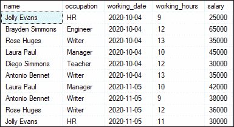
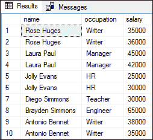
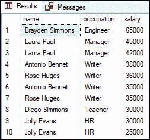
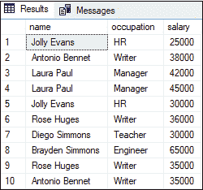
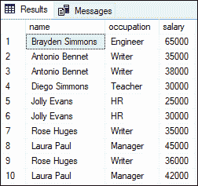
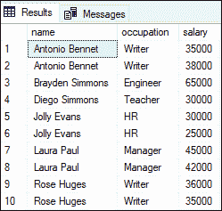
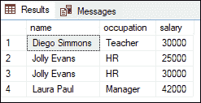

# SQL Server 订单依据

> 原文：<https://www.javatpoint.com/sql-server-order-by>

ORDER BY 子句是**，用于根据给定的列或列列表，以升序或降序排列表中的数据**。它通常与 SELECT 语句一起使用，因为它返回记录而不按特定顺序排序。这意味着 SQL Server 以未指定的顺序生成输出。但是，使用 ORDER BY 子句可以保证输出中的记录按升序或降序排序。该子句允许通过定义单个或多个列对表进行排序。

### 句法

以下是说明 SQL Server 中 ORDER BY 子句的语法:

```sql

SELECT column_lists 
FROM table_name 
WHERE conditions  
ORDER BY column_name [ASC | DESC];

```

下面给出了上述语法参数描述:

**Column _ list:**它表示我们要在结果集中检索的列的名称。

**Table_name:** 表示我们要从中检索列的表的名称。我们必须在 FROM 子句中至少提供一个表名。

**条件:**可选参数，用于过滤表记录。

**列名[ASC | DESC]:** 表示表排序到的列名。ASC 关键字是可选的，但是如果定义了，它会以升序(从低到高)对输出进行排序。DESC 关键字是可选的，但是如果定义了，它会按降序(从高到低)对输出进行排序。

**如果我们没有定义 ASC 或 DESC 关键字，SQL Server 将使用 ASC 作为默认排序顺序。** SQL Server 将**空值**视为最低值。此外，ORDER BY 子句是处理带有 ORDER BY 子句的 SELECT 语句时要考虑的最后一个子句。

## ORDER BY 子句示例

让我们通过几个实际的例子来理解 ORDER BY 子句在 SQL Server 中是如何工作的。这里我们要用一个表 **employee_info** 来演示这个子句。employee_info 表包含以下记录:



**示例 1:** 以下语句解释了 ORDER BY 子句，但没有指定任何排序顺序。这里我们将指定**【工资】**列来排序表格。

```sql

SELECT name, occupation, salary
FROM employee_info
ORDER BY salary;

```

执行该语句将返回下面的输出，其中我们看到该表是根据薪金列排序的。由于我们没有指定排序顺序，SQL Server 将按默认顺序对表进行排序:


**示例 2:** 本示例将基于单个列按降序对结果集进行排序。下面的语句**使用员工姓名列按降序对员工信息表**进行排序:

```sql

SELECT name, occupation, salary
FROM employee_info
ORDER BY name DESC;

```

执行该语句将显示以下输出。由于我们明确指定了 **DESC** 关键字，所以 SQL Server 根据名称值以降序对结果集进行排序。



**示例 3:** 本示例将基于多列对结果集进行排序。以下声明将返回员工的**姓名、职业、**和**工资**。首先按**薪资栏**对员工列表进行排序，然后按**姓名栏进行排序。**

```sql

SELECT name, occupation, salary
FROM employee_info
ORDER BY salary, name;

```

执行该语句将产生以下结果集:


**示例 4:** 本示例将根据多列和不同的顺序对结果集进行排序。以下语句将返回员工的姓名、职业和工资。它首先按工资列降序对员工列表进行排序，然后按姓名升序对排序结果集进行排序。

```sql

SELECT name, occupation, salary
FROM employee_info
ORDER BY 
salary DESC,
name ASC;

```

执行该语句将产生以下结果集:



**示例 5:** 本示例将根据 SELECT 列表中未定义的列对结果进行排序。因为在某些情况下，用于对结果进行排序的列名不会出现在选择列表中。以下语句根据工作时间对员工进行排序，即使选择列表中没有列出**工作时间**列。

```sql

SELECT name, occupation, salary
FROM employee_info
ORDER BY working_hours;

```

应该注意的是，工作时间列是在 employee_info 表中定义的。否则，我们将得到一个无效的查询。现在，执行查询以显示结果:



**示例 6:** 本示例将根据定义的表达式对结果集进行排序。以下示例使用 **LEN()函数**返回字符串的字符数。这里，我们在 ORDER BY 子句中使用这个函数来检索按姓名长度排序的员工信息。

```sql

SELECT name, occupation, salary
FROM employee_info
ORDER BY LEN(name) DESC;

```

该查询将产生以下输出:



**示例 7:** 本示例将**根据列的序号位置对表格进行排序。**我们这样做是因为 SQL Server 允许我们根据列在选择列表中的序号位置对结果进行排序。

给定的查询通过指定**名称**和**职业**列的序号位置对 employee_info 表名进行排序，而不是显式指定列名:

```sql

SELECT name, occupation, salary
FROM employee_info
ORDER BY 1, 2;

```

执行该语句将显示以下结果集:



在语句中，名称列用 1 表示，职业列用 2 表示。此语句已成功执行，但 DBA 认为在 ORDER BY 子句中使用列的序号位置是糟糕的编程实践。一些流行的原因如下:

*   表的列没有序号位置，必须通过它们的名称来引用。
*   当我们编辑选择列表时，可能会忘记更新 ORDER BY 子句中的相应更改。

因此，建议总是直接在 ORDER BY 子句中指定列名，以消除将来的困难。

### ORDER BY 子句中的偏移量和提取选项

在 ORDER BY 子句中使用了 OFFSET 选项，以从起始记录(TOP)中删除记录数。这意味着 OFFSET 指定从结果集中返回行的起始点。

ORDER BY 子句中的 FETCH 选项用于指定在查询中处理 OFFSET 子句后返回的行数。

**例**

假设我们想要从 3 开始到接下来的四行获取员工记录**。**可以使用 OFFSET 和 FETCH 子句轻松检索。以下是查询:

```sql

SELECT name, occupation, salary
FROM employee_info
ORDER BY name   
OFFSET 3 ROWS   
FETCH NEXT 4 ROWS ONLY;  

```

执行该语句将返回以下输出，其中 OFFSET 3 跳过三行，FETCH 4 ROWS ONLY 显示所需的结果。



本文将深入解释 SQL Server 中的 ORDER BY 子句。在这里，我们学习了 ORDER BY 子句是什么，我们如何在不同的情况下使用它，以及 OFFSET 和 FETCH 选项如何与该子句一起详细工作。

* * *