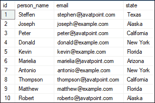
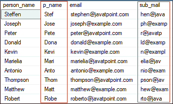
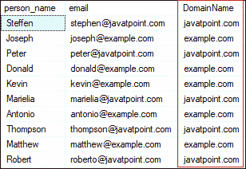
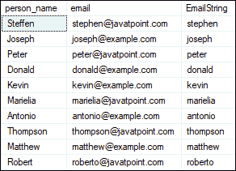
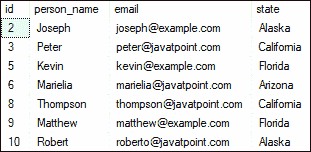
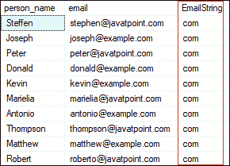

# SQL Server 子字符串

> 原文：<https://www.javatpoint.com/sql-server-substring>

SUBSTRING 是一个 SQL Server 内置函数，允许我们根据自己的需求从任意给定的字符串集合中**提取特定的子字符串。数据库开发人员在查询中广泛使用这个函数来从输入字符串中提取任意数量的子字符串。Substring 从从指定位置开始的输入字符串中提取指定长度的字符串。这个函数的主要目标是返回字符串的特定部分。**

### 子字符串的语法

以下是 [SQL Server](https://www.javatpoint.com/sql-server-tutorial) 中子串函数的基本语法:

```

SUBSTRING(Expression, Position, Length)

```

### 因素

此函数的参数描述如下:

*   **表达式:**这是一个**输入字符串**，我们将根据需要从其中提取一部分字符串(子字符串)。它可以是任何字符、文本、ntext、二进制或图像。
*   **位置:**是一个**整数值，它决定了起始位置**，从该位置可以提取给定表达式中字符串的特定部分。表达式的第一个位置总是 1，而不是 0。它还支持负整数值作为起始位置。
*   **长度:**它是一个正整数值**指定我们可以从给定的表达式中检索多少个字符**。如果长度为负，则返回一个错误。如果 start +长度大于输入字符串的长度，子字符串将从输入字符串的剩余字符开始和结束。

### 返回类型

如果输入表达式是支持的字符数据类型之一，则返回**字符**数据。如果是二进制数据类型，该函数返回**二进制**数据。我们将获得与指定表达式相同类型的提取子字符串，下表中提到了例外情况:

| 输入表达式 | 返回类型 |
| char/varchar/文本 | 可变长字符串 |
| nchar/nvarchar/context | 类型 |
| 二进制/可变二进制/图像 | 二进制数据 |

### 需要记住的要点

使用 substring 函数时，必须考虑以下规则:

*   substring 函数总是需要所有三个参数。
*   如果起始位置大于输入字符串的最大字符数，substring 函数不返回任何内容。
*   字符串的总长度可能超过输入字符串的最大字符长度。在这种情况下，结果子字符串将是从表达式起始位置到最后一个字母的整个字符串。

### 支持的版本

以下版本的 SQL Server 可以使用 SUBSTRING 函数:

*   SQL Server 2019，SQL Server 2018，SQL Server 2017，SQL Server 2016，SQL Server 2014，SQL Server 2012，SQL Server 2008 R2，SQL Server 2008，SQL Server 2005，
*   Azure SQL 数据库，Azure SQL 数据仓库，并行数据仓库

### 例子

让我们通过各种例子来了解 SUBSTRING 函数在 SQL Server 中是如何工作的:

**1。带文字字符串的子串函数**

以下语句检索长度为 13 的字符串(子字符串)的一部分，从输入字符串的第五个字符开始。

```

SELECT SUBSTRING('SUBSTRING IN SQL Server', 4, 13) AS result;

```

它将显示以下输出:


以下语句检索整个字符串。这是因为当字符串的总长度超过输入字符串的最大字符长度时，得到的子字符串将是表达式中的整个字符串。

```

SELECT SUBSTRING('javatpoint', 1, 50) AS ExtractString;

```

它将显示以下输出:


**2。表格上的替代功能**

为了理解 substring 函数在表上的用途，我们首先需要创建一个表。以下语句在选定的数据库中创建一个“**人员**”表:

```

CREATE TABLE persons (    
  id int PRIMARY KEY,    
  person_name nvarchar(45) NOT NULL,    
  email nvarchar(45) NOT NULL,    
  state nvarchar(25) NOT NULL    
);

```

接下来，我们将在该表中插入一些值，如下所示:

```

INSERT INTO persons (id, person_name, email, state)     
VALUES (1,'Steffen', 'steffen@javatpoint.com', 'Texas'),     
(2, 'Joseph', 'joseph@example.com', 'Alaska'),     
(3, 'Peter', 'peter@javatpoint.com', 'California'),  
(4, 'Donald', 'donald@example.com', 'New York'),     
(5, 'Kevin', 'kevin@example.com', 'Florida'),
(6, 'Marielia', 'marielia@javatpoint.com', 'Arizona'),  
(7, 'Antonio', 'antonio@example.com', 'New York'),     
(8, 'Thompson', 'thompson@javatpoint.com', 'California'),
(9, 'Matthew', 'matthew@example.com', 'Florida'),     
(10, 'Robert', 'robert@javatpoint.com', 'Alaska');

```

我们可以使用 **SELECT 语句来验证这些值:**

```

SELECT * FROM persons;

```

它将显示以下输出:



该语句对“**人员**表中的**人员名称**和**电子邮件**列都使用了 SQL Server 子字符串函数。人名从第一个位置开始，返回四个字符。电子邮件从第五个位置开始，返回八个字符。

```

SELECT person_name, SUBSTRING(person_name, 1, 4) AS p_name
      ,email, SUBSTRING(email, 5, 8) AS sub_mail
FROM persons; 

```

我们将得到下面的输出，我们可以观察到 p_name 和 submail 是子字符串列:



### 3.带有 Charindex 的子串函数

如果我们希望**使用 substring 函数找到电子邮件列**中存在的域名，我们可以执行如下语句:

```

SELECT person_name, email, 
	SUBSTRING(email, CHARINDEX('@', email) + 1, LEN(email)) AS DomainName
FROM persons; 

```

它将显示下面的输出，我们可以观察到**域名**是返回在 **@符号:**之后的字符串部分的子字符串列



在上面的查询中，我们可以观察到下面的函数:

```

CHARINDEX('@', email) + 1, LEN(email)

```

该函数在每条记录中查找@符号的索引位置，由于域名从下一个位置开始，所以在索引位置上加一，然后使用 LEN 函数查找电子邮件长度。最后，substring 函数提取字符串的一部分，并在字符串结束时终止。

这是**的另一个子字符串示例**通过使用 charindex，我们将在电子邮件列中的@符号前找到该字符串:

```

SELECT person_name, email,
	SUBSTRING(email, 1, CHARINDEX('@', email) - 1) AS EmailString
FROM persons;

```

它将显示下面的输出，我们可以观察到**电子邮件字符串**是返回@符号之前的字符串部分的子字符串电子邮件列:



**4。WHERE 子句中的子字符串**

SQL Server 中的子字符串函数也可以使用 WHERE 子句。下面的语句从“人员”表中提取所有记录，这些记录的状态名以:

```

SELECT id, person_name, email, state
FROM persons WHERE SUBSTRING(state, LEN(state), 1) = 'a'

```

我们将获得以下输出，其中所有记录的状态名都以:



**5。带有 LIKE 运算符的子字符串**

LIKE 运算符用于限制从表中返回所有记录。此运算符用于限制 substring 函数，该函数提取州名以 York 结尾的所有记录:

```

SELECT id, person_name, email, SUBSTRING(state, 1, 10) AS state
FROM persons WHERE state LIKE '%York'

```

我们将获得以下输出，其中所有记录的州名都以约克结尾:


**6。按子句排序的子字符串**

SQL Server 中的子字符串函数也可以使用 ORDER BY 子句。我们在这个子句中使用 substring 函数来使用 substring 结果集对记录进行排序。下面的查询将使用 state 列的子字符串对数据进行排序:

```

SELECT id, person_name, email, SUBSTRING(state, 1, 10) AS us_state
FROM persons ORDER BY SUBSTRING(state, 1, 10)

```

我们将获得以下输出，其中所有记录的州名都以约克结尾:


**7。子串负索引示例**

我们也可以在 SQL Server substring 函数中使用负索引，但这可能没有意义。例如，我们将子串索引作为(-2，3)。这意味着索引从位置-2 开始，并从那里返回 3 个字符。该函数将返回从 1 到 3 的字符，因为我们没有从-2 到 0 的任何记录(3 条记录)。

```

SELECT person_name, email,
	SUBSTRING(email, LEN(Email) - 2, 3) AS EmailString
FROM persons;

```

执行该语句，我们将看到以下输出:



* * *