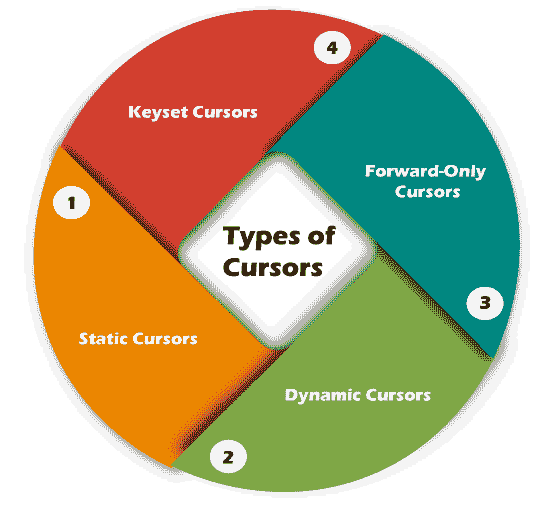
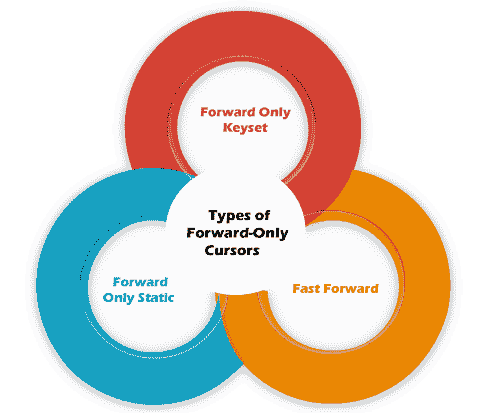
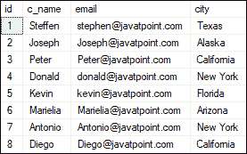
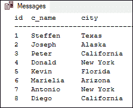

# SQL Server 中的光标

> 原文：<https://www.javatpoint.com/cursor-in-sql-server>

SQL Server 中的游标是一个数据库对象，允许我们一次检索每一行并操作其数据。光标只不过是指向一行的指针。它总是与 SELECT 语句结合使用。它通常是一组 [SQL](https://www.javatpoint.com/sql-tutorial) 逻辑，一个接一个地循环通过预定数量的行。光标的一个简单例子是，当我们有一个广泛的工人记录数据库，并想计算每个工人扣除税款和休假后的工资时。

[SQL Server](https://www.javatpoint.com/sql-server-tutorial) **游标的目的是逐行更新数据，更改数据，或者执行我们一次检索所有记录时无法执行的计算**。它对于按顺序执行管理任务(如 SQL Server 数据库备份)也很有用。游标主要用于开发、数据库管理员和 ETL 过程。

本文解释了关于 SQL Server 游标的所有内容，例如游标的生命周期、使用游标的原因和时间、如何实现游标、游标的局限性以及我们如何替换游标。

## 光标的生命周期

我们可以将光标的生命周期描述为**五个不同的部分**，如下所示:


### 1:声明光标

第一步是使用下面的 SQL 语句声明游标:

```

DECLARE cursor_name CURSOR
    FOR select_statement;

```

我们可以通过在 declare 关键字后用数据类型 cursor 指定游标的名称来声明游标。然后，我们将编写 SELECT 语句来定义游标的输出。

### 2:打开光标

这是第二步，我们打开游标来存储从结果集中检索的数据。我们可以通过使用下面的 SQL 语句来做到这一点:

```

OPEN cursor_name;

```

### 3:获取光标

这是第三步，可以逐个或在一个块中提取行，以对光标中当前活动的行执行数据操作，如插入、更新和删除操作。我们可以通过使用下面的 SQL 语句来做到这一点:

```

FETCH NEXT FROM cursor INTO variable_list;

```

我们也可以使用 SQL Server 中的 **@@FETCHSTATUS 函数**来获取针对游标执行的最近 FETCH 语句游标的状态。当@@FETCHSTATUS 给出零输出时， **FETCH** 语句成功。 **WHILE** 语句可用于从光标处检索所有记录。下面的代码解释得更清楚:

```

WHILE @@FETCH_STATUS = 0  
    BEGIN
        FETCH NEXT FROM cursor_name;  
    END;

```

### 4:关闭光标

这是第四步，在我们使用光标完成工作后，应该关闭光标。我们可以通过使用下面的 SQL 语句来做到这一点:

```

CLOSE cursor_name;

```

### 5:取消分配光标

这是第五步，也是最后一步，我们将删除游标定义并释放与游标相关的所有系统资源。我们可以通过使用下面的 SQL 语句来做到这一点:

```

DEALLOCATE cursor_name;

```

## SQL Server 游标的使用

我们知道，包括 SQL Server 在内的关系数据库管理系统在处理一组称为结果集的行上的数据方面非常出色。**例如**，我们有一个表 **product_table** 包含产品描述。如果我们想更新产品的**价格**，那么下面的“**UPDATE”**查询将更新所有符合“**WHERE”**子句中条件的记录:

```

UPDATE product_table SET unit_price = 100 WHERE product_id = 105;

```

有时，应用程序需要以单一方式处理行，即逐行处理，而不是一次处理整个结果集。我们可以通过在 SQL Server 中使用游标来完成这个过程。在使用游标之前，我们必须知道游标的性能非常差，所以它应该总是只在除了游标之外没有选项的时候使用。

游标使用与我们在所有编程语言中使用 FOREACH、FOR、WHILE、DO WHILE 这样的循环一次迭代一个对象相同的技术。因此，可以选择它，因为它应用了与编程语言循环过程相同的逻辑。

## SQL Server 中游标的类型

下面列出了 SQL Server 中不同类型的游标:

*   静态游标
*   动态游标
*   仅向前游标
*   键集游标



### 静态游标

静态游标显示的结果集始终与首次打开游标时相同。由于静态光标将结果存储在 **tempdb** 中，因此它们始终是**只读**。我们可以使用静态光标向前和向后移动。与其他游标相比，它更慢，消耗更多内存。因此，我们只能在需要滚动时使用它，而其他光标不适合。

此光标显示数据库打开后从数据库中删除的行。静态游标不代表任何插入、更新或删除操作(除非游标已关闭并重新打开)。

### 动态游标

动态游标与静态游标相反，静态游标允许我们在游标打开时执行数据更新、删除和插入操作。默认为**可滚动**。它可以检测对结果集中的行、顺序和值所做的所有更改，无论这些更改发生在游标内部还是外部。在游标之外，我们无法看到更新，直到它们被提交。

### 仅向前游标

它是所有游标中默认且最快的游标类型。它被称为仅向前的光标，因为它**仅向前移动通过结果集**。此光标不支持滚动。它只能从结果集的开头到结尾检索行。它允许我们执行插入、更新和删除操作。在这里，当从游标中提取行时，用户执行的影响结果集中的行的插入、更新和删除操作的效果可见。提取行时，我们无法通过光标看到对行所做的更改。

**仅向前光标分为三种类型:**

1.  仅前进键集
2.  仅转发 _ 静态
3.  快进



### 键集驱动游标

就其检测变化的能力而言，该光标功能**介于静态光标和动态光标**之间。它不能像静态游标一样总是检测到结果集成员和顺序的变化。它可以像动态光标一样检测结果集的行值的变化。只能**从第一排移到最后一排，最后移到第一排**。每当光标打开时，顺序和成员是固定的。

它由一组与密钥集中的密钥相同的唯一标识符来操作。键集由第一次打开游标时限定 SELECT 语句的所有行决定。它还可以检测对数据源的任何更改，这支持更新和删除操作。默认情况下它是可滚动的。

## 示例的实现

让我们在 SQL Server 中实现游标示例。我们可以这样做，首先使用下面的语句创建一个名为“**客户**”的表:

```

CREATE TABLE customer (    
  id int PRIMARY KEY,    
  c_name nvarchar(45) NOT NULL,    
  email nvarchar(45) NOT NULL,    
  city nvarchar(25) NOT NULL    
);  

```

接下来，我们将向表中插入值。我们可以执行下面的语句将数据添加到表中:

```

INSERT INTO customer (id, c_name, email, city)     
VALUES (1,'Steffen', 'stephen@javatpoint.com', 'Texas'),     
(2, 'Joseph', 'Joseph@javatpoint.com', 'Alaska'),     
(3, 'Peter', 'Peter@javatpoint.com', 'California'),  
(4,'Donald', 'donald@javatpoint.com', 'New York'),     
(5, 'Kevin', 'kevin@javatpoint.com', 'Florida'),
(6, 'Marielia', 'Marielia@javatpoint.com', 'Arizona'),  
(7,'Antonio', 'Antonio@javatpoint.com', 'New York'),     
(8, 'Diego', 'Diego@javatpoint.com', 'California');  

```

我们可以通过执行**选择**语句来验证数据:

```

SELECT * FROM customer;

```

执行查询后，我们可以看到下面的输出，其中我们有**八行**进入表格:



现在，我们将创建一个光标来显示客户记录。下面的代码片段通过将所有内容放在一起解释了游标声明或创建的所有步骤:

```

--Declare the variables for holding data.
DECLARE @id INT, @c_name NVARCHAR(50), @city NVARCHAR(50)

--Declare and set counter.
DECLARE @Counter INT
SET @Counter = 1

--Declare a cursor
DECLARE PrintCustomers CURSOR
FOR
SELECT id, c_name, city FROM customer

--Open cursor
OPEN PrintCustomers

--Fetch the record into the variables.
FETCH NEXT FROM PrintCustomers INTO
@id, @c_name, @city

--LOOP UNTIL RECORDS ARE AVAILABLE.
WHILE @@FETCH_STATUS = 0
    BEGIN
        IF @Counter = 1
        BEGIN
            PRINT 'id' + CHAR(9) + 'c_name' + CHAR(9) + CHAR(9) + 'city'
            PRINT '--------------------------'
        END

        --Print the current record
        PRINT CAST(@id AS NVARCHAR(10)) + CHAR(9) + @c_name + CHAR(9) + CHAR(9) + @city

        --Increment the counter variable
        SET @Counter = @Counter + 1

        --Fetch the next record into the variables.
        FETCH NEXT FROM PrintCustomers INTO
        @id, @c_name, @city
    END

--Close the cursor
CLOSE PrintCustomers

--Deallocate the cursor
DEALLOCATE PrintCustomers

```

执行游标后，我们将获得以下输出:



## SQL Server 游标的限制

游标有一些限制，因此它应该总是只在除了游标之外没有其他选项时使用。这些限制是:

*   每次获取记录时，Cursor 都需要进行网络往返，从而消耗网络资源。
*   游标是一组驻留在内存中的指针，这意味着它占用了一些内存，其他进程可以在我们的机器上使用。
*   它在处理数据时对表的一部分或整个表施加锁。
*   游标的性能和速度较慢，因为它们一次更新一行表记录。
*   游标比 while 循环更快，但是它们确实有更多的开销。
*   进入光标的行数和列数是影响光标速度的另一个方面。它指的是打开游标和执行 fetch 语句所花费的时间。

## 如何才能避免光标？

游标的主要工作是逐行遍历表。避免游标的最简单方法如下:

**使用 SQL while 循环**

避免使用游标的最简单方法是使用 while 循环，该循环允许将结果集插入临时表中。

**用户自定义功能**

有时游标用于计算结果行集。我们可以通过使用满足需求的用户定义函数来实现这一点。

**使用连接**

Join 只处理那些满足指定条件的列，因此在需要处理大量记录的情况下，可以减少比游标提供更快性能的代码行。

* * *