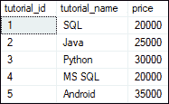
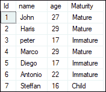
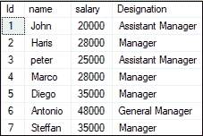
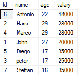

# SQL Server 案例

> 原文：<https://www.javatpoint.com/sql-server-case>

CASE 表达式是控制流函数的一部分，它计算条件列表，并在第一个条件满足时给出输出。它主要用于处理条件语句，与其他编程语言中的 **IF-THEN-ELSE 语句**相同。CASE 语句评估条件，当发现为真时，它将停止执行并返回结果。如果它找不到任何条件为真，它将计算 ELSE 部分以返回值并结束。当没有发现 ELSE 块并且没有条件满足为真时，它将给出空值。

CASE 表达式可用于任何使用有效程序或查询的地方，如 SELECT、where 和 ORDER BY 子句。**其主要功能是管理 SELECT 子句**中的多个 IF 语句。在微软 [SQL Server](https://www.javatpoint.com/sql-server-tutorial) 中，CASE 语句允许用户添加几个条件来执行各种动作集。

## 案例陈述的类型

微软 SQL Server 中有两种形式的 CASE 语句:

1.  简单案例陈述
2.  搜索案例陈述

### 简单案例

我们使用简单的 CASE 语句进行等式测试。它通过将表达式与一组多个值进行比较来确定结果。换句话说，当条件和表达式匹配时，该语句逐个评估条件并返回在 **THEN 子句**中指定的表达式。

**以下是 Simple CASE 语句的语法:**

```

CASE WHEN Condition1 THEN Statement1
     WHEN Condition2 THEN Statement2
     .
     .
     WHEN ConditionN THEN StatementN
     ELSE Statement   
END 
```

这里，CASE 语句通过将表达式( **input_expression** )与每个 **WHEN 子句**中定义的值进行比较来检查是否相等。如果 input_expression 与 WHEN 子句的值匹配，它会在相应的 **THEN 子句**中给出结果语句。如果 input_expression 不匹配任何值，并且 **ELSE 块**可用，CASE 表达式将返回 ELSE 块的结果。当没有找到 ELSE 部分时，CASE 表达式将给出 **NULL** 值，input_expression 与 when 子句中的任何值都不匹配。

### 例子

以下语句解释了 CASE 语句的简单示例:

```

SELECT CASE 2 WHEN 1 THEN 'one' WHEN 2 THEN 'two' ELSE 'more' END AS "CASE Result";

```

它将给出以下输出:


让我们解释一下表中 CASE 语句的工作原理。以下语句创建了一个名为**教程的表:**

```

CREATE TABLE Tutorials (  
  tutorial_id int IDENTITY(1,1) PRIMARY KEY,
  tutorial_name varchar(45) NOT NULL,  
  price float  
);

```

接下来，我们将使用下面的语句向该表中添加一些记录:

```

INSERT INTO Tutorials (tutorial_name, price)   
VALUES ('SQL', 20000.00), 
('Java', 25000.00), 
('Python', 30000.00), 
('MS SQL', 20000.00),   
('Android', 35000.00);

```

我们可以使用显示以下数据的 **SELECT** 语句来验证该表:



以下 SQL CASE 语句评估每个条件，并在满足第一个条件时返回一个值:

```

SELECT tutorial_id, tutorial_name,
CASE tutorial_name
	WHEN 'SQL' THEN 'SQL is developed by IBM'
	WHEN 'Java' THEN 'Java Java was created at Sun Microsystems Inc.'
	WHEN 'MS SQL' THEN 'MS-SQL is developed by Microsoft Corporation.'
	ELSE 'Do not Know.'
END AS Description
FROM Tutorials;

```

它将给出以下输出，我们可以根据 CASE 语句中指定的条件看到结果:


### 搜索案例陈述

搜索到的 CASE 语句是一种更全面的表达式求值格式**对一组布尔表达式求值得到结果**。它允许我们在每个布尔表达式中使用比较运算符和逻辑运算符。

以下是简单案例语句的语法:

```

CASE
  WHEN boolean_expression_1 THEN result_1
  WHEN boolean_expression_2 THEN result_2
  .
  .
  WHEN boolean_expression_N THEN result_N
  ELSE else_result
END;

```

该语句首先按照 CASE 表达式中定义的顺序计算每个 WHEN 子句的**布尔表达式**。如果每个 WHEN 子句中布尔表达式的求值结果为**真**，则该语句给出相应的 **THEN 子句**结果。如果评估为**假**，则该语句返回 **ELSE 块**中指定的结果。如果没有找到 ELSE 块并且布尔表达式求值为真，CASE 表达式将返回**空值**。 **END** 子句是可选的。

### 例子

让我们解释一下表中 CASE 语句的工作原理。假设我们有一个名为**学生**的表，其中包含以下数据:


以下 SQL CASE 语句评估每个条件，并在满足第一个条件时返回一个值:

```

SELECT Id, name, age,
CASE
 WHEN age>22 THEN 'Mature'
 WHEN age>=17 AND age<=22 THEN 'Immature'
 ELSE 'Child'
END AS Maturity FROM STUDENT;

```

在上面的例子中，我们可以看到第一个**‘age’**是 CASE 表达式的一部分。之后，将“年龄”的值与每个“何时”语句进行比较，直到“年龄”与“何时”值相匹配。这里，每个 WHEN 语句都有自己的条件布尔表达式。直到第一个布尔表达式计算为**真**，每个布尔表达式计算为真/假。

执行后，它将给出以下输出，我们可以根据 CASE 语句中指定的条件看到结果:



### 嵌套 CASE 语句

我们也可以使用嵌套的 CASE 语句。以下示例说明了嵌套的 CASE 语句:

```

SELECT Id, name, salary,
CASE
 WHEN salary>25000 THEN
  CASE
   WHEN salary> 35000 THEN 'General Manager'
   ELSE 'Manager'
  END
 ELSE 'Assistant Manager'
END AS Designation
FROM STUDENT;

```

我们将获得以下输出:



在上面的例子中，我们首先检查第一个 WHEN 条件(工资> 25000)是否为真。如果是真的，我们将进入另一个当条件(工资> 35000)。如果第二个条件变为 **TRUE** ，则给该学生分配**【总经理】**的头衔，否则只给**【经理】**的头衔。最后，如果没有条件匹配，则该学生被指定为**“助理经理”**。

### 附有订单条款的案例陈述

我们还可以使用带有 ORDER BY 子句的 CASE 语句，该语句用于按照**升序或降序**对结果进行排序。下面的例子解释得更清楚:

*   对于 17 岁以上的学生，学生的工资应该按降序排列。
*   对于 17 岁以下的学生，学生的工资应该按升序排列。

这个条件可以通过使用 ORDER BY 和 CASE 语句的组合来定义。在下面的语句中，我们结合了 ORDER BY 和 CASE 语句，并描述了 CASE 表达式中的排序条件:

```

SELECT Id, name, age, salary
 FROM STUDENT
 ORDER BY CASE
WHEN age>17 THEN salary End DESC,
CASE WHEN age<17 THEN salary  
END

```

执行该语句后，我们将获得以下输出:



### 用案例陈述更新陈述

SQL Server 还允许我们将 CASE 语句与 UPDATE 语句一起使用。假设我们想根据 CASE 语句条件更新学生的年龄。我们可以在以下条件下进行:

*   如果学生年龄为 22 岁，则更新为 33 岁
*   如果学生年龄为 17 岁，则更新为 18 岁

我们将在上面的**学生表**中解释这个例子。我们可以通过使用 CASE 语句执行以下更新命令来满足我们的需求:

```

UPDATE STUDENT 
SET age = CASE age
 WHEN 22 THEN 23 
 WHEN 17 THEN 18 
 WHEN 29 THEN 30
 WHEN 16 THEN 15
 ELSE 25
 END

```

我们将按照我们的要求得到结果:


### 返回类型

CASE 表达式根据使用它的上下文返回结果。**例如:**

*   如果在字符串上下文中使用它，它将返回字符串结果。
*   如果在数值上下文中使用，它将返回整数、浮点、十进制值。

## 简单案例陈述和搜索案例陈述的区别

下面的对比图解释了简单和搜索案例语句之间的主要区别:

| 简单案例 | 搜索案例 |
| CASE 关键字和 WHEN 子句之间有一个表达式。例如
案例<case_expression></case_expression> | WHEN condition 1 THEN statement 1 CASE 关键字和 WHEN 子句之间没有表达式。例如，
条件 1 然后陈述 1 的情况 |
| 此语句用于简单的相等性检查，并通过将表达式与一组多个值进行比较来确定结果。 | 此语句分别测试每个“当”语句的条件。它帮助我们解决比简单案例更复杂的情况。 |
| 简单的 CASE 语句只支持相等测试。 | 搜索到的 CASE 语句支持任何使用布尔表达式返回布尔值的操作。它包括等于和不等于运算符。 |

### 案例陈述的局限性

以下是案例陈述的局限性:

*   CASE 语句不允许我们控制 SQL Server 中存储过程和函数的执行流程。
*   Case 语句在 CASE 语句中可以有几个条件，但它只能在顺序模型中运行。当其中一个条件为真时，它将停止测试进一步的语句。
*   CASE 语句不允许我们在表中为空值。

* * *