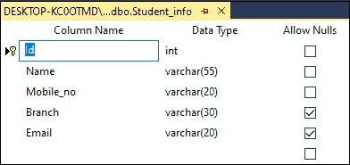
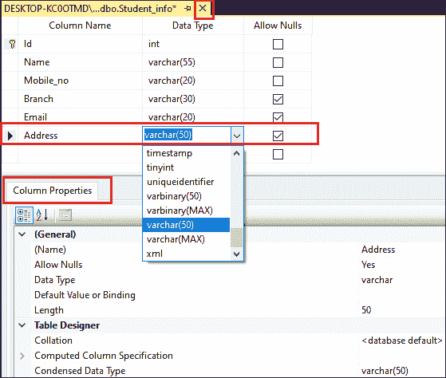
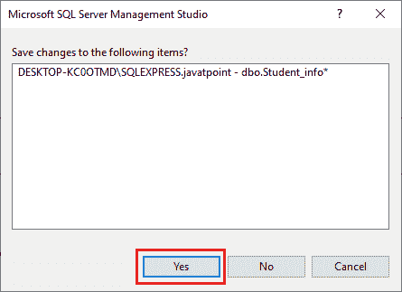

# 在 SQL Server 中添加列

> 原文：<https://www.javatpoint.com/add-columns-in-sql-server>

表格列是一组包含文本或数字的单元格。每列可以为表中的每一行存储一个值。SQL Server 允许我们在需要的时候添加列。在添加表中的列之前，它必须确保我们对对象拥有 **ALTER 权限**。本文全面概述了如何向现有表中添加列。

## 限制和约束

当我们使用 ALTER TABLE 语句添加列时，我们会看到这些列被自动添加到表的末尾。每当我们想要向表中添加特定顺序的列时，我们可以使用[管理工作室](https://www.javatpoint.com/sql-server-management-studio)。但是，就数据库管理员而言，使用 SSMS 添加列并不是最佳做法。在应用程序和查询级别以特定顺序返回列是最佳实践。在我们的查询和应用程序中，我们必须按照我们想要返回的顺序按名称定义列。

**我们可以在 SQL Server 中添加表列，主要使用两种方式:**

1.  以原则为基础的管理检视
2.  SQL Server 管理工作室(SSMS)

## T-SQL

[SQL Server](https://www.javatpoint.com/sql-server-tutorial) 提供了 **ALTER TABLE ADD COLUMN** 语句，用于向现有表添加新列。我们可以使用以下语法来做到这一点:

```sql

ALTER TABLE table_name   
ADD column_name data_type column_constraint; 

```

在上图中，

*   首先，我们将指定要在其中添加新列的表名。
*   接下来，我们将编写新的列名及其定义，如数据类型和约束(如果需要)。

SQL Server 还使我们能够在一个查询中将多个列添加到现有表中。我们可以通过指定一个列列表**来做到这一点，这些列用逗号**分隔，我们希望在 add 子句后将其添加到表中。下面的语法解释得更清楚:

```sql

ALTER TABLE table_name   
ADD
    column1 data_type1 column_constraint1,
    column2 data_type2 column_constraint2,
    ...,
    column_n data_type_n column_constraint_n;

```

### 添加列示例

借助各种示例，让我们了解如何向现有表中添加列。首先，我们将使用下面的语句创建一个名为“ **Student_info** ”的表:

```sql

CREATE TABLE Student_info (  
    Id int IDENTITY PRIMARY KEY,  
    Name varchar(55) NOT NULL  
); 

```

我们的表结构如下图所示，其中只有两列:


假设我们在创建一个表后，错误地没有添加一个重要的列。在这种情况下，我们可以使用下面的语句向表中添加一个新列:

```sql

ALTER TABLE Student_info   
ADD Mobile_no VARCHAR(20) NOT NULL;

```

该命令将在表的末尾添加新添加的列。当我们看到表格结构时，添加 **mobile_no** 列作为表格的最后一列。


如果我们想在表中添加多列(如**，分支和邮件**)，我们需要运行如下语句:

```sql

ALTER TABLE Student_info   
ADD Branch VARCHAR(30) DEFAULT NULL,  
    Email VARCHAR(20) DEFAULT NULL;

```

当我们看到表结构时，**分支**和**邮件**列成功添加到表中。


如果我们错误地添加了一个与表中存在的列名相同的新列，SQL Server 将通过一条错误消息。**例如**，执行此命令会发出错误，因为表中已经有了‘Mobile _ no’列:

```sql

ALTER TABLE Student_info   
ADD Mobile_no VARCHAR(20) NOT NULL;  

```

**我们会得到如下错误信息。**


## SQL Server 管理工作室(SSMS)

SSMS 是一个 windows 软件工具，用于从图形界面而不是使用命令行连接和使用我们的 SQL Server。管理工作室允许我们使用表设计器选项将列添加到表中。

**使用表设计器添加新列的步骤如下:**

**步骤 1:** 在对象资源管理器中，转到数据库- >表菜单并展开它。

**步骤 2:** 选择想要添加新列的表，右键单击该表，然后从上下文菜单中选择“设计”选项。


**第三步:**一旦我们选择了设计选项，我们将看到如下图所示的设计模式下的表格。



**第四步:**在**列名**列的第一个空白单元格中写入新的列名。

**步骤 5:** 选择**数据类型**列，从菜单列表中选择所需类型。如果我们不选择数据类型，SQL Server 将分配默认值。我们可以通过导航到**数据库工具- >选项**菜单来更改该默认值。我们也可以在**列属性选项卡**中指定其他列属性。

**例如**，我们将在下图中添加“**地址**一栏:



**步骤 5:** 要保存您在设计窗口中所做的更改，单击**关闭**按钮，然后在显示的弹出窗口中单击**是**按钮。



我们可以通过导航到**文件**菜单，选择**保存表名**或按键盘上的 **CTRL+S** 来以另一种方式保存在设计窗口中所做的更改。


**第六步:**我们可以对表定义中新增的列进行校验。


* * *