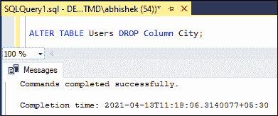
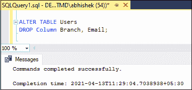
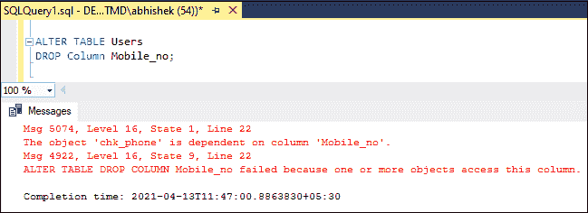
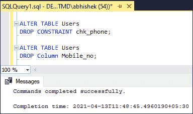
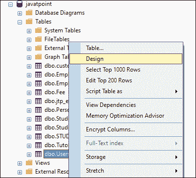
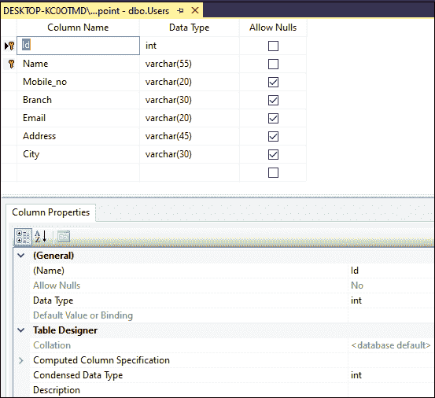

# 在 SQL Server 中删除列

> 原文：<https://www.javatpoint.com/drop-column-in-sql-server>

SQL Server 允许用户从表中删除一个或多个未使用或过时的列。从表中删除列之前，需要对对象拥有 **ALTER 权限**。在本文中，我们将讨论如何从现有表中删除列的完整概述。

## 限制和约束

我们无法删除表中带有 CHECK 约束的列。如果我们想要删除带有约束的列，我们首先要移除约束。 [SQL Server](https://www.javatpoint.com/sql-server-tutorial) 不会删除具有主键或外键约束或其他依赖关系的列。但是，我们可以通过使用表设计器来实现这一点。当使用对象资源管理器或 [Transact-SQL](https://www.javatpoint.com/t-sql) 删除列时，我们将首先删除该列的所有依赖项。

**我们可以在 SQL Server 中放置列，主要有两种方式:**

1.  Transact-SQL。
2.  SQL Server 管理工作室(SSMS)

## 以原则为基础的管理检视

SQL Server 有 **ALTER TABLE DROP COLUMN** 命令，用于从现有表中删除列。我们可以使用以下语法来做到这一点:

```

ALTER TABLE table_name   
DROP COLUMN column_name; 

```

在这个语法中，

*   首先，我们将编写要从中删除列的表名。
*   其次，我们将写下要删除的列名。

我们还可以一次将多个列放入现有的表中。我们可以通过在 DROP COLUMN 子句后指定一个要从表中删除的列列表**来实现。下面的语法解释得更清楚:**

```

ALTER TABLE table_name   
DROP COLUMN 
    column_name1,
    column_name2,
    ...,
    column_name_n; 

```

### 删除列示例

这个例子解释了如何在 SQL Server 中从表中删除一列。我们将首先使用下面的语句创建一个名为“**用户**”的表:

```

CREATE TABLE Users (  
  Id INT IDENTITY,
  Name VARCHAR(55),
  Mobile_no VARCHAR(20),
  Branch VARCHAR(30),
  Email VARCHAR(20),
  Address VARCHAR(45),
  City VARCHAR(30),
  CONSTRAINT chk_phone CHECK (Mobile_no not like '%[^0-9]%'),
  PRIMARY KEY (Id, Name)
); 

```

我们的表格结构如下图所示，共有**七列:**


假设我们想要删除表中不再需要的**‘City’**列。我们可以使用如下语句删除此列:

```

ALTER TABLE Users DROP Column City; 

```

执行此语句将返回如下图所示的消息:



在某些情况下，我们希望一次从表中删除多个列。**例如**，我们可以通过执行下面的语句，从“**用户”**表中删除“**分支”**和**【邮件】**列:

```

ALTER TABLE Users 
DROP Column Branch, Email;

```

当命令成功运行时，我们将收到以下消息:



正如我们在表格定义中看到的那样， **Mobile_no** 列有一个 **CHECK 约束**。因此，我们不能删除它。如果我们尝试运行以下命令，将会得到一个错误:

```

ALTER TABLE Users DROP Column Mobile_no;

```

以下是错误消息:



如果我们想删除 Mobile_no 列，我们首先需要使用下面的语句删除它的 CHECK 约束:

```

ALTER TABLE Users
DROP CONSTRAINT chk_phone; 

```

现在，我们可以删除移动 _ 否列。请参见以下输出:



## SQL Server 管理工作室(SSMS)

SSMS 是一个 windows 软件工具，用于从图形界面而不是使用命令行连接和使用我们的 SQL Server。[管理工作室](https://www.javatpoint.com/sql-server-management-studio)允许我们通过以下方式从表格中删除列:

1.  使用表设计器删除列
2.  使用对象资源管理器删除列

让我们详细看看每一个。

### 使用表设计器删除列

以下步骤用于使用表设计器删除列:

**步骤 1:** 在对象资源管理器中，转到数据库- >表菜单并展开它。

**第二步:**选择我们想要删除列的表，右键单击它，然后从上下文菜单中选择**设计**选项。



**第三步:**一旦我们选择了设计选项，我们将看到如下图所示的设计模式下的表格。



**第四步:**右键点击我们要删除的栏目，从菜单中选择**删除栏目**选项。


**第五步:**如果您收到确认您的列的删除和关系的提示信息，点击**是**按钮。

### 使用对象资源管理器拖放列

以下步骤用于使用对象资源管理器删除列:

**步骤 1:** 转到数据库- >表格菜单并展开它。

**步骤 2:** 选择所需的表格并展开。

**步骤 3:** 选择列并展开它们。

**步骤 4:** 右键单击要删除的列名，选择删除选项。


**第五步:**在**删除对象**对话框中，点击**确定**。

#### 注意:如果列包含约束或其他依赖关系，则“删除对象”对话框中会出现一条错误消息。删除引用的约束以解决问题。


**步骤 6:** 刷新数据库或表，完成删除步骤。

* * *