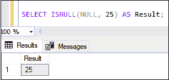
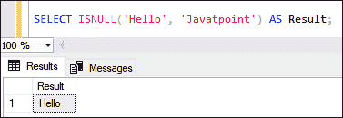
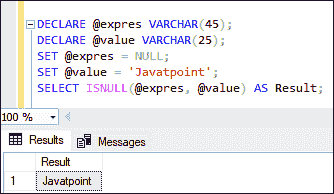
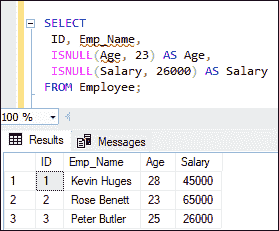
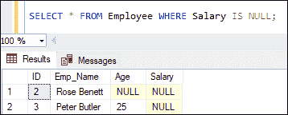

# SQL Server 是空函数

> 原文：<https://www.javatpoint.com/sql-server-isnull-function>

它是 SQL Server 中的一个内置函数。它允许用户用给定的替换值来替换空值。本文给出了 ISNULL 函数的完整概述，如果表达式或表记录具有空值，该函数将返回一个替代值。

### 句法

以下是说明 ISNULL 函数的语法:

```sql

ISNULL ( Expression, Replacement )

```

**我们可以看到，这个语法只接受两个参数:**

*   **表达式**:用于检查是否为空。它可以是任何类型。
*   **替换**:是表达式为空时返回的值。它必须可以隐式转换为表达式类型的值。

如果表达式的计算结果为空，则此函数用替换值替换空值。当参数的**数据类型不同**时，SQL server **会在返回值之前将替换值数据类型隐式转换为表达式数据类型**。当表达式不为空时，我们将获得表达式值。

ISNULL 函数可以在 [SQL Server](https://www.javatpoint.com/sql-server-tutorial) (从 2008 年开始)、并行数据仓库、Azure SQL 数据库、Azure SQL 数据仓库中工作。

## ISNULL 函数示例

让我们用 SQL Server 中的一些例子来探索 ISNULL 函数。

### 1.带有数值的 ISNULL 函数

下面的例子使用了 ISNULL 函数。这里第一个参数为空；因此，它返回结果中第二个参数的值:

```sql

SELECT ISNULL(NULL, 25) AS Result; 

```

执行后，我们将获得以下输出:



### 2.带字符串数据的 ISNULL 函数

下面的例子使用了 ISNULL 函数。这里我们将得到字符串值**‘Hello’**，因为它是第一个参数。从 ISNULL()函数定义开始，当它不为空时，它返回第一个参数值:

```sql

SELECT ISNULL('Hello', 'Javatpoint') AS Result;

```

执行后，我们将获得以下输出:



### 3.带变量的 ISNULL 函数

以下示例使用 ISNULL 函数，并使用变量返回结果:

```sql

DECLARE @expres VARCHAR(45);
DECLARE @value VARCHAR(25);
SET @expres = NULL;
SET @value = 'Javatpoint';
SELECT ISNULL(@expres, @value) AS Result;

```

执行后，我们将获得以下输出:



### 4.表的 ISNULL 函数

在这里，我们将看到当列值包含空值时，如何用有意义的值替换它。让我们首先使用下面的语句创建一个名为“**员工”**的表:

```sql

CREATE TABLE Employee
(ID INT IDENTITY PRIMARY KEY, 
 Emp_Name VARCHAR(50) NOT NULL, 
 Age INT NULL,
 Salary INT NULL
);

```

现在，我们将使用下面的语句向该表中插入一些值:

```sql

INSERT INTO Employee (Emp_Name, Age, Salary)
VALUES ('Kevin Huges', 28, 45000), 
('Rose Bennet', NULL, 36000), 
('Peter Butler', 25, NULL); 

```

当我们验证该表时，我们可以看到**员工 2 和 3 的**值为空。


假设我们想要替换这些列的空值，而不在表中永久更新它们。在这种情况下，我们可以使用 ISNULL 函数将空值替换为特定值。

**例如**，如果员工表中的**年龄**和**工资**的列为空值，则分别返回 22 和 25000 的员工。我们可以通过使用以下语句来做到这一点:

```sql

SELECT 
  ID, Emp_Name,
  ISNULL(Age, 22) AS Age, 
  ISNULL(Salary, 25000) AS Salary 
 FROM Employee;

```

执行后，我们将获得以下输出:


如果我们对表中没有列具有空值的列运行带有 ISNULL 函数的查询，该查询将返回行的实际值。

**例如**，我们更新了 **ID=2** 的员工的**工资**如下:

```sql

UPDATE Employee SET Salary = 65000 WHERE ID=2;

```

同样，如果我们执行 ISNULL 函数，它不会改变工资列。请参见以下输出:



### 5.带有聚合函数的 ISNULL

SQL Server 还使我们能够将 SUM、AVG 等聚合函数与 ISNULL 函数一起使用。假设我们可能需要获取 Employee 表中某个工资列的**之和，如果任何一个工资列为 NULL，则在添加工资之前，它将被替换为 25000。**

在执行聚合方法之前，我们将使用下面的查询用 id 为 2 的空值更新员工工资。

```sql

UPDATE Employee SET Salary = NULL WHERE ID=2;

```

下面的示例首先用 25000 替换空值，然后对其执行 SUM 函数。请参见以下输出:

```sql

SELECT SUM(ISNULL(Salary, 25000)) AS Sum_of_Salaries FROM Employee;

```

执行后，我们将获得以下输出:


同样，可以用 ISNULL 函数代替 NULL 值，然后用 **AVG()函数**返回平均值。请参见以下声明:

```sql

SELECT AVG(ISNULL(Salary, 25000)) AS Avg_of_Salaries FROM Employee;

```

执行后，我们将获得以下输出:


## SQL Server 为空和为空的区别

在 SQL Server 中，ISNULL 和 IS 空函数都是不同的。当我们需要将空值替换为指定值时，我们使用 ISNULL 函数。另一方面，当我们想要**识别表中的空值**时，我们使用的是空函数。

**让我们看下面的例子来说明他们的区别**。

假设我们想从“**Employee”**表中获取员工数据，该表在“薪资”列中包含空值。为了获得这种类型的信息，我们应该在 **WHERE** 子句中使用 IS NULL 函数，如下所示:

```sql

SELECT * FROM Employee WHERE Salary IS NULL;

```

它将返回工资为空的员工详细信息:



现在，如果我们尝试用 ISNULL 函数获取这种类型的信息，SQL Server 会通过以下**错误**:

```sql

SELECT * FROM Employee WHERE Salary ISNULL(NULL, 0;

```

错误如下:


因此，很明显，SQL Server 不允许我们使用 ISNULL 来查找空值。

* * *