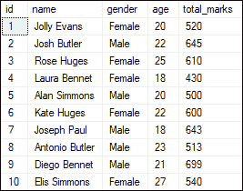
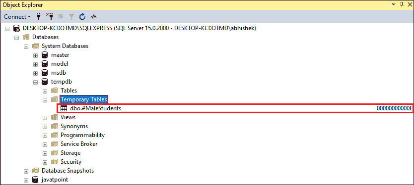
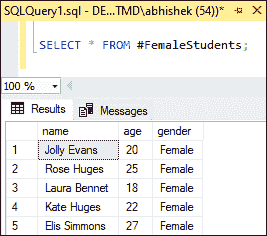
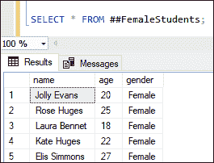

# SQL Server 临时表

> 原文：<https://www.javatpoint.com/sql-server-temp-table>

SQL Server 中的临时(临时)表是一种特殊的表**不能永久存储在数据库服务器**上。该表保留了常规表中的数据子集，并且可以在特定会话中多次重用。我们不能把这张表存储在内存中。由于此表暂时存在于当前数据库服务器上，因此当当前会话结束或用户终止数据库连接时，它将被自动删除。我们可以在系统数据库“ **tempdb** 中获取临时表

当我们在一个表中有一堆记录，并且只需要定期处理一小部分记录时，临时表是很方便的。在这种情况下，我们可以过滤一次数据，并将它们保存在临时表中，而不是多次过滤数据来获得所需的数据。之后，我们可以在这个临时表上运行查询。因此，临时表有一个功能，使我们能够快速完成复杂的任务。

## 在 SQL Server 中创建临时表

我们可以通过两种方式创建临时表:

1.  选择进入
2.  创建表语句

让我们首先创建一个表，以两种方式演示临时表。以下语句在示例数据库中创建了一个名为**‘Student’**的表:

```sql

CREATE TABLE Student
(
    id INT IDENTITY PRIMARY KEY,
    name VARCHAR(50) NOT NULL,
    gender VARCHAR(20) NOT NULL,
    age INT NOT NULL,
    total_marks INT NOT NULL
 )

INSERT INTO Student 
VALUES ('Jolly Evans', 'Female', 20, 520), 
('Josh Butler', 'Male', 22, 645), 
('Rose Huges', 'Female', 25, 610), 
('Laura Bennet', 'Female', 18, 430), 
('Alan Simmons', 'Male', 20, 500), 
('Kate Huges', 'Female', 22, 600), 
('Joseph Paul', 'Male', 18, 643), 
('Antonio Butler', 'Male', 23, 513), 
('Diego Bennet', 'Male', 21, 699), 
('Elis Simmons', 'Female', 27, 540); 

```

我们可以使用 SELECT 语句来验证该表。它显示下表:



### 使用选择进入语句的临时表

SELECT INTO 语句是在 [SQL Server](https://www.javatpoint.com/sql-server-tutorial) 中创建临时表的最简单方法。我们通常使用这种方法来保存中间结果，以便在同一会话中重复使用。

以下**语法说明了如何使用 SELECT INTO 语句创建临时表**:

```sql

SELECT select_list
INTO temporary_table_name
FROM regular_table_name
WHERE conditions;

```

临时表的名称总是以**散列符号(#)开头。**哈希符号表示 SQL Server 正在处理一个临时表。**例如**，下面的查询借助 SELECT INTO 语句在 tempdb 数据库中创建一个临时表。我们只能在创建临时表的会话中使用该表。

```sql

SELECT name, age, gender
INTO #MaleStudents
FROM Student
WHERE gender = 'Male'

```

正如我们在上面的语句中看到的，它创建了一个名为**“#男学生”**的临时表，其中有三列(**姓名、年龄和性别**)来自 SELECT 语句。它填充了来自包含所有男学生记录的姓名、年龄和性别的**【学生】**表的数据。我们不应该忘记临时表名必须在其名称的开头有一个散列(#)符号。

执行该语句后，我们可以通过使用以下路径访问 SQL Server Management Studio 来查看临时表的位置:**对象资源管理器- >数据库- >系统数据库- > tempdb - >临时表**。在这里，我们得到了临时表名和散列符号。见下图:



如图所示， **temp 表在名称的末尾还包含一个序号**。它表示一个**唯一标识符**，SQL Server 为每个临时表创建该标识符来区分临时表。创建它是因为多个临时表可以有多个相同的数据库连接名称。

现在，我们可以对创建临时表的连接中的临时表执行 SQL 操作。**例如**，如果我们想要得到所有男同学的详细信息，那么我们可以执行如下查询:

```sql

SELECT * FROM #MaleStudents;

```

该语句将获取以下记录:


### 使用创建表语句的临时表

CREATE TABLE 语句是创建临时表的第二种方法。下面的语句将创建一个名为# **FemaleStudents** 的临时表。如果我们想要创建同一个表(例如，#MaleStudents)，需要将当前数据库更改为新的连接。

**以下是使用 CREATE TABLE 语句创建临时表的查询:**

```sql

CREATE TABLE #FemaleStudents
(
	name VARCHAR(65),
	age INT,
	gender VARCHAR (10)
) 

```

正如我们在语句中看到的，这类似于创建普通表。唯一的区别是临时表的名称以哈希(#)符号开头。

接下来，我们将向该表中添加记录，与常规表相同:

```sql

INSERT INTO #FemaleStudents
SELECT name, age, gender
FROM Student
WHERE gender = 'Female'

```

现在，我们可以查询当前会话中的数据，如下所示:



如果我们尝试在另一个连接中查询上表，SQL Server 将通过以下错误消息:


因为临时表只能在生成它们的会话中访问。

## 临时表的类型

SQL Server 将临时表分为两种类型:

1.  本地临时表
2.  全局临时表

### 本地临时表

本地临时表存储在 tempdb 中，并且仅对创建它们的会话可见。当我们关闭与 SQL Server 实例的连接时，这些表会自动销毁。我们可以用哈希符号(#)的前缀定义本地临时表名。可以在多个连接中使用相同的名称创建临时表。

**我们可以使用以下语法在 SQL Server** 中创建一个本地临时表:

```sql

CREATE TABLE #local_temp_table
(
column1 data_type,
column2 data_type,
?.
?.
column_n data_type
);

```

我们已经看到了上面解释本地临时表的临时表示例。

### 全局临时表

全局临时表存储在 tempdb 中，对所有用户和所有会话可见。当引用这些表的所有用户断开连接或当使用它们的最后一个会话完成时，这些表会自动销毁。我们可以用双哈希(#)符号的前缀定义全局临时表名。

**我们可以使用以下语法在 SQL Server** 中创建一个全局临时表:

```sql

CREATE TABLE ##global_temp_table
(
column1 data_type,
column2 data_type,
?.
?.
column_n data_type
);

```

### 例子

下面的例子解释了全局临时表的创建。在这里，我们创建了一个名为**# # FemaleStudents”**的临时表，存储在 tempdb 系统数据库中。

```sql

CREATE TABLE ##FemaleStudents
(
	name VARCHAR(65),
	age INT,
	gender VARCHAR (10)
)

INSERT INTO ##FemaleStudents
SELECT name, age, gender
FROM Student
WHERE gender = 'Female'

```

我们可以如下查询该表:



## 临时表怎么掉？

SQL Server 允许我们以两种方式删除临时表:

1.  自动的
2.  指南

### 自动删除

当我们关闭创建临时表的连接时，SQL Server 会自动删除临时表。当创建全局临时表的连接关闭，并且从其他连接引用该表的查询已经完成时，SQL Server 将删除它们。

### 手动删除

我们可以使用 **DROP TABLE** 语句从创建临时表的连接中手动删除临时表。语法如下:

```sql

DROP TEMPORARY TABLE #table_name; 

```

如果我们想删除多个临时表，我们需要提供逗号分隔的表名。请参见以下语法:

```sql

DROP TABLE #table_name1, #table_name2;

```

## 临时表与常规表

下面的比较图解释了临时表和常规表之间的主要区别:

| 常规表 | 工作单元表 |
| 常规表是作为文件存储在硬盘上的永久表。 | 临时表存储在 tempdb 系统数据库中，而不是物理位置。 |
| 常规表加载数据的速度较慢，因为它存储在硬盘中，并将修改记录在日志文件中。 | 临时表加载数据更快，因为它存储在 tempdb 中，并且修改不会记录在日志文件中。 |
| 系统将手动删除每个常规表。 | 系统可以隐式删除每个临时表。 |

* * *