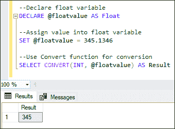
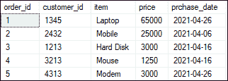

# SQL Server CONVERT

> 原文：<https://www.javatpoint.com/sql-server-convert>

数据类型转换是一种用于将值的数据类型转换为另一种类型的方法。所有编程语言都必须有一些数据类型转换函数。类似地，SQL Server 允许用户隐式地**或显式地**更改值的数据类型。SQL Server 为他们的内部需求执行隐式转换。相反，数据库管理员或程序员在数据转换函数的帮助下执行显式转换。本文将主要关注在微软 SQL Server 中使用 CONVERT 函数。****

 ****CONVERT 函数使用户能够**将一个值的数据类型转换为表达式中指定的另一种类型**。 [SQL Server](https://www.javatpoint.com/sql-server-tutorial) 中的转换函数语法如下:

```sql

CONVERT ( data_type (length) , expr, style)

```

**在语法中，我们使用了以下参数:**

*   **data_type:** 表示我们要转换表达式的目标数据类型。它可以包含以下数据类型作为输入:bigint、int、smallint、tinyint、bit、decimal、numeric、money、float、datetime、char、nchar、varchar、nvarchar、text、ntext、binary、image 等。我们确保输入数据类型不应该是别名类型。
*   **长度:**为可选参数，用于指定目标数据类型的长度。默认情况下，其值为 30。
*   **expr:** 它指定了我们要转换成另一种类型的有效表达式。
*   **样式:**为可选值，表示转换值的输出样式。当它为空时，我们将得到空值。它对于 DATE 数据类型格式很有用。

### 返回值

它将返回一个表达式的值，在该表达式中，我们希望用指定的样式转换数据类型。

## 转换函数示例

让我们用各种实际例子来理解 CONVERT 函数。

**将 FLOAT 转换为 INT**

本示例将浮点值的数据类型转换为整数。这里我们首先声明了一个浮点变量，然后给它们赋值。接下来，我们将借助 convert 函数将浮点值转换为整数，并打印结果。

```sql

--Declare float variable
DECLARE @floatvalue AS Float
--Assign value into a float variable
SET @floatvalue = 345.1346 
--Use Convert function for conversion
SELECT CONVERT(INT, @floatvalue) AS Result

```

执行后，我们将获得以下输出:



**将浮点转换为 Varchar**

本示例将浮点值的数据类型转换为 varchar。它类似于上面的例子，除了这里我们将在 convert 函数的帮助下把浮点值转换成 varchar。

```sql

DECLARE @fvalue AS Float
SET @fvalue = 345.1346 
--Conversion of float into varchar
SELECT CONVERT(varchar, @fvalue) AS Result

```

执行后，我们将获得以下输出:


**将十进制转换为不同长度的另一个十进制**

本示例将在 convert 函数的帮助下，将十进制数转换为另一个零刻度的十进制数。此函数的舍入和截断行为类似于 SQL Server 中的 CAST 函数。

```sql

DECLARE @decimalVal AS DECIMAL
SET @decimalVal = 9.956
SELECT CONVERT(DECIMAL(2, 0), @decimalVal) AS Result

```

执行后，我们将获得以下输出:


**将字符串转换为日期时间**

本示例将借助 convert 函数将字符串 **'2021-04-26'** 转换为 **DATETIME** 值。

```sql

SELECT CONVERT(DATETIME, '2021-04-26') AS Result;

```

执行后，我们将获得以下输出:


**将 DATETIME 转换为 Varchar**

本示例将使用 convert 函数将当前日期和时间转换为具有特定样式的字符串。

```sql

SELECT CONVERT(VARCHAR, GETDATE(), 13) AS Result;

```

执行后，我们将获得以下输出:


**用表格转换功能**

这里我们将看到如何在表中使用 convert 函数来过滤记录。让我们首先使用以下语句创建一个表**“订单”**:

```sql

CREATE TABLE orders (
    order_id INTEGER PRIMARY KEY IDENTITY,
    customer_id INTEGER,
    item TEXT,
    price FLOAT,
	prchase_date DATE
);
INSERT INTO orders (customer_id, item, price, prchase_date)
    VALUES (1345, 'Laptop', 65000.00, '2021-04-26'),
	(2432, 'Mobile', 25000.00, '2021-04-06'),
    (1213, 'Hard Disk', 3000.00, '2021-04-16'),
	(3213, 'Mouse', 1250.00, '2021-04-16'),
	(4313, 'Modem', 3000.00, '2021-04-26');

```

我们可以使用 SELECT 语句来验证该表:



在上表中，**采购日期**为**日期数据类型。**如果我们想获取所选日期范围之间的项目列表，我们可以使用下面的语句。

```sql

SELECT * FROM orders   
WHERE prchase_date   
BETWEEN CONVERT(DATETIME, '2021-04-10') AND CONVERT(DATETIME, '2021-04-20');

```

以下是输出:


### TRY_CONVERT 函数

是 SQL Server 中 CONVERT 函数的**高级形式。在数据转换过程中**保护在查询执行过程中不会出现数据转换错误**是很有用的。有了 CONVERT 函数，我们就有可能在将数据类型转换成另一种形式时，由于数据不合适或不干净而出现错误。但是，这些错误可以通过使用 TRY_CONVERT 函数来避免。CONVERT 和 TRY_CONVERT 函数的语法没有区别。当数据转换产生错误时，如果我们使用 TRY_CONVERT 函数，我们将得到**空**结果。**

让我们看看下面的例子，我们将尝试使用 convert 函数将字符串值转换为整数数据类型:

```sql

SELECT CONVERT(INT, 'Javatpoint') AS Result;

```

当我们执行此查询时，SQL Server 将引发以下错误:


但是，SQL Server 有一个 TRY_CONVERT 函数，可以防止出现这种类型的错误，并返回空值。请参见下面的查询:

```sql

SELECT TRY_CONVERT(INT, 'Javatpoint') AS Result;

```

当我们执行此查询时，SQL Server 返回空值，而不是引发错误:


### CAST 和 CONVERT 函数的区别

SQL Server 总是使用 CAST 和 CONVERT 函数进行数据类型转换。但是，它们有一些差异，我们将在下面讨论:

*   CONVERT 不是 ANSI-SQL 规范的一部分。实际上，它是特定于 SQL 实现的。另一方面，CAST 纯粹是 ANSI-SQL 规范的一部分。
*   它们之间的另一个区别是，CONVERT 函数可以接受一个可选的样式参数，该参数指定转换后数据类型的格式，而 CAST 则不能。
*   CAST 使用“AS”子句分隔参数，而 CONVERT 使用逗号(，)运算符分隔参数。
*   CAST 函数可以在将十进制值转换为整数的过程中保留十进制值。如有必要，它还可以截断十进制值。另一方面，这个功能不能用 CONVERT 函数来实现。

* * *****