# SQL Server 复制表

> 原文：<https://www.javatpoint.com/sql-server-copy-tables>

复制表是指**对现有表**进行克隆或复制。复制表必须包括与原始表相同的表结构、索引、约束和默认值。将现有表中的数据复制到新表中在表失败时备份数据这样的情况下非常有用。它在维护、测试、演示和移动到新实例而不影响原始表的情况下也很有用。

本文将解释我们如何在 [SQL Server](https://www.javatpoint.com/sql-server-tutorial) 中从一个数据库到另一个数据库制作重复表的多种方法。以下是制作重复表的常用方法:

*   使用 SQL 查询
*   使用 SQL Server 管理工作室(SSMS)
*   使用生成脚本

## 使用 SQL 查询

我们可以使用 **SELECT INTO 语句**将表从一个数据库复制到另一个数据库或同一数据库内。该语句将首先创建一个新表，然后将数据复制到其中。如果我们成功地复制了像索引和约束这样的数据库对象，我们必须为每个对象创建一个查询，然后将该查询添加到目标数据库。

**以下是说明 SELECT INTO 语句的语法:**

```

SELECT columns_list INTO new_table_name
FROM source_table_name WHERE conditions;

```

**例**

让我们了解如何使用 SELECT INTO 语句来创建克隆表。假设我们有一个包含以下数据的表'**员工'**:

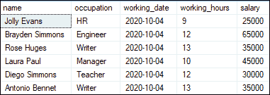

如果我们想通过复制所有记录作为 **backup_employee** 表来复制**雇员**表，我们可以使用 SELECT INTO 语句，如下所示:

```

SELECT * INTO backup_employee FROM employee;

```

克隆表包含的列顺序与 SELECT 语句中指定的顺序相同。这些列具有与原始表相同的名称、数据类型、可空属性和值。如果任何表中存在**标识列**，克隆表中的新列将继承该属性，而无需启用**标识 _ 插入**。

我们可以验证员工数据是否成功插入 **backup_employee** 表，如下所示:

```

SELECT * FROM backup_employee;

```

以下是输出:

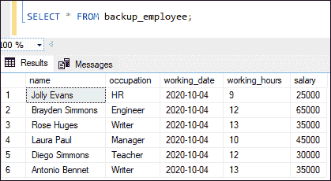

## 使用 SQL Server 管理工作室

我们还可以使用管理工作室制作一个克隆表或将源表数据复制到目标表中。我们可以通过使用 SQL Server 管理工作室的导出和导入向导来实现这一点。要传输/复制数据，用户可以选择使用此向导从源数据库导出或从目标数据库导入。

**以下是从一个数据库到另一个数据库制作克隆表的步骤:**

**步骤 1:** 打开 SQL Server 管理工作室，导航到对象资源管理器。

**步骤 2:** 在对象资源管理器中，选择数据库并将其展开以查看可用的数据库。

**第三步:**选择想要的数据库，右键点击。将打开一个上下文菜单，单击任务选项并选择导出数据命令，如下所示:

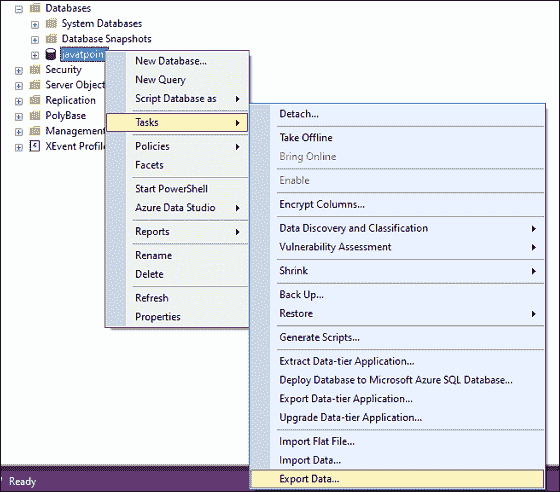

**第四步:**我们会得到“欢迎使用 SQL Server 导入导出向导”，点击下一步按钮。

**第五步:**下一步，我们会看到**【选择数据源】**窗口。在这里，我们需要指定源服务器名称、连接到源服务器的身份验证方法、源数据库名称，然后单击“下一步”按钮。请参见下图:

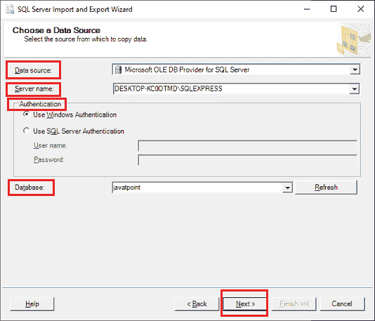

**第六步:**下一步，我们会看到**【选择目的地】**向导。在这里，我们将指定目标服务器名称、与目标服务器连接的身份验证方法、目标数据库名称，然后单击“下一步”按钮。请参见下图:

#### 注意:我们将使用相同的源和目标数据库和服务器。

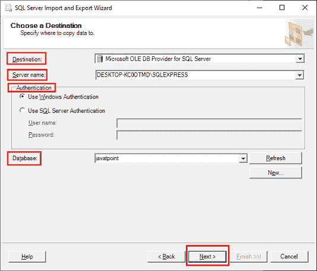

**第 7 步:**下一步将打开**指定表格复制或查询**向导。在这里，我们需要选择“从一个或多个表或视图复制数据”选项，然后单击“下一步”按钮:

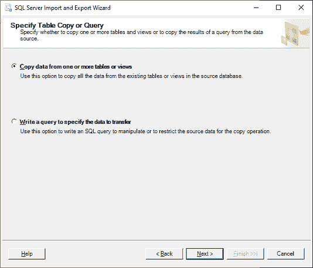

**第 8 步:**该步将打开**选择源表和视图**向导。在这里，我们需要选择要从源复制到目标的表，然后单击“下一步”按钮。

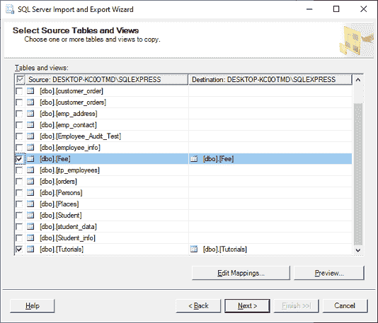

**第 9 步:**我们需要点击**编辑映射**按钮，**勾选****创建目标表**选项，以确保选定的表将在目标数据库中创建。如果任何选定的表都有标识列，我们还必须在单击“确定”按钮之前勾选“启用标识插入”选项。如果我们选择了多个表来复制到目标数据库，我们应该再次单击“编辑映射”选项，并逐个检查每个表。

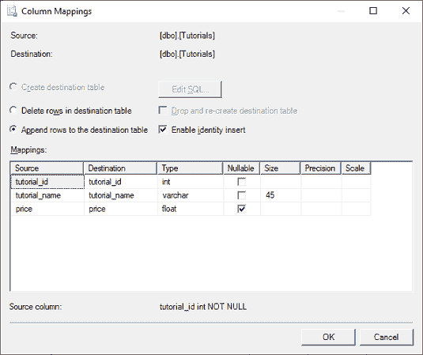

现在，当通过编辑映射检查所有表时，我们将单击下一步按钮。

**第 10 步:**该步将打开**保存并运行包**向导。在这里，我们需要点击下一步按钮。

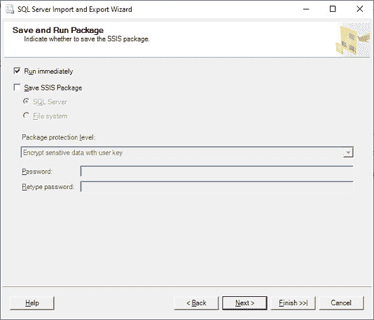

**步骤 11:** 该步骤将打开完成向导步骤。在这里，我们需要单击“完成”按钮。


**第 12 步:**当所有执行成功完成后，我们会看到复制表所采取的步骤以及传输的记录数。在这里，我们需要查看步骤和消息，如果没有错误，请按关闭按钮:

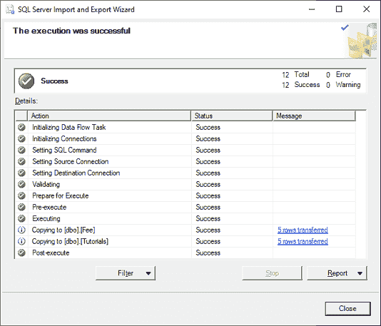

这种方法是制作克隆表的最快方法，但它无法传输或复制表的索引和键。如果我们想创建一个包含索引和关键字的克隆表，我们需要对这些数据库对象使用生成脚本方法。如果我们要克隆的表是外键连接的，我们必须以正确的顺序导出数据。如果我们不这样做，导出向导将失败。

## 使用生成脚本

生成脚本方法是 SQL Server 提供的另一种方法。当我们不仅要将表模式和数据从源数据库复制到目标数据库，还要将对象、索引、触发器、约束、键等复制到目标数据库时，就要使用这种方法。

我们可以使用以下步骤生成一个脚本，将表从一个数据库克隆到另一个数据库:

**步骤 1:** 打开 SQL Server 管理工作室，导航到对象资源管理器。

**步骤 2:** 在对象资源管理器中，选择数据库并将其展开以查看可用的数据库。

**第三步:**选择想要的数据库，右键点击。将会打开一个上下文菜单，单击任务选项并选择生成脚本命令，如下所示:

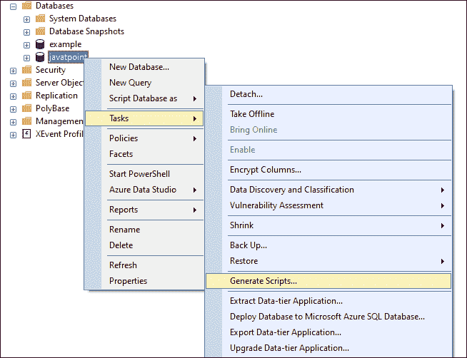

**第 4 步:**下一步将打开**选择对象向导**。在这里，我们将选择“选择特定数据库对象”选项，该选项显示我们将为其生成脚本的表。通过标记相应的表格来选择所需的表格，然后单击下一步按钮:

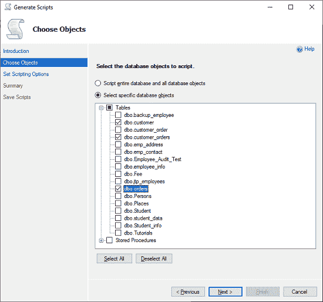

**步骤 5:** 该步骤将打开**设置脚本选项**页面。这里我们将指定我们想要保存生成的脚本文件的路径，然后点击**高级**按钮:

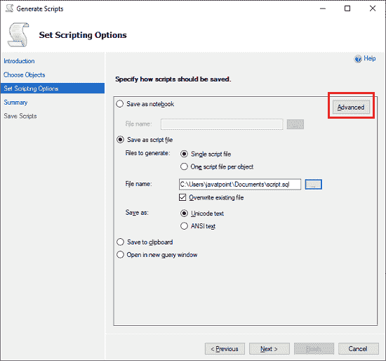

当我们单击“**高级”**选项时，我们将看到高级脚本选项页面。在这里，我们将选择要编写脚本的数据类型，并指定“**模式和数据”**，如下所示:

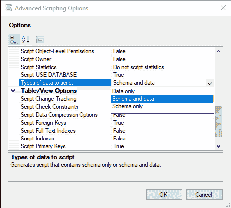

该页面还使我们能够决定为表中的索引和键编写脚本。在此页面上填写必要的详细信息后，单击确定按钮。我们将再次导航回高级脚本选项页面，单击下一步按钮。

**第 6 步:**这一步将打开**总结**页面，我们将回顾整个流程步骤并点击下一步按钮:


**第七步:**下一步将打开**保存脚本**页面，我们可以在这里监控整个过程的进度。如果一切正常，点击**完成**按钮。现在，我们可以在指定的位置找到脚本，并在所需的数据库中执行它。

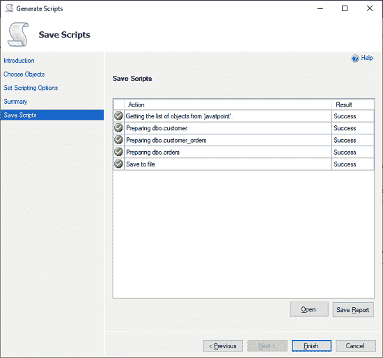

SQL Server 中的脚本方法有助于为表、索引和键的模式和数据生成单个脚本。但是，如果表之间存在关系，此方法不会正确生成表的创建脚本。

### 当数据库文件损坏时该怎么办？

当我们启动任何涉及 SQL Server 数据库的进程或任务时，可能会因为错误或不正确的执行或糟糕的数据库文件处理而导致数据丢失或 SQL Server 数据库文件损坏。“用于 SQL 数据库恢复的内核”是一种 SQL 恢复工具，可在 SQL Server 数据库文件损坏时使用。它可以轻松地恢复损坏、损坏或不活动的 MDF & NDF 文件，同时保持原始文件结构和属性。

### 结论

本文解释了制作从源数据库到目标位置的克隆表以及索引和键的几种方法。这些方法很容易，但是需要很大的努力来复制表，包括索引和键。如果指定的表有关系，这些工具就不能处理表的创建顺序。此外，如果在此过程中出现任何问题，可能会有数据和数据库文件损坏的风险。

* * *