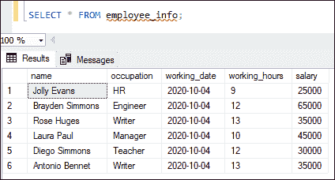
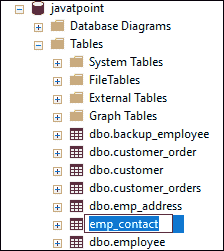

# SQL Server 重命名表

> 原文：<https://www.javatpoint.com/sql-server-rename-table>

当表名不再相关或不再服务于创建目的时，我们可以更改它。SQL Server 不提供任何直接更改表名的命令。但是，它有一个名为 **sp_rename** 的存储过程，使我们能够重命名一个表。在更改表名之前，它必须确保我们对该对象拥有 ALTER 权限。

### 限制和约束

[SQL Server](https://www.javatpoint.com/sql-server-tutorial) 在重命名表时有一些限制，因为当我们重命名表时，并不意味着对该表的所有引用也会被重命名。我们必须手动修改属于重命名表的所有对象。

例如，如果我们想要更改触发器中也引用的表名，则需要修改触发器以反映新的表名。**sys . SQL _ expression _ dependencies**可用于在更改名称前列出对象的所有依赖关系。

**我们可以通过两种方式在 SQL Server 中更改表名:**

*   SQL 查询
*   SQL Server 管理工作室(SSMS)

在更改表名之前，我们必须非常小心。引用该表的现有查询、视图、用户定义函数、存储过程或程序将因名称更改而变得无效。

### SQL 查询

SQL Server 提供了一个名为 SP_RENAME 的标准存储过程，用于重命名当前数据库中用户创建的对象。用户创建的对象可以是表或列。

**以下语法用于重命名表:**

```sql

EXEC sp_rename 'old_table_name', 'new_table_name'

```

**例**

我们可以使用下面的**员工**表来演示表的重命名:


现在，我们将使用 sp_rename 存储过程语法将**雇员**表的名称更改为**雇员 _ 信息**。以下是查询:

```sql

EXEC sp_rename 'employee', 'employee_info';

```

执行此语句时，SQL Server 显示以下消息:


我们将收到此消息，因为在重命名表时，SQL Server 不会自动更改与该表关联的任何引用的名称。但是，该表已成功重命名。我们可以通过执行 SELECT 语句来验证表是否被重命名:



### SQL Server 管理工作室(SSMS)

SSMS 是一个图形用户界面工具，允许我们通过以下方式更改表名:

*   使用对象资源管理器重命名表
*   双击表格名称

让我们详细讨论每一个问题。

**使用对象资源管理器**重命名表格

以下步骤用于使用对象资源管理器重命名表:

**步骤 1:** 转到数据库- >表格菜单并展开它。

**第二步:**选择想要的表格，右键点击选择**重命名**选项。

下图解释了我们将**“客户订单”**表重命名为“**客户订单”**的所有上述步骤:


**第三步:**当我们点击重命名选项时，表名将被更改为可编辑。为所选表格键入新名称，然后按回车键。如果您收到任何提示信息，请单击“是”按钮。


**步骤 4:** 刷新数据库或表，完成重命名步骤。

**步骤 5:** 执行 SELECT 语句，验证更改后的表名。

**双击表格名称**

我们可以使用以下步骤通过双击来重命名表:

**步骤 1:** 转到数据库- >表。

**第二步:**选择要更改的表格，双击。我们可以将表名更改为可编辑的形式。请参见下图:



**步骤 3:** 为您选择的表键入新名称，按回车键，并刷新数据库或表以完成重命名步骤。

### 结论

本文给出了借助存储过程“sp_rename”和 SQL Server Management Studio 更改数据库中表名的完整概述。总是建议使用 T-SQL 查询对数据库或表进行任何更改。使用 SSMS 重命名表不是一个好主意，因为这会使数据库管理员的工作更加难以理解。

* * *