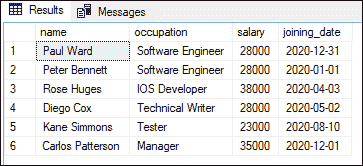

# SQL Server DATEDIFF 函数

> 原文：<https://www.javatpoint.com/sql-server-datediff-function>

SQL Server 中的 DATEDIFF 函数是一个用于基于日期执行数学计算的基本函数。它产生的输出是以年、月、日、分、秒为单位的整数值。**DATEDIFF 函数的官方定义是计算两个日期**的差值。

该功能具有以下特点:

*   用于**查找两个日期**的差异。
*   它属于日期函数类别。
*   **间隔、****第一个日期值、**和**第二个日期值**是该函数接受的三个参数。
*   时间可以包含在该函数的间隔部分和日期值部分。

### 句法

以下是说明 DATEDIFF 函数的语法:

```sql

DATEDIFF( date_part , start_date , end_date)

```

该功能的参数解释如下:

**date_part** :是一个日期的指定部分，比如一年、一个季度、一个月或者一周，我们需要比较起止日期值。它不能在变量或字符串(如“月”)中指定。

**下表显示了所有有效的日期 _ 零件值**。它应该是 date_part 的全名或完整名称的任何指定缩写。它们返回相同的值。

| 日期 _ 零件名称 | 日期 _ 零件缩写 |
| 年 | yy，yyy |
| 四分之一 | qq，q |
| 月 | 嗯，米 |
| 年复一天 | dy，y |
| 天 | dd，d |
| 周 | wk，ww |
| 小时 | 倍硬 |
| 分钟 | 密歇根州 |
| 第二 | ss，s |
| 毫秒 | 女士 |
| 微秒 | 计算机科学硕士 |
| 十亿分之一秒 | 纳秒 |

**开始 _ 日期和结束 _ 日期**:这些是要比较的指定日期。它可以解析为以下值之一:日期、日期时间、日期时间偏移量、日期时间 2、小日期时间或时间。

### 返回类型

该函数以 date_part 参数指定的单位返回一个**整数值**。

### 例子

通过不同的例子，让我们了解一下 DATEDIFF 函数在 [SQL Server](https://www.javatpoint.com/sql-server-tutorial) 中是如何工作的。

**1。以下示例使用 DATEDIFF 函数，比较几个日期部分**中两个日期之间的差异:

```sql

DECLARE 
    @start_date DATETIME2= '2020-12-31 08:00', 
    @end_date DATETIME2= '2021-01-01 10:45';

SELECT 
    DATEDIFF(year, @start_date, @end_date) AS difference_in_year, 
    DATEDIFF(month, @start_date, @end_date) AS difference_in_month, 
    DATEDIFF(day, @start_date, @end_date) AS difference_in_day, 
    DATEDIFF(hour, @start_date, @end_date) AS difference_in_hour, 
    DATEDIFF(minute, @start_date, @end_date) AS difference_in_minute, 
    DATEDIFF(second, @start_date, @end_date) AS difference_in_second, 
    DATEDIFF(millisecond, @start_date, @end_date) AS difference_in_millisecond;

```

执行上述语句将返回以下输出:


**2。下面的示例使用 DATEDIFF 函数，将标量系统函数作为开始日期和结束日期的参数，然后比较它们的差异。**

```sql

SELECT DATEDIFF(millisecond, GETDATE(), SYSDATETIME()) AS difference_in_millisecond;

```

执行上面的语句将返回下面的输出。它的输出在您的系统中可能不同。


**3。这个例子将使用 DATEDIFF 函数来解释他们如何处理表列**。首先，我们将使用下面的语句创建一个**员工信息表**:

```sql

CREATE TABLE [dbo].[employee_info](
	[name] [varchar](45) NOT NULL,
	[occupation] [varchar](35) NOT NULL,
	[salary] [int] NULL,
	[joining_date] [date] NULL,
) ON [PRIMARY]

```

接下来，我们将在该表中插入一些值，如下所示:

```sql

INSERT INTO employee_info VALUES 
('Paul Ward', 'Software Engineer', 28000, '2020-12-31'),     
('Peter Bennett', 'Software Engineer', 28000, '2020-01-01'), 
('Rose Huges', 'IOS Developer', 38000, '2020-04-03'), 
('Diego Cox', 'Technical Writer', 28000, '2020-05-02'), 
('Kane Simmons', 'Tester', 23000, '2020-8-10'), 
('Carlos Patterson', 'Manager', 35000, '2020-12-01');

```

执行 SELECT 语句将返回以下输出:



现在，我们将借助 DATEDIFF 函数计算表格中每个员工的持续时间**。请参阅使用 DATEDIFF 查询前后的表格:**

```sql

SELECT *, GETDATE() As "current date",
DATEDIFF(day, joining_date, GETDATE()) AS " Number of Days ",
DATEDIFF(month, joining_date, GETDATE()) AS " Number of Months ",
DATEDIFF(year, joining_date, GETDATE()) AS " Number of Years "
 FROM employee_info;

```

它将返回以下输出:


我们可以看到，通过使用 **GETDATE()函数**，对于每个员工，当前日期显示在不同的列中。然后通过从加入日期中减去该日期来计算天数、月数和年数。

### 摘要

*   DATEDIFF()函数将日期和时间值作为参数处理。
*   如果我们试图给函数参数提供非日期格式的变量，编译器会引发错误。
*   当我们需要找到时间戳的不同日期部分之间的差异时，这个函数非常有用。

* * *