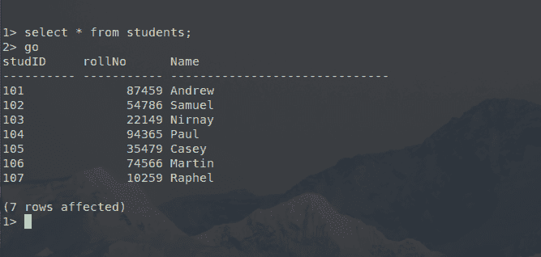
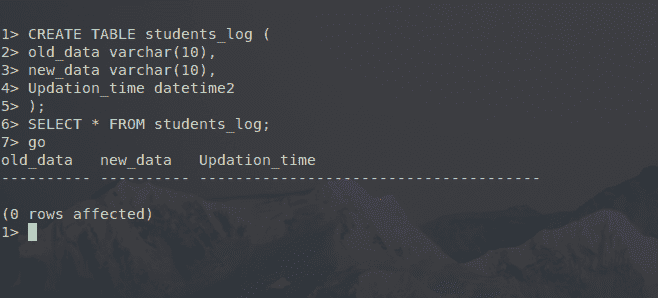
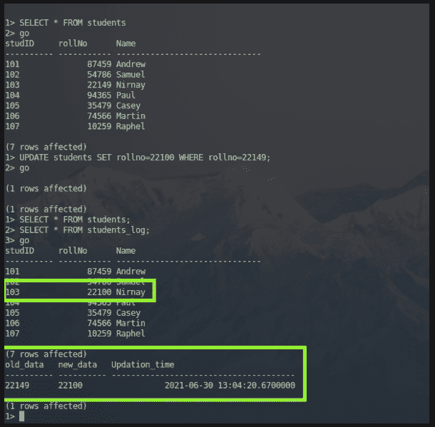
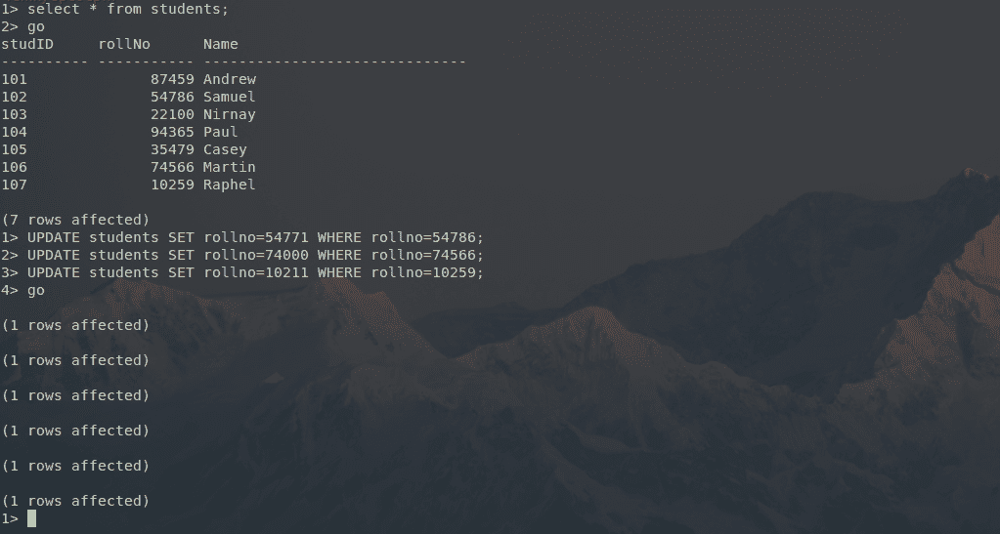
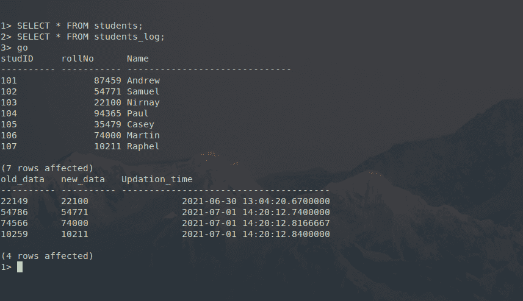
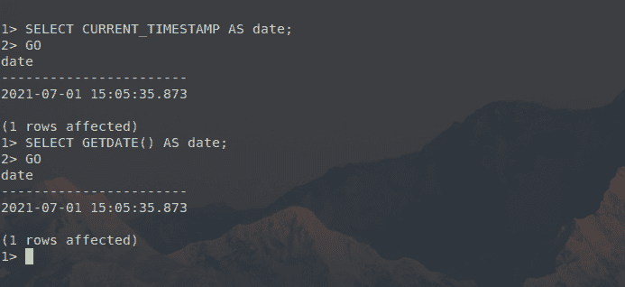

# SQL Server 当前时间戳函数

> 原文：<https://www.javatpoint.com/sql-server-current_timestamp-function>

如果我们想得到一个系统当前运行 SQL server 的确切时间，可以使用 SQL Server 提供的 **CURRENT_TIMESTAMP** 函数。函数的作用是:以“YYYY-MM-DD hh:mm:ss.mmm”格式返回计算机的当前时间戳。SQL Server CURRENT_TIMESTAMP 函数在我们想要记录 SQL Server 中特定表的更新或删除操作的场景中非常有用。

**CURRENT _ TIMESTAMP 函数语法:**

CURRENT _ 时间戳函数的语法如下:

```

SELECT CURRENT_TIMESTAMP AS name_of_column;

```

在上面编写的语法中，CURRENT_TIMESTAMP 是函数的名称，name_of_column 可以是我们希望给列的任何名称，在该列下，当前时间戳将作为查询的结果显示。CURRENT _ 时间戳函数没有参数。

**如何在 SQL Server 中使用 CURRENT_TIMESTAMP 函数？**

让我们通过一个例子来了解当前时间戳函数在 SQL Server 中的用法和工作原理。让我们创建一个名为 studID、rollno 和 Name 的表，其中 studID、roll no 和 Name 的数据类型分别为 varchar、int 和 varchar。使用 CREATE TABLE 命令创建具有上述模式的表的语法是:

```

CREATE TABLE students (
	studID varchar(10),
	rollNo int,
	Name varchar(30)
);

```


如图所示，我们已经成功地创建了一个具有上述模式的三列表，其中两列的数据类型为 varchar，一列为 int。

现在，让我们给学生的表格添加一些数据。SQL Server 中的 INSERT 命令在**学生表**中添加数据的语法为:

```

INSERT INTO students(studID, rollNo, Name) VALUES(101, 87459, "Andrew");
INSERT INTO students(studID, rollNo, Name) VALUES(102, 54786, "Samuel");
INSERT INTO students(studID, rollNo, Name) VALUES(103, 22149, "Nirnay");
INSERT INTO students(studID, rollNo, Name) VALUES(104, 94365, "Paul");
INSERT INTO students(studID, rollNo, Name) VALUES(105, 35479, "Casey");
INSERT INTO students(studID, rollNo, Name) VALUES(106, 74566, "Martin");
INSERT INTO students(studID, rollNo, Name) VALUES(107, 10259, "Raphel");
INSERT INTO students(studID, rollNo, Name) VALUES(108, 85488, "Akul");

```



如图所示，我们已经成功地向学生表中添加了七行，在 SELECT 查询的结果中也可以看到同样的情况。

下一步是在学生表上的 UPDATE 命令上创建一个触发器。因此，每当对学生表执行 UPDATE 命令时，它都会将 UPDATE 记录记录在名为 students_log 的日志表中。为了存储日志信息，首先创建一个名为 students_log 的表，该表有三列 old_data、new_data 和 updation _ time，数据类型为 varchar、varchar 和 datetime2。使用 CREATE TABLE 命令创建具有上述模式的表的语法是:

```

 CREATE TABLE students_log (
	old_data varchar(10),
	new_data varchar(10),
	Updation_time datetime2

);

```



如上图所示，我们成功创建了一个名为 students_log 的表，用于记录学生表上的更新信息。现在让我们创建一个名为 log _ updation 的触发器，每当在学生表上执行更新命令时，该触发器都会被执行。在学生表上为 UPDATE 命令创建触发器的语法是:

```

CREATE TRIGGER log_updation ON students FOR UPDATE AS
DECLARE @new_data int;
DECLARE @old_data int;
SELECT @new_data = i.rollno from inserted i;
SELECT @old_data = o.rollno from deleted o;
BEGIN
INSERT INTO students_log(old_data,new_data,updation_time) VALUES(@old_data,@new_data, CURRENT_TIMESTAMP );
END

```


如图所示，名为 log_update 的触发器已成功创建，该触发器将在 students_log 表中添加新的、旧的数据和当前时间戳。为了输入当前时间戳，我们使用了 SQL Server 提供的 CURRENT_TIMESTAMP 函数，使用 CURRENT_TIMESTAMP 函数在学生日志表中输入当前时间戳的语法是:

```

INSERT INTO students_log(old_data,new_data,updation_time) VALUES(@old_data,@new_data, CURRENT_TIMESTAMP );

```

现在让我们更新学生表中的一个值，看看数据是否被添加到 studnets_log 表中。更新学生表中的值的语法是:

```

UPDATE students SET rollno=22100 WHERE rollno=22149;

```



从上图中我们可以看到，当我们对学生表执行 UPDATE 查询时，它做了两件事，第一件事是更新表中的 rollno 列，第二件事是调用“log _ updation”触发器，该触发器使用 CURRENT_TIMESTAMP 函数在 students_log 表中输入了更新的值和以前的值以及更新的时间。

现在让我们更新学生表中的更多列，并观察输出。对其的查询如下:

```

UPDATE students SET rollno=54771 WHERE rollno=54786;
UPDATE students SET rollno=74000 WHERE rollno=74566;
UPDATE students SET rollno=10211 WHERE rollno=10259;

```



如图所示，我们对学生表执行了三次更新查询，作为输出，“受影响的 1 行”显示了六次。它显示六次，因为三次用于学生表中的更新，三次用于学生日志表中的条目，使用的触发器是我们在学生表的 UPDATE 命令中创建的。



如图所示，我们已经成功更新了学生表三列中的 rollnos，并且这些更新查询的详细信息已成功记录在**学生日志**表中，我们还可以看到在**学生日志**表中添加了三个新行。

我们可以在学生日志表的 updation _ time 列中输入当前时间戳时使用默认关键字。当我们将默认关键字与 CURRENT_TIMESTAMP 函数一起使用时，数据将自动插入到该列中，而无需解释在该列中添加数据。将默认关键字与 CURRENT_TIMESTAMP 函数一起使用的语法是:

```

CREATE TABLE students_log (
	old_data varchar(10),
	new_data varchar(10),
	Updation_time datetime2 DEFAULT CURRENT_TIMESTAMP

);

```

如果我们在 CURRENT_TIMESTAMP 函数中使用默认关键字，那么在学生表的 UPDATE 查询上创建触发器来记录该表的所有 UPDATE 操作的语法是:

```

CREATE TRIGGER log_updation ON students FOR UPDATE AS
DECLARE @new_data int;
DECLARE @old_data int;
SELECT @new_data = i.rollno from inserted i;
SELECT @old_data = o.rollno from deleted o;
BEGIN
INSERT INTO students_log(old_data,new_data) VALUES(@old_data,@new_data);
END

```

以前的语法和这个新语法的区别在于 INSERT 命令。在上一个示例中，我们在 studnet_log 表的 INSERT 命令中为三列传递了三个值，但是在这个新语法中，我们只为 studnet_log 表的三列传递了两个值，因为我们使用了 default 关键字将当前时间戳作为默认值添加到 studnet_log 表的 updation _ date 列中。

除了使用 CURRENT_TIMESTAMP 函数，我们还可以使用 GETDATE()函数。GETDATE()函数与 CURRENT_TIMESTAMP 函数非常相似。CURRENT_TIMESTAMP 函数和 GETDATE()函数的唯一区别是 CURRENT_TIMESTAMP 函数是 ANSI SQL 函数，而另一方面 GETDATE 是同一函数的 T-SQL 实现。它们都是从运行 SQL Server 实例的计算机的操作系统中派生的值。

因此，如果我们使用 GETDATE()函数来创建名为“log _ updation”的触发器，那么它的语法将是:

```

CREATE TRIGGER log_updation ON students FOR UPDATE AS
DECLARE @new_data int;
DECLARE @old_data int;
SELECT @new_data = i.rollno from inserted i;
SELECT @old_data = o.rollno from deleted o;
BEGIN
INSERT INTO students_log(old_data,new_data,updation_date) VALUES(@old_data,@new_data,GETDATE());
END

```

用 CURRENT_TIMESTAMP 函数和用 GETDATE()函数创建触发器的语法之间的唯一区别是我们在 students_log 表的 updation date 列中为数据传递的参数。



```

SELECT CURRENT_TIMESTAMP AS date;

SELECT GETDATE() AS date;

```

正如我们所看到的，上面两个查询的输出是相同的，所以我们可以说 CURRENT_TIMESTAMP 函数和 GETDATE()函数可以在各种 SQL Server 查询中互换使用。

这是一个我们可以使用 CURRENT_TIMESTAMP 函数或 GETDATE()函数的场景，可以有任何场景使用 SQL Server 提供的这两个函数。

因此，本文有助于我们更好地了解 SQL Server CURRENT_TIMESTAMP 函数及其在不同场景中的使用。

* * *