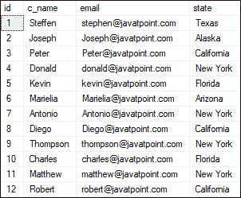
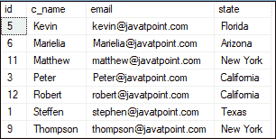
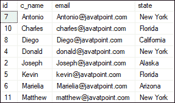

# SQL Server 偏移量获取

> 原文：<https://www.javatpoint.com/sql-server-offset-fetch>

本文将解释在**中使用 OFFSET FETCH 功能来检索内存有限的记录，并避免内存不足的异常**。SQL Server 中的 FETCH 和 OFFSET 子句与 SELECT 和 ORDER BY 子句结合使用，以限制查询返回的记录范围。它是**在 2012 版**中首次引入的，用于对结果集进行分页。当我们的数据库包含大量数据时，它非常有用。

### 偏移量和 FETCH 的用法

**OFFSET** :该子句用于**指定从结果集中返回行的起始点**。基本上，它忽略了初始记录集。SQL Server 只能在 ORDER BY 子句中使用它。如果其值为**负值**，将返回一个错误。因此，它应该始终大于或等于零。

**FETCH** :是一个可选的子句，**提供了查询中 OFFSET 之后我们想要返回的行数**。没有 OFFSET 我们就不能使用它。其值不能为负，类似于 OFFSET。因此，它应该总是大于或等于零；否则，它将抛出一个错误。

### 句法

以下是说明 OFFSET 和 FETCH 子句使用的语法:

```sql

SELECT * FROM table_name
ORDER BY columns [ASC |DESC]
OFFSET no_of_rows_to_skip
FETCH {FIRST | NEXT} no_of_rows_to_return {ROW | ROWS} ONLY

```

在这个语法中，我们已经定义了**表名**，将从中检索数据。接下来，我们为以升序或降序显示的记录指定了 **ORDER BY** 子句。接下来我们指定 **OFFSET** 跳过记录数，最后用 **FETCH** 返回记录集。

### 例子

让我们实际理解 OFFSET 和 FETCH 子句的用法。假设我们有一个名为**客户**的表，其中包含以下数据:



假设你想得到从 5 **到下四行**的**记录范围。我们可以通过使用 OFFSET 和 FETCH 子句轻松地做到这一点。以下是查询:**

```sql

SELECT * FROM customer 
ORDER BY c_name 
OFFSET 5 ROWS 
FETCH NEXT 4 ROWS ONLY;

```

执行该语句将返回以下输出，其中 OFFSET 5 跳过五行，**仅提取 4 行**以显示所需的结果。


如果我们想跳过前五条客户记录并返回其余记录，我们只需要使用 OFFSET 子句，如下查询所示:

```sql

SELECT * FROM customer 
ORDER BY c_name 
OFFSET 5 ROWS;

```

执行该语句将返回所需的输出:



如果我们希望**根据客户名称的升序检索前 6 名客户**，我们需要同时使用 OFFSET 和 FETCH 子句，如下所示:

```sql

SELECT * FROM customer 
ORDER BY c_name 
OFFSET 0 ROWS 
FETCH NEXT 6 ROWS ONLY;

```

执行查询将返回所需的结果:



如果我们想让**在按名称排序时得到客户的最后三条记录**，我们可以使用如下的 OFFSET 和 FETCH 子句:

```sql

SELECT c_name, email, state FROM customer ORDER BY c_name 
OFFSET (SELECT COUNT(*) FROM customer) - 3 ROWS
FETCH NEXT 3 ROWS ONLY;

```

执行查询将返回所需的结果:


如果我们在没有 OFFSET 子句的情况下执行上述语句，我们将会得到一个错误:

```sql

SELECT c_name, email, state FROM customer 
ORDER BY c_name 
FETCH NEXT 3 ROWS ONLY;

```

SQL Server 将通过以下错误消息:


## TOP 和 OFFSET & FETCH 子句之间的区别

TOP 和 OFFSET FETCH 子句都用于限制查询在 SQL Server 中返回的行数。但是，它们有一些差异，如下表所示:

| 顶端 | 偏移& FETCH |
| TOP 子句只能返回查询结果中的特定记录。 | OFFSET 和 FETCH 返回查询中的记录集。OFFSET 用于跳过行数，FETCH 提供结果中 OFFSET 之后我们想要返回的行数。 |
| TOP 不符合 ANSI 标准，因此它只能用于像 SQL Server 和 MS-Access 这样的微软产品。 | OFFSET 和 FETCH 子句符合 ANSI 标准，最近被添加到 SQL Server 2012 中。 |
| TOP 子句可以在 SELECT 语句的列列表中使用，也可以不使用 ORDER BY。 | 它应该总是与 ORDER BY 子句一起使用。 |
| 它不能从结果中间返回记录。 | 它可以从结果中间返回记录。 |
| 它支持 SQL Server 版及以上版本。 | 它支持 SQL Server 版及以上版本。 |

* * *