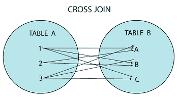
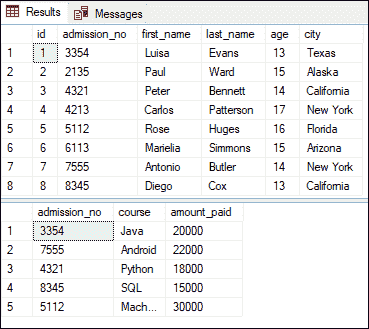
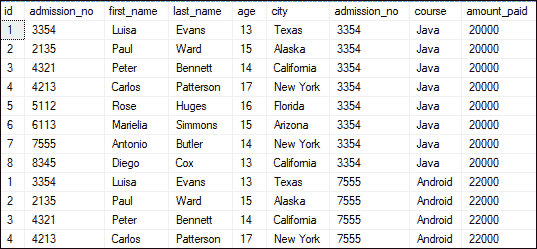
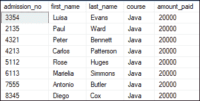
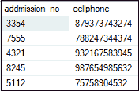

# SQL Server 交叉连接

> 原文：<https://www.javatpoint.com/sql-server-cross-join>

CROSS JOIN 通过组合两个或多个表的所有可能性来生成结果，这两个表包含所有贡献表中的每一行。换句话说，它通过生成参与连接操作的所有表的每一行的成对组合来返回结果。这种连接有时也被称为**笛卡尔连接**，它提供所有关联表的笛卡尔乘积。

**笛卡尔乘积**可以解释为第一个表中的所有行乘以第二个表中的所有行。它类似于 INNER JOIN，该子句不提供连接条件。

我们可以用下面的可视化表示来理解，其中 CROSS JOIN 返回来自**表 1** 和**表 2** 的所有记录，第一个表的每一行与第二个表的每一行组合。



### 交叉连接语法

使用 SELECT 语句时，必须在 FROM 子句后添加 CROSS JOIN 关键字。使用以下语法检索两个联接表中的所有记录:

```sql

SELECT column_lists  
FROM table1  
CROSS JOIN table2;  

```

在上面的语法中，**column _ list**是您想要返回的列或字段的名称，table1 和 table2 是您从中获取记录的表名。

#### 注意:SQL Server 中的交叉联接不能使用带有联接条件的 ON 子句。但是，所有其他联接都可以将其与联接条件一起使用。当我们试图在交叉连接上使用 ON 子句时，我们会得到一个语法错误。

### 交叉连接示例

让我们通过例子来了解 CROSS JOIN 在 SQL Server 中是如何工作的。假设我们有两个名为“**学生**”的表，包含学生信息和包含费用详细信息的“**费用**”。以下是表格输出:



如果我们想从两个表中获取所有记录，我们使用下面的语句:

```sql

SELECT *  
FROM Student  
CROSS JOIN Fee;

```

执行上述记录后，我们将获得以下输出:



当我们执行上面的语句时，我们会观察到它显示了 40 行。这意味着学生表中的八行乘以费用表中的五行。

在上面的输出图像中，我们注意到该表包含几个重复的列。如果要避免这种重复，建议使用单独的列名，而不是 SELECT *语句。

### 交叉连接中的模糊列问题

假设我们只想从所有参与的表中检索选定的列，并且这些表包含一些相同的列名。在这种情况下，SQL Server **抛出一个错误:列名不明确**。它表示列的名称出现在两个表中，并且 [SQL Server](https://www.javatpoint.com/sql-server-tutorial) 不确定要检索哪个列。以下示例可以帮助您更好地理解它:

```sql

SELECT admission_no, first_name, last_name, course, amount_paid  
FROM Student  
CROSS JOIN Fee;  

```

执行此语句将产生以下错误消息:


但是，我们可以通过在列名之前指定表名来解决这个问题。因此，我们可以将上面的查询重写如下，以消除这个错误:

```sql

SELECT Student.admission_no, Student.first_name, Student.last_name, 
Fee.course, Fee.amount_paid  
FROM Student  
CROSS JOIN Fee;

```

执行查询将返回以下输出:



### 带 WHERE 子句的交叉连接

我们使用 WHERE 子句从表中检索筛选的行。以下查询将**获取两张表**中录取人数相同的学生记录:

```sql

SELECT Student.admission_no, Student.first_name, Student.last_name, 
Fee.course, Fee.amount_paid  
FROM Student  
CROSS JOIN Fee
WHERE Student.admission_no = Fee.admission_no;  

```

执行查询将返回所需的结果:


### 带 ORDER BY 子句的交叉联接

ORDER BY 子句用于以指定的顺序排列表的结果。顺序可以是升序或降序。以下查询将**按照课程名称**的升序显示结果:

```sql

SELECT Student.admission_no, Student.first_name, Student.last_name, 
Fee.course, Fee.amount_paid  
FROM Student  
CROSS JOIN Fee
WHERE Student.admission_no = Fee.admission_no
ORDER BY course;

```

执行查询将按课程名称的升序返回学生信息:


### 多表交叉连接

交叉连接也可以用于两个以上的表。在这里，我们将实际学习连接两个以上的表。我们已经有两张名为“**学生**”和“**费**的桌子了。让我们再创建一个表，并使用以下查询将其命名为“**联系人**”:

```sql

CREATE TABLE contact ( 
 addmission_no INT,
 cellphone BIGINT
)
--insert values
INSERT INTO contact (addmission_no, cellphone)
VALUES (3354, 879373743274), (7555, 788247344374),
(4321, 932167583945), (8245, 987654985632),
(5112, 75758904532);

```

我们可以使用 SELECT 语句来验证该表:



让我们执行下面的查询，该查询连接名为 student、fee 和 contact 的三个表。在此语句中，首先在学生和 fee 之间完成 CROSS JOIN，然后它将根据 WHERE 子句中指定的条件与 contact 表连接:

```sql

SELECT Student.admission_no, Student.first_name, Student.last_name, 
Fee.course, Fee.amount_paid, contact.cellphone
FROM Student  
CROSS JOIN Fee
CROSS JOIN contact
WHERE Student.admission_no = Fee.admission_no AND Fee.admission_no = contact.addmission_no;  

```

执行查询将返回以下输出:


### 交叉连接和内部连接的区别

这是一个关于 SQL 面试问题的重要话题。SQL Server 中交叉连接和内部连接之间的主要区别解释如下:

| 内部连接 | 交叉连接 |
| 此联接仅返回表中符合指定条件的记录，并隐藏其他行和列。如果我们没有指定任何联接，它将假定为默认联接。 | 它返回两个表中记录的所有可能组合。它还返回两个表的笛卡尔乘积。笛卡尔乘积意味着第一个表中的所有行乘以第二个表中的所有行。 |
| 只有在表中找到一个匹配的列时，才会发生这种连接。 | 这种联接不需要匹配的列来联接两个表。 |
| 它组合了行，这意味着如果两个参与的表有 100 条记录，那么内部连接只返回 100 条记录。 | 它不合并行，这意味着如果两个参与的表有 100 条记录，那么交叉联接将返回 10000 条记录。 |
| 它的性能很快，因为它消耗的资源更少。 | 它的性能很慢，因为它消耗更多的资源。 |

* * *