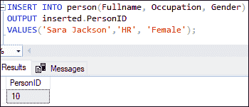
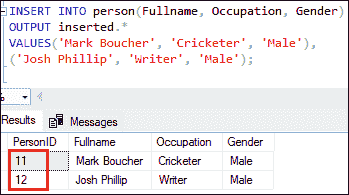
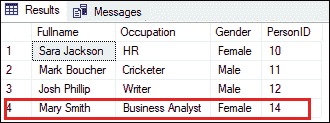
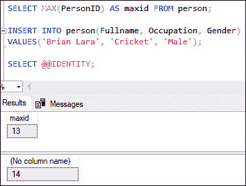
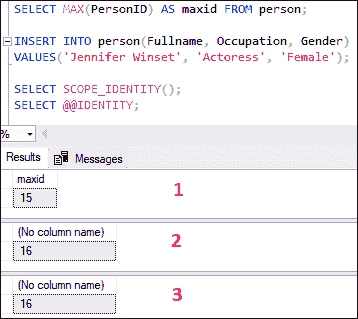
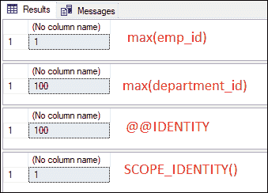
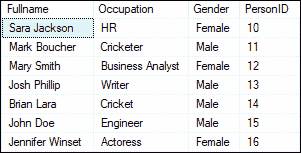
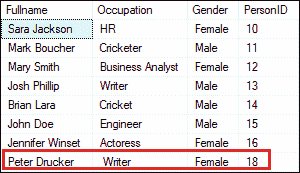

# SQL Server 标识

> 原文：<https://www.javatpoint.com/sql-server-identity>

身份关键字是 SQL Server 中的一个属性。**当一个表列定义了一个标识属性时，它的值将是自动生成的增量值**。该值由服务器自动创建。因此，我们不能以用户身份手动在身份列中输入值。因此，如果我们将一列标记为标识，SQL Server 将以自动递增的方式填充它。

### 句法

以下是说明在 SQL Server 中使用 IDENTITY 属性的语法:

```

IDENTITY[(seed, increment)]

```

**以上语法参数解释如下:**

*   **Seed:** 表示加载到表中的行的起始值。默认情况下，其值为 1。
*   **增量:**表示增量值，加到最后一个加载行的标识值上。默认情况下，其值为 1。

**让我们通过一个简单的例子来理解这个概念。**

假设我们有一个“**学生**”表，我们希望自动生成**学生标识**。我们有一个 10 的**开头学生证，想用每个新的学生证加 1。在这种情况下，必须定义以下值。**

**种子:** 10

**增量:** 1

```

CREATE TABLE Student (
 StudentID INT IDENTITY(10, 1) PRIMARY KEY NOT NULL, 
) 

```

#### 注意:在 SQL Server 中，每个表只允许有一个标识列。

## SQL Server 标识示例

让我们了解如何使用表中的 identity 属性。可以在创建新表时或创建后设置列中的 identity 属性。这里我们将通过例子来看这两种情况。

### 带有新表的身份属性

以下语句将在指定的数据库中创建一个带有 identity 属性的新表:

```

CREATE TABLE person (
    PersonID INT IDENTITY(10,1) PRIMARY KEY NOT NULL,
    Fullname VARCHAR(100) NOT NULL,
    Occupation VARCHAR(50),
    Gender VARCHAR(10) NOT NULL
);

```

接下来，我们将在该表中插入一个带有 **OUTPUT** 子句的新行，以查看自动生成的人员 id:

```

INSERT INTO person(Fullname, Occupation, Gender)
OUTPUT inserted.PersonID
VALUES('Sara Jackson', 'HR', 'Female');

```

执行此查询将显示以下输出:



该输出显示，第一行已经插入了值为十的**personad**列，如表定义标识列中所指定的。

让我们在**人员表**中插入另一行，如下所示:

```

INSERT INTO person(Fullname, Occupation, Gender)
OUTPUT inserted.*
VALUES('Mark Boucher', 'Cricketer', 'Male'),
('Josh Phillip', 'Writer', 'Male');

```

该查询将返回以下输出:



该输出显示，在 PersonID 列中，第二行插入了值 11，第三行插入了值 12。

### 现有表的身份属性

我们将解释这个概念，首先删除上面的表，并在没有标识属性的情况下创建它们。执行以下语句删除该表:

```

DROP TABLE person;

```

接下来，我们将使用下面的查询创建一个表:

```

CREATE TABLE person (
    Fullname VARCHAR(100) NOT NULL,
    Occupation VARCHAR(50),
    Gender VARCHAR(10) NOT NULL
); 

```

如果我们想在现有表中添加一个带有 identity 属性的新列，我们需要使用 ALTER 命令。下面的查询将把 PersonID 作为身份列添加到 person 表中:

```

ALTER TABLE person  
ADD PersonID INT IDENTITY(10,1) PRIMARY KEY NOT NULL; 

```

### 向标识列显式添加值

如果我们通过显式指定标识列值向上表中添加一个新行，SQL Server 将抛出一个错误。请参见下面的查询:

```

INSERT INTO person(Fullname, Occupation, Gender, PersonID)
VALUES('Mary Smith', 'Business Analyst', 'Female', 13);

```

执行此查询将通过以下错误:


要显式插入标识列值，我们需要首先将 IDENTITY_INSERT 值设置为 ON。接下来，执行插入操作，将新行添加到表中，然后将 IDENTITY_INSERT 值设置为 OFF。请参见下面的代码脚本:

```

SET IDENTITY_INSERT person ON

/*INSERT VALUE*/  
INSERT INTO person(Fullname, Occupation, Gender, PersonID)
VALUES('Mary Smith', 'Business Analyst', 'Female', 14);

SET IDENTITY_INSERT person OFF  

SELECT * FROM person;

```

**IDENTITY_INSERT ON** 允许用户将数据放入 IDENTITY 列，而 **IDENTITY_INSERT OFF** 阻止用户向该列添加值。

执行代码脚本将显示下面的输出，我们可以看到值为 14 的 PersonID 被成功插入。



## 身份函数

SQL Server 为处理表中的标识列提供了一些标识函数。下面列出了这些身份功能:

1.  @@IDENTITY 函数
2.  作用域 _ 身份()函数
3.  识别当前功能
4.  身份函数

让我们用一些例子来看看 IDENTITY 函数。

### @@IDENTITY 函数

@@identity 是一个系统定义的函数，**显示在同一会话中为 identity 列的表中创建的最后一个 IDENTITY 值**(最大使用的 IDENTITY 值)。此函数列返回在表中插入新条目后由语句生成的标识值。当我们执行一个不创建身份值的查询时，它返回一个**空值**。它始终在当前会话的范围内工作。不能远程使用。

**例**

假设我们在 person 表中的当前最大标识值是 13。现在，我们将在同一个会话中添加一条记录，将标识值增加 1。然后我们将使用@@IDENTITY 函数来获取在同一会话中创建的最后一个 IDENTITY 值。

下面是完整的代码脚本:

```

SELECT MAX(PersonID) AS maxidentity FROM person;

INSERT INTO person(Fullname, Occupation, Gender)
VALUES('Brian Lara', 'Cricket', 'Male');

SELECT @@IDENTITY; 

```

执行该脚本将返回以下输出，其中我们可以看到最大使用标识值为 14。



### 作用域 _ 身份()函数

SCOPE_IDENTITY()是一个系统定义的函数，用于在当前作用域下的表格中**显示最近的标识值**。该范围可以是模块、触发器、函数或存储过程。它类似于@@IDENTITY()函数，只是这个函数的作用域有限。如果我们在同一个作用域中生成值的插入操作之前执行 SCOPE_IDENTITY 函数，它将返回空值。

**例**

下面的代码在同一个会话中同时使用了@IDENTITY 和 SCOPE_IDENTITY()函数。本示例将首先显示最后一个标识值，然后向表中插入一行。接下来，它执行两个身份函数。

```

SELECT MAX(PersonID) AS maxid FROM person;

INSERT INTO person(Fullname, Occupation, Gender)
VALUES('Jennifer Winset', 'Actoress', 'Female');

SELECT SCOPE_IDENTITY();
SELECT @@IDENTITY;

```

执行代码将在当前会话中显示相同的值和相似的范围。请参见下面的输出图像:



现在我们将通过一个例子来看看这两个函数是如何不同的。首先，我们将使用下面的语句创建两个名为**员工 _ 数据**和**部门**的表:

```

CREATE TABLE employee_data (
 emp_id INT IDENTITY(1, 1) PRIMARY KEY NOT NULL, 
 fullname VARCHAR(20) NULL
)
GO
CREATE TABLE department (
 department_id INT IDENTITY(100, 5) PRIMARY KEY, 
 department_name VARCHAR(20) NULL
); 

```

接下来，我们在 employee_data 表上创建一个 INSERT 触发器。每当我们在 employee_data 表中插入一行时，都会调用该触发器在 department 表中插入一行。

下面的查询创建了一个触发器，用于在 employee_data 表的每个插入查询的部门表中插入默认值**‘IT’**:

```

CREATE TRIGGER Insert_Department  
ON employee_data  
FOR INSERT AS   
 BEGIN  
  INSERT INTO department  VALUES ('IT')  
 END; 

```

创建触发器后，我们将在 employee_data 表中插入一条记录，并看到@@IDENTITY 和 SCOPE_IDENTITY()函数的输出。

```

INSERT INTO employee_data VALUES ('John Mathew'); 

```

执行查询将向 employee_data 表中添加一行，并在同一会话中生成一个标识值。一旦在 employee_data 表中执行了插入查询，它就会自动调用触发器在 department 表中添加一行。对于 employee_data，身份种子值为 1，对于 department 表，身份种子值为 100。

最后，我们执行下面的语句，显示 SELECT @@IDENTITY 函数的输出 100 和 SCOPE_IDENTITY 函数的输出 1，因为它们只在同一个作用域中返回标识值。

```

SELECT MAX(emp_id) FROM employee_data
SELECT MAX(department_id) FROM department

SELECT @@IDENTITY
SELECT SCOPE_IDENTITY()

```

结果如下:



### 识别当前()函数

IDENT_CURRENT 是一个系统定义的函数，用于**显示在任何连接下为给定表生成的最新身份值**。此函数不考虑创建标识值的 SQL 查询的范围。这个函数需要我们想要获取其标识值的表名。

**例**

我们可以通过首先打开两个连接窗口来理解它。我们将在第一个窗口中插入一条记录，在 person 表中生成标识值 15。接下来，我们可以在另一个连接窗口中验证这个标识值，在那里我们可以看到相同的输出。下面是完整的代码:

```

1st Connection Window

INSERT INTO person(Fullname, Occupation, Gender)
VALUES('John Doe', 'Engineer', 'Male');
GO
SELECT MAX(PersonID) AS maxid FROM person;

2nd Connection Window

SELECT MAX(PersonID) AS maxid FROM person;
GO
SELECT IDENT_CURRENT('person') AS identity_value;

```

在两个不同的窗口中执行上述代码将显示相同的标识值。


### 身份()函数

identity()函数是一个系统定义的函数**，用于将一个 IDENTITY 列插入到一个新的表**中。这个函数不同于我们在 CREATE TABLE 和 ALTER TABLE 语句中使用的 IDENTITY 属性。我们只能在 SELECT INTO 语句中使用该函数，该语句在将数据从一个表传输到另一个表时使用。

以下语法说明了此函数在 SQL Server 中的使用:

```

IDENTITY (data_type , seed , increment) AS column_name

```

如果源表有一个 IDENTITY 列，默认情况下，用 SELECT INTO 命令形成的表会继承它。**例如**，我们之前已经创建了一个带有身份列的表人。假设我们使用带有 IDENTITY()函数的 SELECT INTO 语句创建了一个继承 person 表的新表。在这种情况下，我们将得到一个错误，因为源表已经有一个标识列。请参见下面的查询:

```

SELECT IDENTITY(INT, 100, 2) AS NEW_ID, 
    PersonID,
    Fullname,
    Occupation,
    Gender 
INTO person_info
FROM person;

```

执行上述语句将返回以下错误消息:


让我们使用下面的语句创建一个没有标识属性的新表:

```

CREATE TABLE student_data (
 roll_no INT PRIMARY KEY NOT NULL, 
 fullname VARCHAR(20) NULL
)

```

然后，使用包含身份函数的 SELECT INTO 语句复制该表，如下所示:

```

SELECT IDENTITY(INT, 100, 1) AS student_id,
  roll_no,
  fullname
INTO temp_data
FROM student_data;

```

一旦语句执行，我们可以使用显示表属性的 **sp_help** 命令来验证它。


根据指定的条件，您可以在**临时表**属性中看到身份列。

如果我们将此函数用于 SELECT 语句，SQL Server 将通过以下错误消息:

Msg 177，第 15 级，状态 1，第 2 行只有当 SELECT 语句有 INTO 子句时，才能使用 IDENTITY 函数。

### 重用 IDENTITY 值

我们不能重用 SQL Server 表中的标识值。当我们从标识列表中删除任何行时，将在标识列中创建一个间隙。此外，当我们在标识列中插入一个新行时，SQL Server 会创建一个间隙，并且语句会失败或回滚。该间隙表示标识值丢失，无法再次生成到标识列中。

考虑下面的例子来实际理解它。我们已经有一个包含以下数据的人员表:



接下来，我们将使用以下语句再创建两个名为**【位置】**和 **person_position** 的表:

```

CREATE TABLE POSITION (
	PositionID INT IDENTITY (1, 1) PRIMARY KEY,
	Position_name VARCHAR (255) NOT NULL
);

CREATE TABLE person_position (
	PersonID INT,
	PositionID INT,
	PRIMARY KEY (PersonID, PositionID),
	FOREIGN KEY (PersonID) REFERENCES person (PersonID),
	FOREIGN KEY (PositionID) REFERENCES POSITION (PositionID)
); 

```

接下来，我们尝试在 person 表中插入一条新记录，并通过在 person_position 表中添加一个新行来为他们分配一个职位。我们将通过使用如下交易语句来实现这一点:

```

BEGIN TRANSACTION
    BEGIN TRY
        -- insert a new row into the person table
        INSERT INTO person (Fullname, Occupation, Gender) 
	 VALUES('Joan Smith', 'Manager', 'Male');

        -- assign a position to a new person
        INSERT INTO person_position (PersonID, PositionID)
        VALUES(@@IDENTITY, 10);
    END TRY
    BEGIN CATCH
         IF @@TRANCOUNT > 0  
            ROLLBACK TRANSACTION;  
    END CATCH

    IF @@TRANCOUNT > 0  
        COMMIT TRANSACTION;

```

上面的事务代码脚本成功执行了第一个 insert 语句。但是第二条语句失败了，因为职位表中没有 id 为 ten 的职位。因此，整个事务被回滚。

因为 PersonID 列中的最大标识值是 16，所以第一个 insert 语句消耗了标识值 17，然后事务被回滚。因此，如果我们在 Person 表中插入下一行，下一个标识值将是 18。执行以下语句:

```

INSERT INTO person(Fullname, Occupation, Gender)
VALUES('Peter Drucker',' Writer', 'Female');

```

再次检查人员表后，我们看到新添加的记录包含身份值 18。



### 单个表中的两个 IDENTITY 列

从技术上讲，不可能在一个表中创建两个标识列。如果我们这样做，SQL Server 会抛出一个错误。请参见以下查询:

```

CREATE TABLE TwoIdentityTable (
 ID1 INT IDENTITY (10, 1) NOT NULL,
 ID2 INT IDENTITY (100, 1) NOT NULL
) 

```

当我们执行这段代码时，我们将看到以下错误:


但是，我们可以使用计算列在单个表中创建两个标识列。下面的查询创建一个表，该表具有使用原始标识列的计算列，并将其减少 1。

```

CREATE TABLE TwoIdentityTable (
 ID1 INT IDENTITY (10, 1) NOT NULL,
 SecondID AS 10000-ID1,
 Descriptions VARCHAR(60)
)

```

接下来，我们将使用下面的命令向该表中添加一些数据:

```

INSERT INTO TwoIdentityTable (Descriptions)
VALUES ('Javatpoint provides best educational tutorials'),
('www.javatpoint.com')

```

最后，我们使用 SELECT 语句检查表数据。它返回以下输出:


我们可以在图像中看到 SecondID 列如何充当第二个标识列，从起始值 9990 开始递减 10。

### SQL Server 的标识列误解

数据库管理员用户对 SQL Server 标识列有许多误解。以下是关于身份列的最常见误解列表:

**IDENTITY 列唯一:**根据 SQL Server 官方文档，IDENTITY 属性不能保证列值唯一。我们必须使用主键、唯一约束或唯一索引来加强列的唯一性。

**IDENTITY 列生成连续的数字:**官方文档明确指出，在数据库故障或服务器重启时，IDENTITY 列中的赋值可能会丢失。在插入过程中，它会导致标识值出现间隙。当我们从表中删除该值或者回滚 insert 语句时，也可能会产生间隙。产生间隙的值不能进一步使用。

**identity 列无法自动生成现有值:**在使用 DBCC CHECKIDENT 命令重新播种 IDENTITY 属性之前，IDENTITY 列无法自动生成现有值。它允许我们调整 identity 属性的种子值(行的起始值)。执行此命令后，SQL Server 将不会检查表中是否已经存在新创建的值。

**IDENTITY 列作为 PRIMARY KEY 就足以标识该行:**如果主键包含表中的 IDENTITY 列，而没有任何其他唯一约束，则该列可以存储重复值，并防止列唯一性。我们知道，主键不能存储重复的值，但是标识列可以存储重复的值；建议不要在同一列上使用主键和 identity 属性。

**使用错误的工具在插入后获取标识值:**对于@@identity、SCOPE_IDENTITY()、IDENT_CURRENT 和 IDENTITY()函数之间的差异，不知道从我们刚刚执行的语句中直接获取插入的标识值，这也是一个常见的误解。

## 序列和同一性的区别

我们使用序列和身份来生成自动号码。然而，它有一些不同，主要的不同是身份是表依赖的，而序列不是。让我们用表格形式总结一下它们的区别:

| 身份 | 顺序 |
| identity 属性用于特定的表，不能与其他表共享。 | 数据库管理员定义了可以在多个表之间共享的序列对象，因为它独立于一个表。 |
| 每次对表执行 insert 语句时，此属性都会自动生成值。 | 它使用 NEXT VALUE FOR 子句为序列对象生成下一个值。 |
| SQL Server 不会将标识属性的列值重置为其初始值。 | SQL Server 可以重置序列对象的值。 |
| 我们无法设置标识属性的最大值。 | 我们可以为序列对象设置最大值。 |
| 它是在 SQL Server 2000 中引入的。 | 在 SQL Server 2012 中引入。 |
| 此属性不能按降序生成标识值。 | 它可以按降序生成值。 |

### 结论

本文将全面概述 SQL Server 中的 IDENTITY 属性。在这里，我们学习了如何以及何时使用身份属性，它的不同功能，误解，以及它与序列的不同之处。

* * *