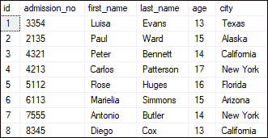
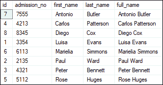

# SQL Server CONCAT 函数

> 原文：<https://www.javatpoint.com/sql-server-concat-function>

SQL Server CONCAT 是一个字符串函数**，用于连接两个或多个字符串**。如果发现**为空**值，当显示结果时，会将其转换为**空字符串**。此方法可以接受多个参数，但只返回单个字符串作为输出。它可以接受数字、字符或日期作为输入参数。我们确保该函数至少需要两个输入参数，并且最多可以扩展到 254 个输入参数。

#### 注意:CONCAT 函数在连接前隐式地将非字符串值转换成字符串。

### 句法

以下是说明 SQL Server 中 CONCAT 函数的基本语法:

```sql

CONCAT ( input_string1, input_string2 [, input_stringN ] );

```

以下是用于表格的语法:

```sql

SELECT column_names, CONCAT(column1, column2) 
FROM table_name
ORDER BY column_name

```

### 例子

让我们通过下面给出的基本例子来理解 CONCAT 函数的工作原理:

```sql

SELECT CONCAT('Hello', ' ', 'java', 'T', 'point') AS concat_string;

```

在语句中，我们提供了五个输入参数，包括一个空字符串。执行该函数将返回下面的输出，我们看到该函数将结果组合成一个字符串:


这是另一个例子，我们使用空值和 CONCAT 函数:

```sql

SELECT CONCAT(NULL, 'java', 'T', 'point') AS concat_string;

```

执行该语句将正确返回结果:


如上所述，CONCAT 函数必须至少需要两个参数。否则，给出一个错误。下面的例子解释得更清楚:

```sql

SELECT CONCAT('javaTpoint') AS concat_string;

```

以下是错误消息:


以下示例将数字字符串连接成一个字符串:

```sql

SELECT CONCAT('15', '0', '22') AS concat_string;

```

或者，

```sql

SELECT CONCAT(15, 0, 22) AS concat_string;

```

当我们执行上述语句时，我们将得到如下所示的相同结果:


### 带表的 CONCAT 函数

我们还可以对表的列使用 CONCAT 函数。这里我们要拿一个**学生** **表**来演示这个功能。假设学生表包含以下数据:



假设我们想要**合并学生表中的名和姓**。我们可以通过使用下面的语句来实现这一点，连接的字符串成为**全名**:

```sql

SELECT id, admission_no, first_name, last_name,
    CONCAT(first_name, ' ', last_name) AS full_name
FROM Student
ORDER BY full_name;

```

执行该功能将显示以下输出:



* * *