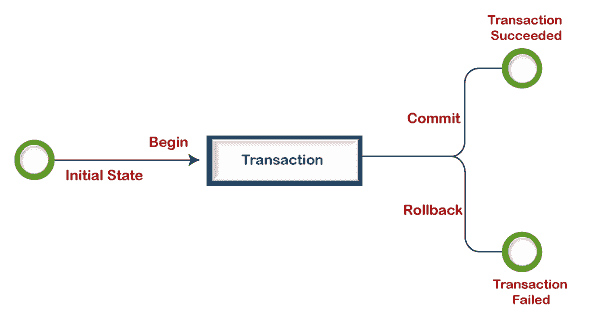
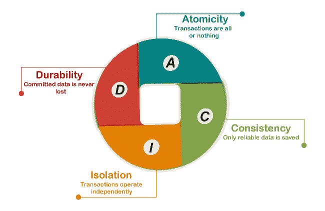
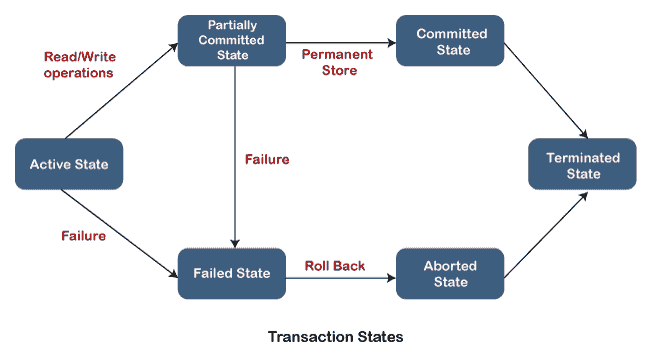
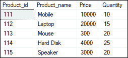
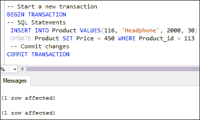
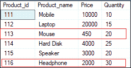
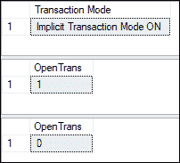

# SQL Server 事务

> 原文：<https://www.javatpoint.com/sql-server-transaction>

SQL Server 中的事务是在数据库中执行单个或多个任务的一组连续的语句或查询。每个事务可以有单个读、写、更新或删除操作，或者所有这些操作的组合。在 SQL Server 中，每个事务必须发生两件事:

*   提交事务时，要么所有修改都成功。
*   或者，当事务回滚时，所有修改都被撤消。

只有完成集合中的所有操作，事务才能成功。这意味着如果任何参数失败，事务操作将失败。每个事务都从第一个可执行的 SQL 语句开始，并在找到提交或回滚时结束，无论是显式的还是隐式的。它显式使用 **COMMIT** 或 **ROLLBACK** 语句，当使用 DDL 语句时，它也隐式使用。

下图解释了交易过程:



**下面的例子将解释交易的概念:**

这个例子将使用银行数据库系统来解释交易的概念。假设某银行客户想使用 ATM 模式从其账户中取款。自动柜员机可以通过以下三个步骤实现该操作:

1.  **第一步**是检查账户中请求金额的可用性。
2.  **第二步**如果有可用金额，从账户中扣除金额，然后更新账户余额。
3.  **第三步**是将取钱操作写入日志文件。此步骤会记录事务是成功还是失败。如果成功，将数据修改写入数据库。否则，事务将回滚到以前的状态。

事务背后的基本原则是，如果其中一条语句返回错误，整个更改集将回滚，以确保数据完整性。如果事务成功，所有更改都将永久保存在数据库中。因此，如果从自动取款机取钱时出现停电或其他问题，交易可以保证我们的余额保持一致。事务语句最好地执行这些操作，因为事务的四个关键属性使所有操作更加准确和一致。该事务的四个属性被称为 ACID。

### 交易属性

事务属性被称为 ACID(原子性、一致性、隔离性、持久性)属性，这将在下面详细讨论:



**原子性:**该属性确保事务中包含的所有语句或操作都必须成功执行。否则，整个事务将被中止，并且当任何操作失败时，所有操作都将回滚到以前的状态。

**一致性:**此属性确保只有在事务成功提交时，数据库才会更改状态。它还负责保护数据免受崩溃。

**隔离:**该属性保证所有事务与其他事务隔离，意味着事务中的每个操作都是独立操作的。它还确保语句对彼此透明。

**持久性:**该属性保证即使系统崩溃或失败，提交事务的结果也能永久保存在数据库中。

### SQL Server 中的事务模式

SQL Server 可以使用三种不同的事务模式:

**自动提交事务模式:**是 SQL Server 的默认事务模式。它会将每个 SQL 语句作为一个事务进行评估，并相应地提交或回滚结果。因此，成功的语句会立即提交，而失败的语句会立即回滚。

**隐式交易模式。**这种模式允许 SQL Server 为每个 DML 语句开始隐式事务，但它明确要求在语句结束时使用提交或回滚命令。

**显式交易模式:**该模式由用户定义，允许我们准确识别交易的开始点和结束点。如果出现致命错误，它将自动中止。

### 交易控制

以下是用于控制事务的命令:

*   **BEGIN TRANSACTION:** 它是指示每个事务开始的命令。
*   **COMMIT:** 这是一个用于将更改永久保存在数据库中的命令。
*   **ROLLBACK:** 这是一个命令，用于取消所有修改并进入它们之前的状态。
*   **保存点:**该命令在事务组内创建点，允许我们只回滚事务的一部分，而不是整个事务。
*   **释放保存点:**用于删除已经存在的保存点。
*   **SET TRANSACTION:** 此命令为事务赋予一个名称，该名称可用于使事务成为只读或读/写，或将其分配给特定的回滚段。

#### 注意:对于事务控制语言命令，我们只能使用 DML 语句(插入、更新和删除)。我们不能在创建或删除表时使用它们，因为这些操作是自动提交给数据库的。

### 交易状态

它指示事务在其生命周期中的进展情况。**描述交易的当前状态，以及未来如何处理交易。**这些状态定义了确定事务是提交还是中止的规则。



让我们描述一下 SQL Server 中的每个事务状态:

**活动状态:**在执行事务的指令时，事务处于活动状态。如果所有“读和写”操作都没有错误地完成，它将变为**“部分提交状态”**。如果任何指令失败，它将变为“失败状态”

**部分提交:**所有读写操作完成后，对主内存或本地缓冲区进行更改。如果更改在数据库中永久保存，状态将变为**“已提交状态”**。否则，将进入“失败状态”。

**失败状态:**当任何事务的指令失败或对数据库的永久修改失败时，事务进入失败状态。

**中止状态:**当任何一种故障发生时，交易从**“失败状态”**转移到**“中止状态”**。更改被删除或回滚，因为这些更改仅在以前的状态下对本地缓冲区或主内存进行。

**提交状态:**当更改在数据库中永久保存并在**“终止状态”下终止时，事务完成并进入该状态。**

**终止状态:**如果没有回滚，并且事务处于**“已提交”状态，**系统保持一致，并准备好新事务，而旧事务被终止。

## 事务在 SQL Server 中的实现

让我们举一些例子来理解如何在 SQL Server 中实现事务。这里我们将使用**“产品”**表来演示所有事务状态。

以下 SQL 脚本在选定的数据库中创建产品表:

```sql

CREATE TABLE Product (
 Product_id INT PRIMARY KEY, 
 Product_name VARCHAR(40), 
 Price INT,
 Quantity INT
)

```

接下来，执行以下脚本将数据插入该表:

```sql

INSERT INTO Product VALUES(111, 'Mobile', 10000, 10),
(112, 'Laptop', 20000, 15),
(113, 'Mouse', 300, 20),
(114, 'Hard Disk', 4000, 25),
(115, 'Speaker', 3000, 20);

```

执行 SELECT 语句来验证数据:



### 提交事务的示例

将事务中使用的 SQL 语句分成多个逻辑部分是一个好主意。然后，我们可以决定是提交还是回滚数据。以下步骤说明了如何创建事务:

*   使用**开始交易**命令开始交易。
*   编写 SQL 语句，并根据我们的需求进行划分
*   使用 **COMMIT** 语句完成事务并永久保存更改。

**以下是解释 SQL Server 中提交操作的命令:**

```sql

-- Start a new transaction  
BEGIN TRANSACTION
-- SQL Statements
 INSERT INTO Product VALUES(116, 'Headphone', 2000, 30)
 UPDATE Product SET Price = 450 WHERE Product_id = 113
 -- Commit changes 
COMMIT TRANSACTION

```

如果没有发现错误，我们将看到以下输出，其中每个事务的 SQL 语句独立执行:



提交事务后，无法回滚 INSERT 和 UPDATE 语句。当我们在提交操作后验证表时，我们将看到以下数据:



### 回滚事务的示例

我们将使用 ROLLBACK 命令撤销任何尚未保存到数据库的事务，并返回到事务开始的地方。**以下示例说明了 SQL Server 中的 ROLLBACK 操作:**

```sql

-- Start a new transaction  
BEGIN TRANSACTION
-- SQL Statements
UPDATE Product SET Price = 5000 WHERE Product_id = 114
DELETE FROM Product WHERE Product_id = 116

```

一旦我们执行了上面的事务，我们可以看到它将被成功执行。但是，它不会影响数据库中的任何更改，因为除非我们不执行 COMMIT 或 ROLLBACK 语句，否则这些更改不会永久存在。因此，我们可以选择使用回滚事务命令来回滚所有数据库操作。**以下是完整的交易对账单:**

```sql

-- Start a new transaction  
BEGIN TRANSACTION
-- SQL Statements
UPDATE Product SET Price = 5000 WHERE Product_id = 114
DELETE FROM Product WHERE Product_id = 116
--Undo Changes
ROLLBACK TRANSACTION

```

### 在事务中使用@ @错误全局变量:

这个变量是**用来检查是否有错误。**下面的例子解释了它的概念。在这里，我们将首先使用 BEGIN 命令启动事务，然后编写两个 insert 语句。接下来，我们将使用 **IF 语句**中的全局系统变量 **@@ERROR** 来检查错误。如果该值大于 0，则表示存在一些错误。现在，事务正在回滚；否则，事务被提交。

```sql

BEGIN TRANSACTION
INSERT INTO Product VALUES(115,'Speaker', 3000, 25)
-- Check for error
IF(@@ERROR > 0)
BEGIN
    ROLLBACK TRANSACTION
END
ELSE
BEGIN
   COMMIT TRANSACTION
END

```

当执行上述事务时，我们会注意到它已经回滚。这是因为我们试图在主键列中插入重复的值。

### 自动回滚事务

大多数事务包含多个查询。在执行事务时，如果任何 SQL 语句产生错误，数据库中不会发生任何修改，其余语句也不会执行。这个概念在 SQL Server 中被称为自动回滚事务。让我们用一个简单的例子来演示这个过程。

```sql

BEGIN TRANSACTION
 INSERT INTO Product VALUES(118, 'Desktop', 25000, 15)
 UPDATE Product SET Quantity = 'ten' WHERE Product_id = 113
 SELECT * FROM Product
COMMIT TRANSACTION

```

该事务产生以下输出:


在这个输出中，我们可以看到 insert 语句成功执行。但是，由于数据类型转换问题，执行 update 语句时发现了一个错误。在这种情况下，SQL Server 不允许对数据库进行任何更改，这意味着插入操作不会添加任何值，并且不会执行 select 语句。

### 事务中的保存点

保存点在事务中插入一个特殊标记，允许我们回滚保存点之后执行的所有更改。它还用于回滚事务的任何特定部分，而不是整个事务。我们可以使用 **SAVE TRANSACTION sp_name** 语句来定义它。以下示例将解释保存点在提交 insert 语句和回滚 delete 语句的事务中的使用。

```sql

BEGIN TRANSACTION 
INSERT INTO Product VALUES(117, 'USB Drive', 1500, 10)
SAVE TRANSACTION InsertStatement
DELETE FROM Product WHERE Product_id = 116
SELECT * FROM Product 
ROLLBACK TRANSACTION InsertStatement
COMMIT
SELECT * FROM Product;

```

看到下面的结果，我们可以看到产品 id 116 被删除，117 被插入到第一个输出中。但是，在第二个输出中，删除操作由于保存点而回滚。


**如何释放事务中的保存点？**

释放保存点用于从当前事务中删除命名保存点，而不恢复保存点后执行的查询的结果。MySQL 有这个命令，但是 SQL Server 不提供任何释放保存点的命令。相反，它们会在提交或回滚事务结束时自动释放，因此我们不必立即担心它们。

### SQL Server 中的隐式事务

我们可以通过启用 INCLUDE _ TRANSACTIONS 选项来定义隐式事务。下面的例子将很容易解释这个概念:

```sql

SET IMPLICIT_TRANSACTIONS ON 
UPDATE Product SET Quantity = 10 WHERE Product_id = 113
SELECT 
    IIF(@@OPTIONS & 2 = 2, 
    'Implicit Transaction Mode ON', 
    'Implicit Transaction Mode OFF'
    ) AS 'Transaction Mode' 
SELECT @@TRANCOUNT AS OpenTrans 
COMMIT TRANSACTION
SELECT @@TRANCOUNT AS OpenTrans

```

在这次交易中，我们使用了两个选项 **@@OPTION 和@@TRANCOUNT。**在当前会话中，@@OPTOPN 提供了关于当前 SET 选项的信息，@@TRANCOUNT 提供了 BEGIN TRANSACTION 语句。

现在，执行事务将返回以下输出:



### SQL Server 中的显式事务

显式事务必须通过 BEGIN TRANSACTION 命令来定义，因为它标识了显式事务的起始点。我们可以如下定义 SQL Server 中的显式事务:

```sql

BEGIN TRANSACTION [ {trans_name | @trans_name_variable }
    [WITH MARK ['description']]]

```

在语法中，trans_name 选项表示事务的唯一名称。 **@trans_name_var** 表示存储事务名称的用户定义变量。最后， **MARK** 选项允许我们在日志文件中标记特定的事务。

通过 BEGIN TRANSACTION 命令的显式事务根据事务相关资源的隔离级别获得了一个锁。这有助于减少锁定问题。请参见下面的示例:

```sql

BEGIN TRANSACTION
UPDATE Product SET Quantity = 15 WHERE Product_id = 114
SELECT @@TRANCOUNT AS OpenTrans 
COMMIT TRANSACTION
SELECT @@TRANCOUNT AS OpenTrans

```

以下是输出:


### 在 SQL Server 中标记事务

标记的事务用于向日志文件中的特定事务添加描述。当将数据库恢复到以前的状态时，我们可以使用它作为恢复点来代替日期和时间。我们必须知道，只有当标记的事务修改数据库时，才会在日志文件中添加标记。我们可以通过下面的例子来理解它的概念。

假设我们意外地修改了数据库，并且我们不知道数据更改的确切时刻；在这种情况下，数据恢复可能需要很长时间。但是，如果我们使用标记的事务，它可以成为确定数据更改的确切时间的有用工具。

**以下语法说明了 SQL Server 中标记的事务:**

```sql

BEGIN TRANSACTION trans_name WITH MARK 'description';

```

这里我们必须定义事务的名称，然后添加 WITH MARK 选项。在下面的示例中，我们将删除记录并在日志文件中添加标记:

```sql

BEGIN TRANSACTION DeleteProduct WITH MARK 'Deleted Product with id = 117' 
    DELETE Product WHERE Product_id = 117
COMMIT TRANSACTION DeleteProduct

```

**logmarkhistory** 表包含在 **msdb 数据库**中，并存储关于已提交的每个标记交易的信息。执行以下语句从 logmarkhistory 表中获取详细信息:

```sql

SELECT * FROM msdb.dbo.logmarkhistory

```

### SQL Server 中的命名事务

我们还可以在 SQL Server 中为我们的事务提供一个名称。当在一个查询中处理多个事务时，总是建议使用命名事务。下面的示例解释了如何重命名事务:

```sql

BEGIN TRANSACTION AddProduct
INSERT INTO Product VALUES(118, 'Desktop', 25000, 15)
UPDATE Product SET Product_name = 'Pen Drive' WHERE Product_id = 117
COMMIT TRANSACTION AddProduct

```

以下是输出:


**结论**

本文将全面概述 SQL Server 语句中的事务。事务在关系数据库系统中很有帮助，因为它们确保了数据库的完整性。

* * *