# SQL Server 窗口函数

> 原文：<https://www.javatpoint.com/sql-server-window-functions>

我们都以在表上执行计算并使用 GROUP BY 子句的常规聚合函数而闻名。但是，只有一小部分 SQL 用户使用窗口函数，这些函数对一组行起作用，并为每行显示一个聚合值。本文将详细讨论 SQL Server 中的窗口函数。

## 什么是窗口功能？

窗口函数用于**基于一组行对聚合值**进行计算，并为每个组返回多行。窗口字表示将在其上操作该功能的一组行。该函数执行计算的方式与聚合函数相同。与对整个表进行操作的聚合函数不同，窗口函数不会给出要合并到一行中的结果。这意味着窗口函数对一组行进行操作，并为每行返回一个总值。因此，每一行都保留其独特的身份。

下面的图示说明了 SQL Server 中聚合函数和窗口函数的区别:


### 窗口函数类型

SQL Server 将窗口函数主要分为三种类型:

1.  **聚合窗口函数:**这些函数在多行上运行，这种函数的例子有 SUM()、MAX()、MIN()、AVG()、COUNT()等。
2.  **排序窗口函数:**这些函数对表中分区的每一行进行排序。这种函数例子是 RANK()、DENSE_RANK()、ROW_NUMBER()、NTILE()等。
3.  **值窗函数:**这些函数局部用幂级数表示。这种函数例子有 LAG()、LEAD()、FIRST_VALUE()、LAST_VALUE()等。

**语法**

以下是使用窗口函数的基本语法:

```sql

window_function_name([ALL] expression)   
OVER (  
    [partition_defintion]  
    [order_definition] 
) 

```

**参数说明**

让我们理解上面语法中使用的参数:

**window_function:** 表示你的窗口函数的名称。

**ALL:** 是一个可选的关键字，用于统计所有值以及重复值。我们不能在窗口函数中使用 DISTINCT 关键字。

**表达式:**是操作窗口功能的列或表达式的名称。换句话说，它是我们计算聚合值的列名。

**OVER:** 指定聚合函数的窗口子句。它主要包含两个表达式 partition by 和 order by，即使没有表达式，它也总是有一个左括号和一个右括号。

**PARTITION BY:** 这个子句将行划分为分区，然后在每个分区上运行一个 window 函数。这里我们需要在 PARTITION BY 子句之后为分区提供列。如果我们想指定一个以上的列，我们必须用逗号分隔它们。当未指定该子句时，SQL Server 将对整个表进行分组，并将相应地聚合值。

**ORDER BY:** 用于指定每个分区内的行顺序。未定义此子句时，SQL Server 将对整个表使用 ORDER BY。

### 例子

让我们通过一个例子来理解窗函数的概念。首先，我们将使用以下语句创建一个名为“ **product_sales** ”的表:

```sql

CREATE TABLE Product_Sales(  
    Emp_Name VARCHAR(45) NOT NULL,  
    Year INT NOT NULL,
	Country VARCHAR(45) NOT NULL,  
    Prod_name VARCHAR(45) NOT NULL,  
    Sales DECIMAL(12,2) NOT NULL,  
    PRIMARY KEY(Emp_Name, Year)  
); 

```

接下来，我们将使用如下的 INSERT 语句将记录填充到该表中:

```sql

INSERT INTO Product_Sales(Emp_Name, Year, Country, Prod_name, Sales)  
VALUES('Mike Johnson', 2017, 'Britain', 'Laptop', 10000),  
('Mike Johnson', 2018, 'Britain', 'Laptop', 15000),  
('Mike Johnson', 2019, 'Britain', 'TV', 20000),  
('Mary Greenspan', 2017, 'Australia', 'Computer', 15000),  
('Mary Greenspan', 2018, 'Australia', 'Computer', 10000),  
('Mary Greenspan', 2019, 'Australia', 'TV', 20000),  
('Nancy Jackson', 2017, 'Canada', 'Mobile', 20000),  
('Nancy Jackson', 2018, 'Canada', 'Calculator', 1500),  
('Nancy Jackson', 2019, 'Canada', 'Mobile', 25000);  

```

我们可以使用 SELECT 语句来验证插入的记录。我们将看到以下输出:


现在，我们将使用该表演示所有窗口功能。

### 聚集窗函数

**SUM()**

它是一个聚合函数，当我们没有指定任何组时，它为指定的组或整个表执行指定字段的添加。这里我们将从两个方面来研究这个函数，要么是常规聚合函数，要么是窗口聚合函数。

**以下语句解释了添加每个国家订单金额的常规聚合函数:**

```sql

SELECT Country, SUM(Sales) AS total_amount
FROM Product_Sales GROUP BY Country;

```

执行该语句时，我们看到该函数将多行组合成一个输出行。它会导致单个行失去其标识。


下面的语句解释了维护行标识的窗口聚合函数。它还显示每行的聚合值。

```sql

SELECT Emp_Name, Year, Country, Prod_name, Sales, SUM(Sales) 
OVER(PARTITION BY Country) as grand_total 
FROM Product_Sales; 

```

执行查询将返回以下输出。这里我们可以看到，它汇总了每个国家的数据，并显示了每个国家的总销售额。它还为总销售额插入了另一列 **grand_total** ，这样每一行都保留了它的标识。

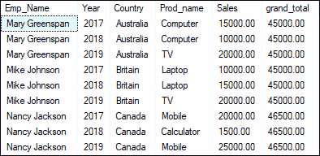

**AVG()**

此函数返回指定列的平均值。它与窗口函数的工作方式完全相同。

**下面的例子将产生每个国家和每年的平均销售额**。这里，我们通过在分区列表中指定多个字段来指定多个平均值。

```sql

SELECT Emp_Name, Year, Country, Prod_name, Sales, AVG(Sales) 
OVER(PARTITION BY Country, YEAR(Year)) as avg_sales_amount 
FROM Product_Sales; 

```

执行该语句将返回下面的输出，我们可以看到，平均而言，我们收到了澳大利亚国家 15000 英镑的销售额。

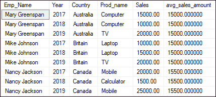

**MIN()**

此函数返回指定组的最小值。当我们没有定义组时，它将返回整个表的最小值。

**以下示例将返回每个国家的最小销售额:**

```sql

SELECT Emp_Name, Year, Country, Prod_name, Sales, MIN(Sales) 
OVER(PARTITION BY Country) AS minimum_sales_amount 
FROM Product_Sales;

```

执行该查询将产生以下输出，从中我们可以看到每个国家的最低销售额:

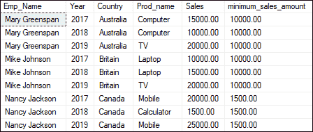

**MAX()**

此函数返回指定组的最大值。当我们没有定义组时，它将返回整个表的最大值。

**以下示例将返回每个国家的最高销售额:**

```sql

SELECT Emp_Name, Year, Country, Prod_name, Sales, MAX(Sales) 
OVER(PARTITION BY Country) AS minimum_sales_amount 
FROM Product_Sales;

```

执行该查询将产生以下输出，从中我们可以看到每个国家的最高销售额:

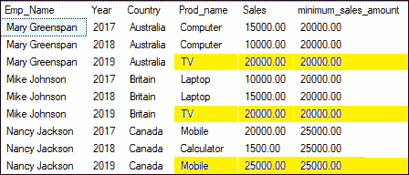

**COUNT()**

count 函数将返回表或组中存在的行或记录的总数。常规聚合函数使用 DISTINCT 关键字不计算重复的行。但是窗口计数函数不支持这个关键字。如果我们在窗口函数中使用这个关键字，SQL Server 会抛出一个错误。

假设我们想看看 2018 年有多少员工订购该产品。我们不能直接计算所有员工，因为同一名员工在同一年订购了多种产品。

**例如**，

**COUNT(emp_name)** 将产生不正确的结果，因为它也可以计算重复项。 **COUNT(DISTINCT emp_name)** 将产生正确的结果，因为它总是只对每个员工计数一次。

此语句成功执行，因为它是一个常规聚合函数:

```sql

SELECT Country, COUNT(DISTINCT Emp_name) As number_of_employees
FROM Product_Sales
GROUP BY Country;

```

此语句将产生一个错误，因为它是一个窗口聚合函数:

```sql

SELECT Country, COUNT(DISTINCT Emp_name) 
OVER(PARTITION BY Country) As number_of_employees
FROM Product_Sales;

```

错误如下:


以下语句将使用窗口计数功能返回每个国家的产品总销售额:

```sql

SELECT Emp_Name, Year, Country, Prod_name, Sales, COUNT(Prod_name) 
OVER(PARTITION BY Country) As total_product
FROM Product_Sales;

```

结果如下:


### 排序窗口函数

RANKING 函数**对定义列**中的值进行排序，并根据它们的等级对它们进行分类。以下是 SQL Server 中支持的排名函数:

RANK()、DENSE_RANK()、ROW_NUMBER()和 NTILE()。让我们基于包含以下数据的名为“ **rank_demo** ”的表格详细讨论每个函数:

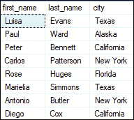

**RANK()**

它用于**根据指定的值为表格中的每一行生成唯一的等级**。如果这个函数得到两个具有相同值的记录，它将为这两个记录分配相同的排名，并跳过下一个排名。**例如**，如果等级 2 有两个相同的值，等级函数会为两个记录提供相同的等级 2，并跳过下一个等级 3。现在，下一个等级将被指定为等级 4。

**下面的语句解释了 RANK()函数，根据城市为每行分配编号:**

```sql

SELECT first_name, last_name, city,   
RANK () OVER (ORDER BY city) AS Rank_No   
FROM rank_demo; 

```

该查询返回以下输出，其中我们看到相同的等级(2)被分配给两个具有相同城市名称的相同记录。排名中的下一个数字将是其先前的排名加上一些重复的数字，即 4。

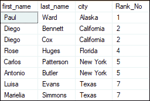

**DENSE_RANK()**

它的工作原理与 rank()函数相同，只是它不跳过任何 RANK。它总是以连续的顺序分配等级。这意味着当发现两个记录相等时，该函数将为两个记录分配相同的等级，下一个等级是下一个序列号。

**下面的查询实际上解释了这个功能，根据城市为每一行分配一个等级编号:**

```sql

SELECT first_name, last_name, city,   
DENSE_RANK() OVER (ORDER BY city) AS Rank_No   
FROM rank_demo; 

```

这个查询将返回下面的输出，在这里我们可以看到重复的值具有相同的排名，并且下一个排名被给予下一个记录，而不跳过排名值。

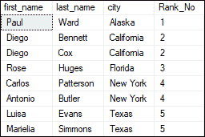

**ROW_NUMBER()**

它用于为分区内的每个记录分配唯一的序列号。它总是从 1 开始，然后增加 1，直到没有达到分区中的所有记录。当一个分区排序完成并进入下一个分区时，它将被重置。

**无**分区的 ROW_NUMBER()示例

下面的查询根据城市为每一行分配数字:

```sql

SELECT first_name, last_name, city,   
ROW_NUMBER() OVER (ORDER BY city) AS Rank_No   
FROM rank_demo;

```

它返回以下输出:

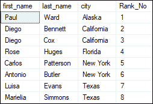

**按**分区的 ROW_NUMBER()示例

下面的语句根据城市对表进行分区，这意味着每个城市的行号都会重置，并再次从 1 开始。它还根据名字列对记录进行排序。

```sql

SELECT first_name, last_name, city,   
ROW_NUMBER() OVER (PARTITION BY city ORDER BY first_name) AS Rank_No   
FROM rank_demo;

```

它返回以下输出:

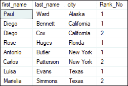

**NTILE()**

该窗口功能**将行分配到预定义数量(N)的近似相等的组**中。根据定义的条件，为每个行组分配一个等级，编号从第一个组开始。它使我们能够确定特定行属于哪个百分位数(或四分位数，或其他细分)。这意味着，如果我们有 20 条记录，并希望根据特定的值字段将它们分成五个四分位数，我们可以轻松地这样做，并查看每个四分位数中有多少行。

**以下语句将根据城市列将表格分为 3 个四分位数:**

```sql

SELECT first_name, last_name, city,   
NTILE(3) OVER ( ORDER BY city) AS Rank_No   
FROM rank_demo;

```

执行该语句将返回以下输出，其中我们看到每个组有三个四分位数:

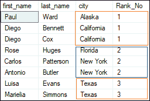

**PERCENT_RANK()**

此函数计算结果集分区内行的百分位数(相对排名)。它给出的结果介于 0 和 1 之间。如果找到空值，它会将它们视为可能的最低值。

该函数借助以下公式对每条记录进行排名:

```sql

(rank-1) / ( total_rows-1)  

```

这里，rank 表示 rank()函数返回的每一行的编号，total_rows 是分区中找到的总行数。

**以下示例将按国家名称计算每行顺序的排名值:**

```sql

SELECT Year, Prod_name, Country, Sales,     
PERCENT_RANK() OVER(PARTITION BY Year ORDER BY Country) AS my_rank   
FROM Product_Sales;  

```

执行该语句将返回预期的输出:

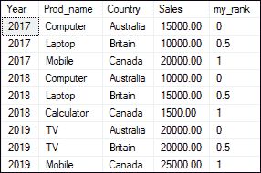

### 值窗口函数

SQL Server 使用此函数获取表中的第一个、最后一个、上一个和下一个值。它主要包含以下功能:LAG()，LEAD()，FIRST_VALUE()，LAST_VALUE()。

**超前和滞后功能**

LEAD 和 LAG 函数用于**从分区内的当前行获取指定行的前一个和后一个值**。

让我们以上面的 **product_sales** 表来演示这些功能。**以下示例返回每个员工的销售和下次销售明细**。它首先根据年份拆分结果集，然后使用国家列对每个分区进行排序。之后，我们必须在每个分区上使用 LEAD()函数来获取下一个销售细节。

```sql

SELECT Year, Prod_name, Country, Sales,     
LEAD(Sales,1) OVER (PARTITION BY Year ORDER BY Country) AS Next_Sale    
FROM Product_Sales;  

```

执行该语句将显示预期结果:

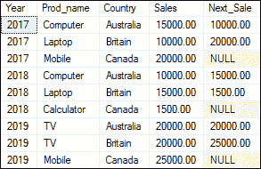

**以下示例返回每个员工的销售额和以前的销售明细**。它首先根据年份拆分结果集，然后使用国家列对每个分区进行排序。之后，我们必须在每个分区上使用 LAD()函数来获取之前的销售明细。

```sql

SELECT Year, Prod_name, Country, Sales,     
LAG(Sales, 1) OVER (PARTITION BY Year ORDER BY Country) AS Previous_Sale    
FROM Product_Sales;

```

执行该语句将显示预期结果:

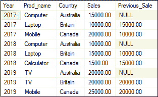

**FIRST_VALUE()和 LAST_VALUE()**

如果指定了 PARTITION BY 子句，这些函数用于查找表或分区中的第一条和最后一条记录。这里我们应该注意到，这些函数是使用 ORDER BY 子句所必需的。让我们通过实例来看看这些函数在 SQL Server 中是如何工作的。

**以下示例将在给定的表中找到每个国家的第一个和最后一个销售额:**

```sql

SELECT Year, Prod_name, Country, Sales,     
FIRST_VALUE(Sales) OVER(PARTITION BY Country ORDER BY Country) first_sale,
LAST_VALUE(Sales) OVER(PARTITION BY Country ORDER BY Country) last_sale    
FROM Product_Sales; 

```

执行查询将显示如下所示的预期结果:

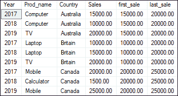

**结论**

本文将解释 SQL Server 中使用的所有窗口函数，这些函数处理一组行，并为每一行返回一个聚合值。

* * *