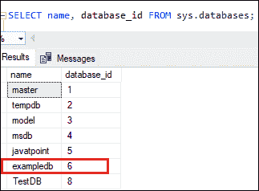
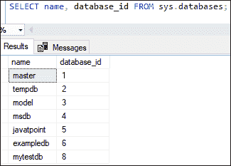
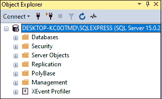
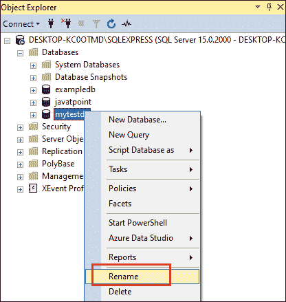
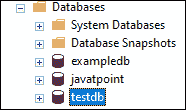
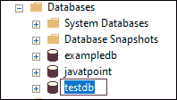

# SQL Server 重命名数据库

> 原文：<https://www.javatpoint.com/sql-server-rename-database>

数据库是数据的逻辑有序集合，包括表、行、列和索引。它帮助用户定期查找重要信息，并使用户访问和管理数据库中的记录变得简单。在 SQL Server 中，所有文件通常以表的形式存储在每个数据库中。

我们为项目需求创建一个数据库，或者在我们学习的时候创建。有时我们需要更改数据库名称，因为以前的名称基于与数据库不再相关的项目，或者因为我们给了一个临时名称，现在想要更改它。本文将为我们提供如何做到这一点，我们可能会遇到什么错误，以及如何解决它们，而不管我们为什么要重命名数据库。

我们可以用多种方法重命名微软的数据库。要重命名数据库，我们可以使用 **SQL Server 管理工作室或执行一个 SQL 查询**。在重命名数据库之前，应该注意，这可能会中断使用当前数据库名称配置的服务或存储过程的连接。

### 限制和约束

重命名数据库时，SQL Server 有一些限制。其中一些如下:

*   我们不能更改系统数据库名称。
*   当其他用户正在访问数据库时，我们无法重命名数据库。
*   SQL Server 允许我们以单用户模式设置数据库，以关闭任何打开的连接。

#### 注意:在重命名数据库之前，我们必须拥有 ALTER 权限。

### 用 SQL 查询重命名数据库

SQL Server 中的 **ALTER 命令**允许我们重命名用户创建的数据库。该命令适用于多种版本的微软 SQL Server，尽管微软声称它将在某个时候消失。

**我们可以使用以下语法来重命名数据库:**

```

ALTER DATABASE currentdb_name MODIFY NAME = newdb_name; 

```

在这个语法中， **currentdb_name** 表示我们要重命名的数据库名称。**新数据库名称**表示数据库的新名称。

### 例子

假设我们有一个名为“example”的数据库，它并不相关。现在，我们想将其名称从“**示例”**更改为“**示例数据库**”下面是重命名它的语句:

```

ALTER DATABASE example MODIFY NAME = exampledb; 

```

执行该语句将显示以下输出，这意味着“example”数据库重命名为 exampledb:


数据库重命名成功后，我们可以验证更改后的名称，如下所示:

```

SELECT name, database_id FROM sys.databases;

```

以下是输出:



### 用存储过程重命名数据库

我们还可以使用标准存储过程来更改用户在 SQL Server 中创建的数据库名称。以下语法用于重命名数据库:

```

EXEC sp_renamedb 'currentdb_name', 'newdb_name'

```

**例**

假设我们有一个名为“TestDB”的数据库，它是不相关的。现在，我们想把它的名字从“**TestDB”**改成“ **mytestdb** ”下面是重命名它的语句:

```

EXEC sp_renamedb 'TestDB', 'mytestdb'

```

执行该语句将显示以下输出，这意味着“TestDB”数据库被重命名为 mytestdb:


数据库重命名成功后，我们可以验证更改后的名称，如下所示:



### 用 SQL Server 管理工作室重命名数据库(SSMS)

SSMS 是一个图形用户界面工具，它允许数据库管理员和数据库开发人员配置、管理和管理 SQL Server 中的所有组件。它的主要功能是创建数据库和表，执行用于插入、更新和删除数据的 SQL 查询，创建和管理存储过程、触发器、视图和游标。

**SQL Server 允许我们以两种方式重命名数据库:**

*   使用对象资源管理器重命名表
*   双击表格名称

让我们详细讨论每一个问题。

**使用对象资源管理器**重命名表格

使用 SQL Server 管理工作室(SSMS)连接到数据库服务器。重命名之前，应确保不再有到数据库的连接。现在，使用以下步骤使用对象资源管理器重命名数据库:

**步骤 1:** 转到数据库菜单并展开它以查看当前实例中的可用数据库。



**第二步:**选择想要重命名的数据库，右键点击，从下拉菜单中选择**重命名选项**。



**步骤 3:** 输入新的数据库名称，然后单击确定。现在，刷新对象资源管理器以查看新的数据库名称。下图显示“**my testdb”**数据库名称已更改为“**testdb”**数据库名称:



### 双击数据库名称

SQL Server 还允许数据库管理员通过双击所需的名称来更改数据库名称。我们可以使用以下步骤通过双击重命名数据库:

**步骤 1:** 转到对象浏览器- >数据库并展开它。

**第二步:**选择要更改的数据库，双击。我们可以看到，数据库名称被更改为一个可编辑的表单。请参见下图:



**第三步:**为你选择的数据库输入一个新名称，按**进入**，刷新对象浏览器完成重命名步骤。

**如果试图重命名一个不存在的数据库会发生什么？**

当我们试图重命名一个不存在的数据库时，SQL Server 抛出一条错误消息，说: ***“不能重命名数据库‘database _ name’；数据库不存在。*T3】**

### 结论

本文给出了借助 SQL 命令、存储过程和 SQL Server Management Studio 更改数据库名称的完整概述。总是建议使用 T-SQL 查询对数据库进行任何更改。

* * *