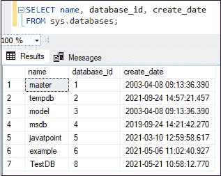
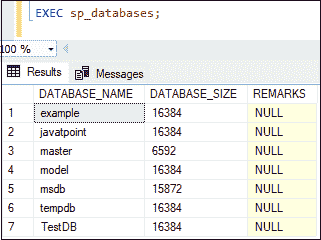
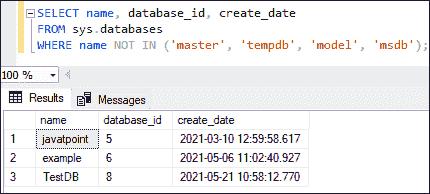
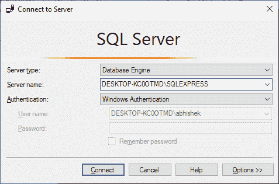
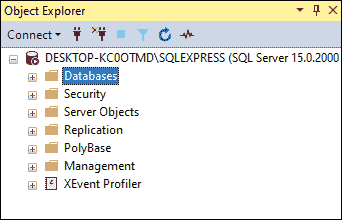
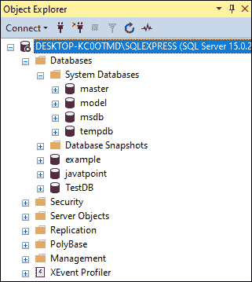

# 显示/列出数据库

> 原文：<https://www.javatpoint.com/sql-server-show-list-databases>

使用 SQL server 时，显示或列出所有数据库、特定数据库的表以及用户帐户及其在服务器上的权限信息是一项常见任务。本主题将完整解释如何查看 SQL Server 实例上的数据库列表。

**SQL Server 将数据库分为两类:**

**系统数据库:**当我们在系统上安装 MS SQL Server 时，系统数据库是自动创建的。它对服务器的正常运行起着重要的作用。以下是 SQL Server 的系统数据库列表:主数据库、模型数据库、MSDB 数据库、临时数据库等。

**用户数据库:**这些数据库由数据库用户创建，如数据库管理员和测试人员，他们也可以访问和操作他们的数据。

**SQL Server 提供了两种列出所有或特定数据库的方法:**

*   Transact-SQL 命令
*   SQL Server 管理工作室(SSMS)

让我们逐一详细讨论。

### 使用 SQL 命令显示数据库

我们可以使用下面的 SQL 语句来显示 SQL Server 实例上的数据库列表。该语句返回包含数据库的**名称、它们的 id、**和**以及它们创建的日期**的输出。应该注意的是，该命令将显示系统和用户定义的所有数据库。

```sql

SELECT * FROM sys.databases;

```

该命令将显示所有数据库的详细信息:


如果我们想在显示数据库列表时只显示有用的信息，我们使用如下查询:

```sql

SELECT name, database_id, create_date FROM sys.databases;

```

执行该命令将返回以下输出:



SQL Server 还提供了另一种方法来显示 SQL Server 实例中所有数据库的列表。**该方法使用如下存储过程语句:**

```sql

EXEC sp_databases; 

```

此存储过程返回包含数据库名称及其大小的以下输出:



### 如何在 SQL Server 中获取用户创建的数据库名称？

如果我们想只获取 SQL Server 实例中用户创建的数据库的名称，我们需要编写下面的查询。此查询将过滤结果以删除已知的系统数据库，因为我们知道 SQL Server 不提供任何机制来将数据库标识为系统或用户创建的数据库。

```sql

SELECT name, database_id, create_date  
FROM sys.databases
WHERE name NOT IN ('master', 'tempdb', 'model', 'msdb');

```

执行该语句将只显示用户定义的数据库:



### 使用 SQL Server 管理工作室显示数据库(SSMS)

SSMS 是一个图形用户界面工具，可以有效地执行几个操作。我们还可以使用它来显示 SQL Server 实例中存在的数据库列表。以下步骤用于列出 SSMS 的数据库:

**步骤 1:** 为避免任何权限问题，以管理员模式启动 SSMS。我们将看到下面的屏幕，我们需要单击“连接”按钮继续。



**步骤 2:** 一旦建立连接，对象浏览器窗口将显示在屏幕的左侧。如果**数据库文件夹**不可见，单击**“+”按钮**将其展开。



**步骤 3:** 单击加号(+)图标展开数据库文件夹。它将显示当前服务器实例中存在的所有数据库(系统和用户)。



* * *