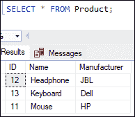

# SQL Server 复合密钥

> 原文：<https://www.javatpoint.com/sql-server-composite-key>

SQL Server 中的组合键是多个列的**组合。它用于唯一标识表行。只有当列组合在一起时，SQL Server 才能保证列的唯一性，如果将它们分开，则无法保持唯一性。当一个键，如**主键、超级键或候选键**有多个列时，它被称为复合键。我们可以在复合键列中使用不同的数据类型，因为在 SQL Server 中创建复合键不需要相同的数据类型。**

**组合键的语法如下:**

```

CONSTRAINT COMPOSITE_KEY_NAME PRIMARY KEY (column1, column2)

```

### 复合键什么时候出现？

在表中，我们并不总是有一个唯一的列可以用作主键。在这种情况下，我们组合两个或多个表列，使它们唯一，并将其用作表的主键。列或属性的这种组合称为复合键。

**SQL Server 允许我们通过两种方式创建复合键:**

1.  使用 CREATE 语句
2.  使用 ALTER 语句

### 使用 CREATE 语句的复合键

SQL Server CREATE 语句定义了一个表。这意味着我们可以在创建表时定义复合键。下面的语句将创建一个表名**产品:**

```

CREATE TABLE Product (  
    ID int NOT NULL,   
    Name varchar(45),   
    Manufacturer varchar(45),  
    PRIMARY KEY (Name, Manufacturer)  
); 

```

我们看到该语句创建了一个名为**和**制造商**列的复合主键。现在，我们将在该表中插入如下一些记录:**

 **```

INSERT INTO Product (ID, Name, Manufacturer)  
VALUES (11, 'Mouse', 'HP'),  
(12, 'Headphone', 'JBL'),  
(13, 'Keyboard', 'Dell');

```

使用**选择**语句验证表格，显示以下输出:



让我们再插入两条记录，看看结果。

```

INSERT INTO Product (ID, Name, Manufacturer)  
VALUES (11, 'Mouse', 'HP');  

INSERT INTO Product (ID, Name, Manufacturer)  
VALUES (11, 'Mouse', 'Lenovo');

```

执行上述语句将返回以下输出:


我们可以在输出中看到，如果我们试图添加一个相同的产品名称和制造商，它将生成一个错误，说“ ***”我们不能在对象 dbo.Product 中输入重复的密钥“***

当我们运行第二个 insert 命令时，它将被成功添加到表中。是因为我们可以在产品栏放多少只老鼠就放多少只，但是厂家栏一定要独一无二。

因此，我们可以得出结论，复合键总是确保表列的唯一性，表列有两个键。

### 使用 ALTER 语句的复合键

ALTER 语句总是用于对现有表进行更改。为了用多个属性唯一地标识数据库的每个记录，有时需要复合键。在这种情况下，使用 ALTER TABLE 语句。

**语法如下:**

```

ALTER TABLE table_name ADD CONSTRAINT constraint_name PRIMARY KEY (column1, column2);

```

让我们用一个例子来理解它。首先，我们将使用下面的语句创建一个表“**学生**”:

```

CREATE TABLE student (
 roll_no INT NOT NULL, 
 name VARCHAR(30), 
 class VARCHAR(30), 
 mobile VARCHAR(10)
); 

```

现在，我们意识到这张桌子需要复合材料。下面的语句将在表创建后添加复合键:

```

ALTER TABLE student ADD CONSTRAINT ck_student PRIMARY KEY (roll_no, mobile);

```

以上语句将在表中成功添加组合键 **ck_student** 。

### 如何删除现有的复合键？

SQL Server 还允许我们从表中删除复合键。我们可以通过使用 ALTER 语句来做到这一点。语法如下:

```

ALTER TABLE table_name DROP CONSTRAINT constraint_name;

```

**假设我们想从 product 表中删除 ck_product 复合键。我们可以编写如下查询:**

```

ALTER TABLE Product DROP CONSTRAINT ck_product; 

```

执行该语句将从产品表中删除复合键“ck_product”。

* * ***