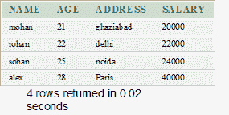

# Oracle 选择语句

> 原文：<https://www.javatpoint.com/oracle-select>

Oracle SELECT 语句用于从一个或多个表、对象表、视图、对象视图等中检索数据。

**语法**

```
SELECT expressions
FROM tables
WHERE conditions; 

```

## 因素

**1)表达式:**指定要检索的列或计算。

**2)表:**此参数指定要从中检索记录的表。FROM 子句中必须至少有一个表。

**3)条件:**规定选择必须遵循的条件。

## 选择示例:选择所有字段

让我们举一个例子，从已经创建的名为 customers 的表中选择所有字段

```
SELECT *
FROM customers; 

```

**输出**



## 选择示例:选择特定字段

**例**

```
SELECT age, address, salary
FROM customers
WHERE  age < 25
AND salary > '20000'
ORDER BY age ASC, salary DESC;

```


## 选择示例:从多个表中选择字段(连接)

```
SELECT customers.name, courses.trainer
FROM courses
INNER JOIN customers
ON courses.course_id = course_id
ORDER BY name; 

```

**输出**

