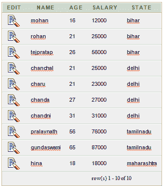

# Oracle DISTINCT 子句

> 原文：<https://www.javatpoint.com/oracle-distinct-clause>

Oracle DISTINCT 子句用于从结果集中删除重复记录。它只与 SELECT 语句一起使用。

**语法:**

```sql
SELECT DISTINCT expressions
FROM tables
WHERE conditions;

```

## 参数:

**表达式:**指定要检索的列。

**表:**指定要从中检索记录的表。

**条件:**规定必须满足的条件。

## Oracle DISTINCT 示例:(带单个表达式)

我们来看一张“顾客”的桌子

**客户表:**

```sql
CREATE TABLE  "CUSTOMERS" 
   (	"NAME" VARCHAR2(4000), 
	"AGE" NUMBER, 
	"SALARY" NUMBER, 
	"STATE" VARCHAR2(4000)
   )
/

```



**执行该查询:**

```sql
SELECT DISTINCT state
FROM customers
WHERE name = 'charu';

```

**输出:**


## Oracle DISTINCT 示例:(带有多个表达式)

**执行该查询:**

```sql
SELECT DISTINCT name, age, salary
FROM customers
WHERE age >= '60';

```

**输出:**


本示例指定年龄大于或等于 65 岁的客户的不同姓名、年龄和工资。