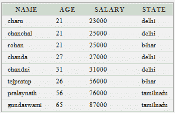
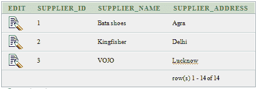

# 甲骨文 FROM 子句

> 原文：<https://www.javatpoint.com/oracle-from-clause>

FROM 子句是 SELECT 表达式中的强制子句。它指定要从中检索数据的表。

**语法:**

```
FROM table_name...
Expressions...

```

## Oracle FROM 子句示例:(带有一个表)

让我们举一个例子来解释如何使用 FROM 子句从一个表中检索数据。考虑一张“顾客”的桌子。

**客户表:**

```
CREATE TABLE  "CUSTOMERS" 
   (	"NAME" VARCHAR2(4000), 
	"AGE" NUMBER, 
	"SALARY" NUMBER, 
	"STATE" VARCHAR2(4000)
   )
/

```


**执行该查询:**

```
SELECT *
FROM customers
WHERE salary >= 20000
ORDER BY salary ASC;

```

**输出:**



## Oracle FROM 子句示例:(带有两个表)

**内部连接示例:**

我们来看两张表“供应商”和“订单 1”。

**供应商:**




**订单 1:**


**执行以下查询:**

```
SELECT suppliers.supplier_id, suppliers.supplier_name, order1.order_number
FROM suppliers
INNER JOIN order1
ON suppliers.supplier_id = order1.supplier_id;

```

**输出:**

