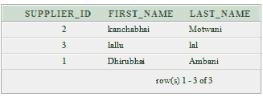

# Oracle 订单依据条款

> 原文：<https://www.javatpoint.com/oracle-order-by-clause>

在 Oracle 中，ORDER BY 子句用于对结果集中的记录进行排序或重新排列。ORDER BY 子句仅用于 SELECT 语句。

**语法:**

```
SELECT expressions
FROM tables
WHERE conditions
ORDER BY expression [ ASC | DESC ]; 

```

## 参数:

**表达式:**指定要检索的列。

**表:**指定要从中检索记录的表名。

**条件:**指定要选择的记录必须满足的条件。

**ASC:** 是一个可选参数，用于按升序对记录进行排序。

**DESC:** 也是一个可选参数，用于对记录进行降序排序。

## Oracle ORDER BY 示例:(无 ASC/DESC 属性)

我们来看一张“供应商”的表格

**供应商表:**

```
CREATE TABLE  "SUPPLIER" 
   (	"SUPPLIER_ID" NUMBER, 
	"FIRST_NAME" VARCHAR2(4000), 
	"LAST_NAME" VARCHAR2(4000)
   )
/

```


**执行该查询:**

```
SELECT *
FROM supplier
ORDER BY last_name;

```

**输出:**


上面的示例返回按姓氏升序排列的名字。

## Oracle ORDER BY 示例:(按降序排序)

如果要按降序对结果进行排序，应该在 ORDER BY 子句中使用 DESC 属性:

**执行该查询:**

```
SELECT *
FROM supplier
ORDER BY last_name DESC;

```

**输出**



上面的示例返回按姓氏降序排列的名字。