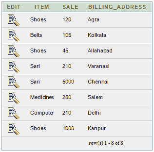
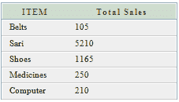
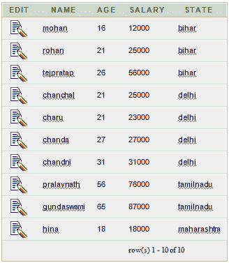
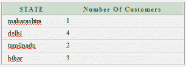

# Oracle 分组依据子句

> 原文：<https://www.javatpoint.com/oracle-group-by-clause>

在 Oracle 中，GROUP BY 子句与 SELECT 语句一起使用，从多个记录中收集数据，并将结果按一列或多列分组。

**语法:**

```
SELECT expression1, expression2, ... expression_n, 
aggregate_function (aggregate_expression)
FROM tables
WHERE conditions
GROUP BY expression1, expression2, ... expression_n; 

```

## 参数:

**表达式 1，表达式 2，...expression_n:** 它指定未封装在聚合函数中的表达式。这些表达式必须包含在 GROUP BY 子句中。

**聚合函数:**指定聚合函数，即 SUM、COUNT、MIN、MAX 或 AVG 函数。

**aggregate_expression:** 指定聚合函数所基于的列或表达式。

**表:**指定要从中检索记录的表。

**条件:**规定了选择记录必须满足的条件。

## Oracle GROUP BY 示例:(带求和函数)

让我们找一张“销售部”的桌子

**营业部表:**

```
CREATE TABLE  "SALESDEPARTMENT" 
   (	"ITEM" VARCHAR2(4000), 
	"SALE" NUMBER, 
	"BILLING_ADDRESS" VARCHAR2(4000)
   )
/

```



**执行该查询:**

```
SELECT item, SUM(sale) AS "Total sales"
FROM salesdepartment
GROUP BY item;

```

**输出**



上面的例子将显示每个单独项目的总销售额。

## Oracle GROUP BY 示例:(带计数功能)

我们来看一张“顾客”的桌子

这里我们创建了一个名为 customers 的表。此表没有任何主键。

**客户表:**

```
CREATE TABLE  "CUSTOMERS" 
   (	"NAME" VARCHAR2(4000), 
	"AGE" NUMBER, 
	"SALARY" NUMBER, 
	"STATE" VARCHAR2(4000)
   )
/

```



**执行该查询:**

```
SELECT state, COUNT(*) AS "Number of customers"
FROM customers
WHERE salary > 10000
GROUP BY state;

```

**输出:**



## Oracle 分组示例:(带最小函数)

让？让我们拿一张“员工”的桌子

**员工表:**

```
CREATE TABLE  "EMPLOYEES" 
   (	"EMP_ID" NUMBER, 
	"NAME" VARCHAR2(4000), 
	"AGE" NUMBER, 
	"DEPARTMENT" VARCHAR2(4000), 
	"SALARY" NUMBER
   )
/

```


**执行该查询:**

```
SELECT department, 
MIN(salary) AS "Lowest salary"
FROM employees
GROUP BY department;

```

**输出:**


## Oracle 分组示例:(带最大函数)

在本例中，我们使用上面给出的“员工”表。

**执行该查询:**

```
SELECT department,
MAX(salary) AS "Highest salary"
FROM employees
GROUP BY department;

```

**输出:**

