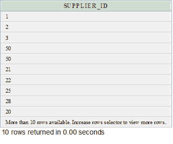

# Oracle 联合所有运营商

> 原文：<https://www.javatpoint.com/oracle-union-all>

在 Oracle 中，UNION ALL 运算符用于组合两个或多个 SELECT 语句的结果集。它与 UNION 运算符的不同之处在于，它不会删除各种 SELECT 语句之间的重复行。它返回所有的行。

UNION ALL 中的每个 SELECT 语句在具有相似数据类型的结果集中必须具有相同数量的字段。

## UNION 和 UNION ALL 运算符之间的区别

UNION 运算符删除重复行，而 UNION ALL 运算符不删除重复行。

**语法**

```sql
SELECT expression1, expression2, ... expression_n
FROM table1
WHERE conditions
UNION ALL
SELECT expression1, expression2, ... expression_n
FROM table2
WHERE conditions; 

```

**参数**

**1) expression1，expression2，expression_n:** 它指定要检索的列。两个 SELECT 语句中的表达式数量必须相同。

**2)表 1，表 2:** 指定要从中检索记录的表名。

**3)条件:**指定要选择的记录必须满足的条件。

## Oracle 联合所有操作员示例

```sql
SELECT supplier_id
FROM suppliers
UNION ALL
SELECT supplier_id
FROM order_details;

```

如果在 supplier_id 和 order_details 表中出现相同的值，上面的示例将在结果集中多次返回 supplier_id。

**输出**

