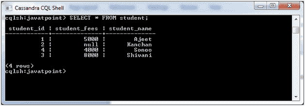
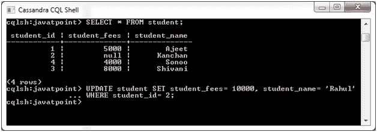

# Cassandra 更新数据

> 原文：<https://www.javatpoint.com/cql-update-data>

UPDATE 命令用于更新 Cassandra 表中的数据。如果在更新数据后没有看到任何结果，则表示数据更新成功，否则将返回错误。更新 Cassandra 表中的数据时，通常使用以下关键字:

*   **Where:**Where 子句用于选择要更新的行。
*   **Set:**Set 子句用于设置值。
*   **必选:**用于包含构成主键的所有列。

**语法:**

```sql

UPDATE <tablename>
SET <column name> = <new value>
<column name> = <value>....
WHERE <condition> 

```

或者

```sql

Update KeyspaceName.TableName 
Set ColumnName1=new Column1Value,
      ColumnName2=new Column2Value,
      ColumnName3=new Column3Value,
       .
       .
       .
Where ColumnName=ColumnValue

```

#### 注意:当您使用 UPDATE 命令并且给定行可用时，UPDATE 会创建一个新行。

**示例:**

让我们举个例子来演示如何更新 Cassandra 表中的数据。我们有一个名为“student”的表，其列(student_id，student_fees student_name)包含以下数据:



在这里，我们将学生证 2 的学生费更新为 10000，将学生证名称更新为 Rahul。

```sql

UPDATE student SET student_fees=10000,student_name='Rahul'
WHERE student_id=2; 

```



现在，表格更新了。您可以使用 SELECT 命令进行验证。

```sql

SELECT * FROM student; 

```

输出:


* * *