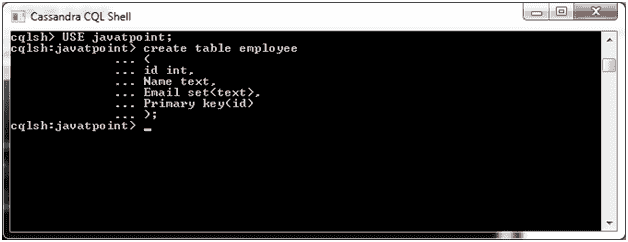
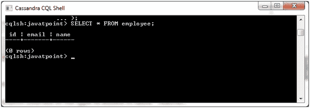
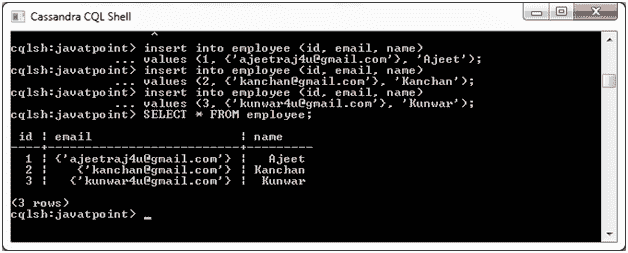

# Cassandra 收藏

> 原文：<https://www.javatpoint.com/cassandra-collections>

Cassandra 集合用于处理任务。您可以在集合中存储多个元素。Cassandra 支持三种类型的收藏:

*   一组
*   目录
*   地图

* * *

## 设置集合

集合集合存储一组元素，这些元素在查询时返回已排序的元素。

**语法:**

```
Create table table_name
(
id int,
Name text,
Email set<text>,
Primary key(id)
); 

```

**示例:**

让我们举个例子来演示集合。创建一个包含三列 id、姓名和电子邮件的“员工”表。



该表是这样创建的:



**在表格中插入数值:**

```
INSERT INTO employee (id, email, name)   
VALUES(1, {'ajeetraj4u@gmail.com'}, 'Ajeet');  
INSERT INTO employee (id, email, name)   
VALUES(2,{'kanchan@gmail.com'}, 'Kanchan'); 
INSERT INTO employee (id, email, name)   
VALUES(3, {'kunwar4u@gmail.com'}, 'Kunwar');

```

输出:



* * *

## 列表集合

当元素的顺序很重要时，使用列表集合。

让我们以上面的“员工”表为例，在员工表中添加一个新的列名“部门”。


现在添加了新列。在新列“部门”中插入一些值。


输出:


* * *

## 地图收藏

映射集合用于存储键值对。它把一件事映射到另一件事。例如，如果要保存课程名称及其必备课程名称，可以使用地图收集。

**见本例:**

创建一个名为“课程”的表格。


现在创建了表。在地图集合类型中插入一些数据。

输出:


* * *