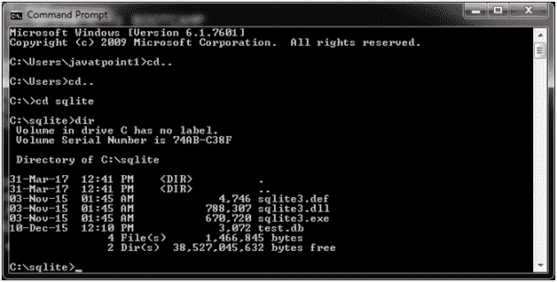

# 创建数据库

> 原文：<https://www.javatpoint.com/sqlite-create-database>

在 SQLite 中，sqlite3 命令用于创建新的数据库。

**语法:**

```sql
sqlite3 DatabaseName.db 

```

您的数据库名称在关系数据库管理系统中应该是唯一的。

#### 注意:sqlite3 命令:sqlite3 命令用于创建数据库。但是，如果数据库不存在，则会自动创建一个具有给定名称的新数据库文件。

**如何创建数据库:**

首先打开命令提示符并设置路径。之后，您可以使用“dir”命令检查 sqlite 目录。



**示例:**

让我们创建一个名为“JTP.db”的数据库:

```sql
sqlite3 JTP.db

```


数据库现在已创建。您可以使用“”检查创建的数据库。数据库”命令。

```sql
.databases

```


您也可以在根文件夹中看到创建的数据库。


* * *

### 那个。退出命令

SQLite。退出命令用于从 sqlite 提示符中出来:

。放弃

### 那个。转储命令

那个。dump dot 命令用于通过在命令提示符下使用 SQlite 命令导出文本文件中的完整数据库。

**例如:**

```sql
sqlite3 JTP.db .dump > JTP.sql

```


现在，完整的数据库以文本文件的形式导出。您可以在根文件夹中看到它。


* * *