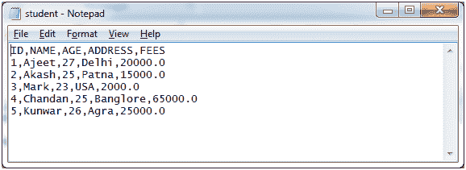

# SQLite 导出

> 原文：<https://www.javatpoint.com/sqlite-export>

SQLite 便于您将数据从 SQLite 数据库导出到 CSV 文件。您可以根据查询导出整个表或更少的表。

。使用 once 命令将数据导出到 CSV 文件，后面跟着您想要写入文件的文件路径/名称。

* * *

## SQLite 表到 CSV 文件

让我们看一个例子，它将把 STUDENT 表的所有内容导出到一个 CSV 文件:

学生表包含以下数据:


```sql
.header on
.mode csv
.once /Users/javatpoint1/Desktop/sqlite/student.csv
SELECT * FROM STUDENT; 

```


**代码解释:**

**。表头开启:**指定启用表头。这是可选的。如果禁用标题，CSV 文件就不会包含任何数据。

**。模式 csv:** 指定启用 csv 模式。

**。一次:**它指定要写入 CSV 文件的输出，下一个是确切的位置。

执行上述代码后，将在指定位置创建一个 CSV 文件:


它与 SQLite STUDENT 表具有相同的数据。



### 如何自动打开 CSV 文件:

**。系统**命令用于自动打开 CSV 文件。

**例如:**

以下命令在窗口中自动打开 CSV 文件:

```sql
.system /Users/javatpoint1/Desktop/sqlite/student.csv

```

此代码可能会根据操作系统进行更改:

*   **在 Windows 上，**使用**。系统**后面跟着文件名。
*   **在 Mac 上，**使用**。系统打开**后跟文件名。
*   **在 Linux 和 Unix 系统上，**使用**。系统**后面跟着打开文件的程序名称，后面跟着文件名。例如，。system libreoffice /file.csv

* * *