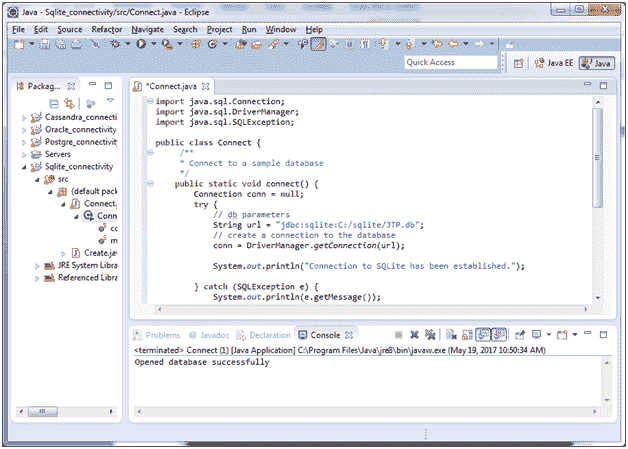
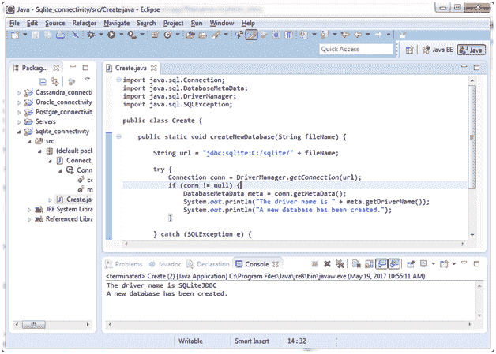
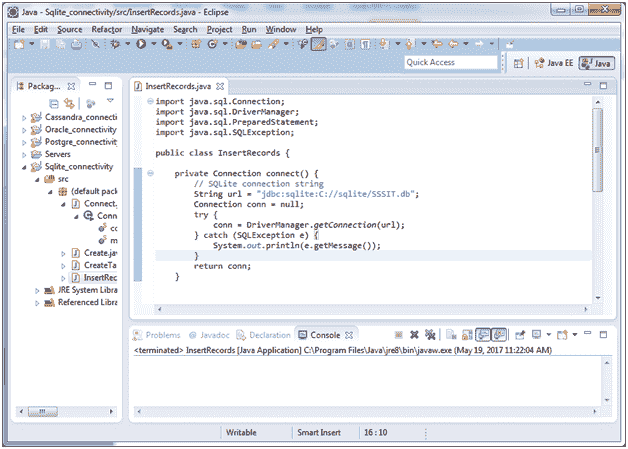
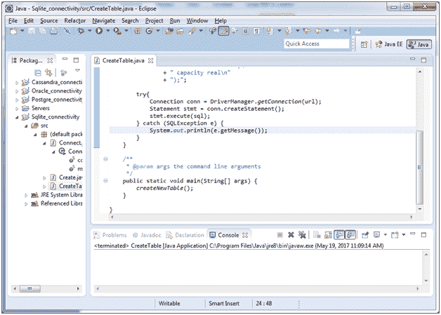

# 带有 SQLite 的 Java

> 原文：<https://www.javatpoint.com/java-sqlite>

要在 java 程序中使用 SQLite，您必须在系统上安装 SQLite JDBC 驱动程序和 Java。遵循以下步骤:

*   下载最新版本的 sqlite-jdbc-(VERSION)。来自 sqlite-jdbc 存储库的 jar。
*   将下载的 jar 文件添加到您的类路径。
*   现在，您可以使用 java 连接到 SQLite 数据库。

* * *

## 连接到 SQLite 数据库

使用以下代码使用 Java 编程语言连接到 SQLite 数据库:

```
import java.sql.Connection;
import java.sql.DriverManager;
import java.sql.SQLException;

public class Connect {
     /**
     * Connect to a sample database
     */
    public static void connect() {
        Connection conn = null;
        try {
            // db parameters
            String url = "jdbc:sqlite:C:/sqlite/JTP.db";
            // create a connection to the database
            conn = DriverManager.getConnection(url);

            System.out.println("Connection to SQLite has been established.");

        } catch (SQLException e) {
            System.out.println(e.getMessage());
        } finally {
            try {
                if (conn != null) {
                    conn.close();
                }
            } catch (SQLException ex) {
                System.out.println(ex.getMessage());
            }
        }
    }
    /**
     * @param args the command line arguments
     */
    public static void main(String[] args) {
        connect();
    }
}

```



它与您已经创建的数据库 JTP.db 相连接

* * *

## 使用 java 创建数据库

您也可以使用 java 编程语言在 SQLite 中创建新的数据库。让我们创建一个名为“SSSIT.db”的数据库。创建一个公共类“Create”，并使用以下代码:

```
import java.sql.Connection;
import java.sql.DatabaseMetaData;
import java.sql.DriverManager;
import java.sql.SQLException;

public class Create {

    public static void createNewDatabase(String fileName) {

        String url = "jdbc:sqlite:C:/sqlite/" + fileName;

        try {
        	Connection conn = DriverManager.getConnection(url);
            if (conn != null) {
                DatabaseMetaData meta = conn.getMetaData();
                System.out.println("The driver name is " + meta.getDriverName());
                System.out.println("A new database has been created.");
            }

        } catch (SQLException e) {
            System.out.println(e.getMessage());
        }
    }

    public static void main(String[] args) {
        createNewDatabase("SSSIT.db");
    }
}

```



现在创建了一个名为“SSSIT.db”的新数据库。你可以在安装 sqlite 的地方看到它。


* * *

## 使用 java 创建一个表

让我们创建一个名为“员工”的表，其中包含“姓名”和“能力”列。创建一个类名“CreateTable”，其代码如下:

```
import java.sql.Connection;
import java.sql.DriverManager;
import java.sql.SQLException;
import java.sql.Statement;

public class CreateTable {

    public static void createNewTable() {
        // SQLite connection string
        String url = "jdbc:sqlite:C://sqlite/SSSIT.db";

        // SQL statement for creating a new table
        String sql = "CREATE TABLE IF NOT EXISTS employees (\n"
                + "	id integer PRIMARY KEY,\n"
                + "	name text NOT NULL,\n"
                + "	capacity real\n"
                + ");";

        try{
        	Connection conn = DriverManager.getConnection(url);
            Statement stmt = conn.createStatement();
            stmt.execute(sql);
        } catch (SQLException e) {
            System.out.println(e.getMessage());
        }
    }

    /**
     * @param args the command line arguments
     */
    public static void main(String[] args) {
        createNewTable();
    }

}

```

它将在 SSSIT.db 数据库中创建一个“雇员”表。

* * *

## 在表中插入记录

创建表后，使用下面的代码在表中插入一些记录。创建一个新类“插入记录”，其代码如下:

```
import java.sql.Connection;
import java.sql.DriverManager;
import java.sql.PreparedStatement;
import java.sql.SQLException;

public class InsertRecords {

    private Connection connect() {
        // SQLite connection string
        String url = "jdbc:sqlite:C://sqlite/SSSIT.db";
        Connection conn = null;
        try {
            conn = DriverManager.getConnection(url);
        } catch (SQLException e) {
            System.out.println(e.getMessage());
        }
        return conn;
    }

    public void insert(String name, double capacity) {
        String sql = "INSERT INTO employees(name, capacity) VALUES(?,?)";

        try{
        	Connection conn = this.connect();
            PreparedStatement pstmt = conn.prepareStatement(sql);
            pstmt.setString(1, name);
            pstmt.setDouble(2, capacity);
            pstmt.executeUpdate();
        } catch (SQLException e) {
            System.out.println(e.getMessage());
        }
    }

    public static void main(String[] args) {

        InsertRecords app = new InsertRecords();
        // insert three new rows
        app.insert("Aryan", 30000);
        app.insert("Robert", 40000);
        app.insert("Jerry", 50000);
    }

}

```



现在记录被插入到表中。您可以使用 SELECT 命令将其检出:

* * *

## 选择记录

要从表中选择记录，请使用以下代码。创建一个新类“选择记录”，包含以下数据。

```
import java.sql.DriverManager;
import java.sql.Connection;
import java.sql.ResultSet;
import java.sql.SQLException;
import java.sql.Statement;

public class SelectRecords {

    private Connection connect() {
        // SQLite connection string
        String url = "jdbc:sqlite:C://sqlite/SSSIT.db";
        Connection conn = null;
        try {
            conn = DriverManager.getConnection(url);
        } catch (SQLException e) {
            System.out.println(e.getMessage());
        }
        return conn;
    }

    public void selectAll(){
        String sql = "SELECT * FROM employees";

        try {
        	Connection conn = this.connect();
            Statement stmt  = conn.createStatement();
            ResultSet rs    = stmt.executeQuery(sql);

            // loop through the result set
            while (rs.next()) {
                System.out.println(rs.getInt("id") +  "\t" + 
                                   rs.getString("name") + "\t" +
                                   rs.getDouble("capacity"));
            }
        } catch (SQLException e) {
            System.out.println(e.getMessage());
        }
    }

    /**
     * @param args the command line arguments
     */
    public static void main(String[] args) {
        SelectRecords app = new SelectRecords();
        app.selectAll();
    }

}

```

输出:

您可以看到它显示了我们曾经插入的所有记录。


#### 注意:通过使用相同的过程，您可以更新和删除表和数据库。

