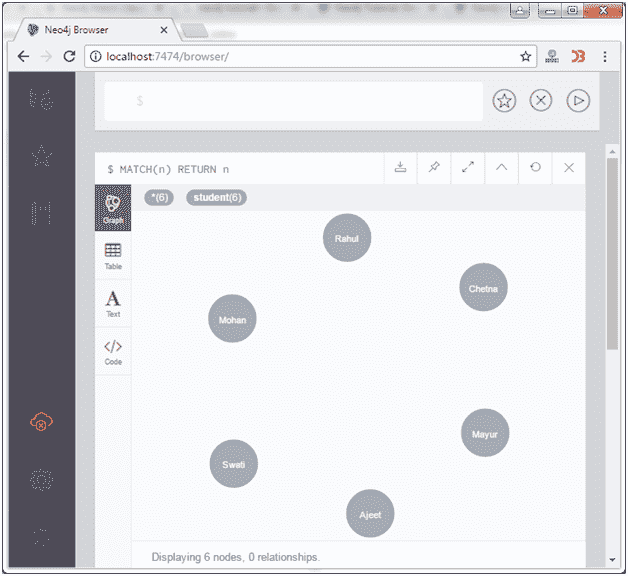
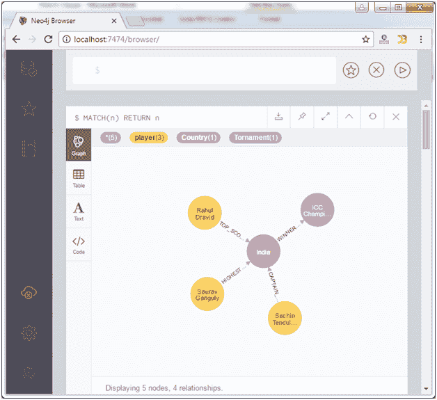

# Neo4j 匹配条款

> 原文：<https://www.javatpoint.com/neo4j-match-clause>

Neo4j MATCH 子句用于检索 Neo4j 数据库中的所有节点。它显示节点以及它们之间的关系。

## 显示节点

我们已经创建了 6 个节点。让我们使用 MATCH 子句来查看节点。

```
MATCH(n) RETURN n 

```

输出:



上面的命令只显示节点，因为它们之间没有关系。

* * *

## 显示节点和关系

让我们首先在 Neo4j 数据库中创建一些节点和关系。这里我们创建 3 个节点和 2 个关系。

```
CREATE (p:player {name: "Sachin Tendulakar", YOB: 1968, POB: "Mumbai"}) 
CREATE (c:Country {name: "India", result: "Winners"}) 
CREATE (ICC:Tornament {name: "ICC Champions Trophy"}) 
CREATE (c)-[r1:WINNERS_OF {NRR:0.938 ,pts:6}]->(ICC) 
CREATE(p)-[r2:CAPTAIN_OF]->(c)  
CREATE (p2:player{name: "Rahul Dravid", YOB: 1972, POB: "Chennai"}) 
CREATE (p3:player {name: "Saurav Ganguly", YOB: 1970, POB: "Kolkata"})  
CREATE (p2)-[:TOP_SCORER_OF {Runs:363}]->(c) 
CREATE (p3)-[:HIGHEST_HUNDRED_OF {Wickets:3}]->(c) 

```


现在使用 MATCH 子句和 RETURN 子句来查看节点和它们之间的关系。

```
MATCH (n) RETURN n

```

输出:



这个例子显示了节点和关系。