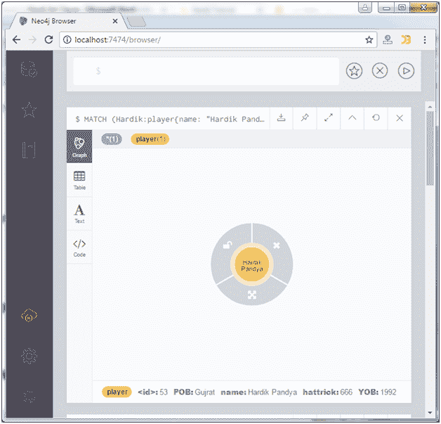
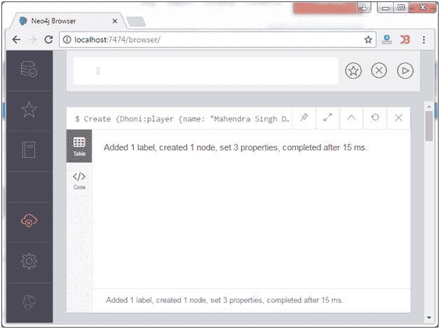
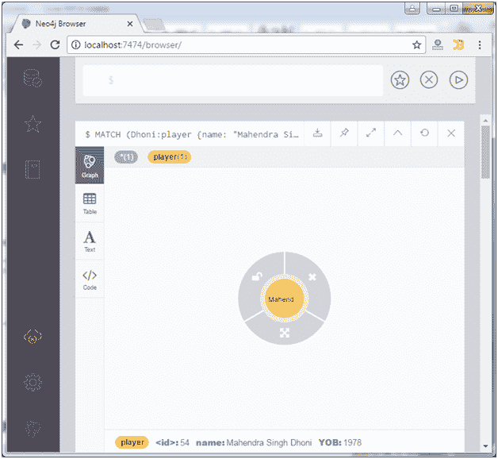
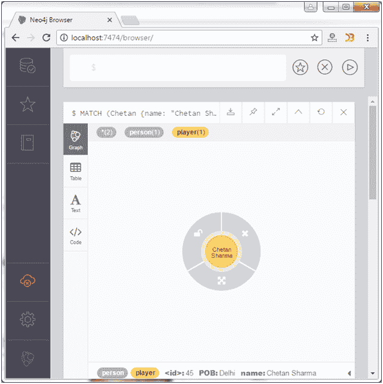

# Neo4j 集合子句

> 原文：<https://www.javatpoint.com/neo4j-set-clause>

SET 子句用于向现有节点或关系添加新属性。它还添加现有的属性值。

使用 SET 命令，您可以执行以下操作:

*   设置属性。
*   移除属性。
*   设置多个属性。
*   在节点上设置标签。
*   在一个节点上设置多个标签。

* * *

## 设置属性

SET 子句用于在节点中创建新属性。

**语法:**

```
MATCH (node:label {properties}) 
SET node.property1 = value, node.property2 = value 
RETURN node

```

**示例:**

首先在 Neo4j 数据库中创建一个名为“Hardik”的节点。

```
CREATE (Hardik:player{name: "Hardik Pandya", YOB: 1992, POB: "Gujrat"})

```

创建名为？帽子戏法？值为“666”。

```
MATCH (Hardik:player{name: "Hardik Pandya", YOB: 1992, POB: "Gujrat"}) 
SET Hardik.hattrick = 666
RETURN Hardik

```

输出:



这里可以看到，在名为“Hardik”的节点中创建了一个键值对为 hattrick/666 的属性。

* * *

## 移除属性

必须将空值作为值传递，才能从节点中移除现有属性。

**语法:**

```
MATCH (node:label {properties}) 
SET node.property = NULL 
RETURN node

```

**示例:**

首先创建一个节点“Dhoni”，如下所示:

```
Create (Dhoni:player {name: "Mahendra Singh Dhoni", YOB: 1978, POB: "Bihar"}) 

```

输出:



现在使用如下的 SET 子句从此节点中删除名为 POB 的属性:

```
MATCH (Dhoni:player {name: "Mahendra Singh Dhoni", YOB: 1978, POB: "Bihar"}) 
SET Dhoni.POB = NULL 

```

输出:



您可以看到 POB 现在已被删除。

* * *

## 设置多个属性

可以使用 SET 子句创建多个属性。您只需用逗号指定这些键值对。

**语法:**

```
MATCH (node:label {properties}) 
SET node.property1 = value, node.property2 = value 
RETURN node 

```

**示例:**

使用 Neo4j 中的 SET 子句在节点中创建多个属性:

```
MATCH (Dhoni:player {name: "Mahendra Singh Dhoni", YOB: 1978})  
SET Dhoni.HS = "183" 
RETURN Dhoni 

```

输出:


* * *

## 在节点上设置标签

SET 子句可用于为现有节点设置标签。

**语法:**

```
MATCH (n {properties . . . . . . . }) 
SET n :label 
RETURN n  

```

首先创建一个节点？甘古丽？如下所示:

```
CREATE (Ganguly {name: "Saurav Ganguly", YOB: 1968, POB: "Kolkata"})

```

现在使用 set 子句在节点上设置标签。这个查询将标签“player”添加到节点 Ganguly 并返回它。

```
MATCH (Ganguly {name: "Saurav Ganguly", YOB: 1968, POB: "Kolkata"}) 
SET Ganguly: player 
RETURN Ganguly 

```

输出:


* * *

## 在一个节点上设置多个标签

可以使用 SET 子句在一个节点上设置多个标签。您必须通过用冒号“:”分隔标签来指定标签。

**语法:**

```
MATCH (n {properties . . . . . . . }) 
SET n :label1:label2 
RETURN n 

```

**示例:**

首先创建一个名为“车坛”的节点，如下所示:

```
CREATE (Chetan {name: "Chetan Sharma", YOB: 1958, POB: "Delhi"}) 

```

使用 SET 子句在一个节点上创建多个标签。

```
MATCH (Chetan {name: "Chetan Sharma", YOB: 1958, POB: "Delhi"}) 
SET Chetan: player:person 
RETURN Chetan   

```

输出:

