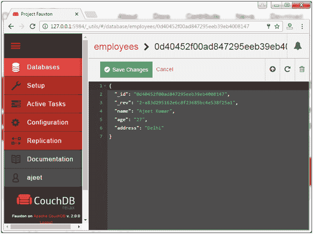
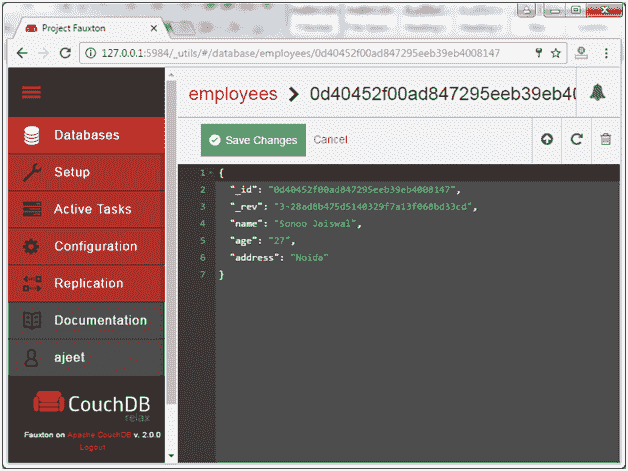

# 库更新文档

> 原文：<https://www.javatpoint.com/couchdb-update-document>

* * *

## 使用 fauxton 更新(编辑)文档

**打开 Fauxton 网址:http://127 . 0 . 0 . 1:5984/_ utils/**

您还可以在创建后更新/更改/编辑您的文档。单击编辑选项(红色圆圈)。


单击后，您将获得一个新页面，您可以在其中编辑您的条目。编辑后，单击保存更改选项卡，您的文档将被更新。

**例如:**在以下示例中，员工姓名为 Ajeet Kumar，年龄为 27 岁，地址为德里。



现在，将名字 Ajeet Kumar 更新为 Sonoo Jaiswal，将德里地址更新为 Noida。



单击“保存更改”选项卡，您的文档将被更新。

* * *

## 使用 cURL 实用程序更新文档

cURL 通过 cURL 实用程序使用 PUT 方法向服务器发送 HTTP 请求，方便用户更新 CouchDB 中的文档。

**语法:**

```js
curl -X PUT http://127.0.0.1:5984/database_name/document_id/ -d '{ "field" : "value", "_rev" : "revision id" }'

```

### 示例:

我们在名为 my_database 的数据库中有一个 id 为 001 的文档。

首先，检索要更新的文档的修订 id。您可以使用以下命令在文档中找到文档的 _rev:

```js
curl -X GET http://127.0.0.1:5984/my_database/001

```


使用文档中的修订 id _rev 来更改数据。这里我们把年龄从 23 岁改为 27 岁。

```js
curl -H 'Content-Type: application/json' \
-X PUT http://127.0.0.1:5984/my_database/001/ -d'{"age": "27",  "_rev":"1-609cd49b1a1bfa5936fcb712b5a82317"}'

```


### 确认

您可以通过再次使用 GET 请求来验证文档是否已更新。

```js
curl -X GET http://127.0.0.1:5984/my_database/001

```


在这里你可以看到年龄现在更新了。

**更新文档时需要记住的点:**

*   我们在请求中发送的 URL 必须包含数据库名称和文档 id。
*   更新现有文档与更新整个文档相同。无法向现有文档添加字段。您只能将文档的全新版本写入具有相同文档标识的数据库。
*   使用修订号作为 JSON 请求的一部分。
*   作为回报，JSON 包含成功消息、正在更新的文档的标识和新的修订信息。如果您想更新文档的新版本，您必须引用这个最新的修订号。