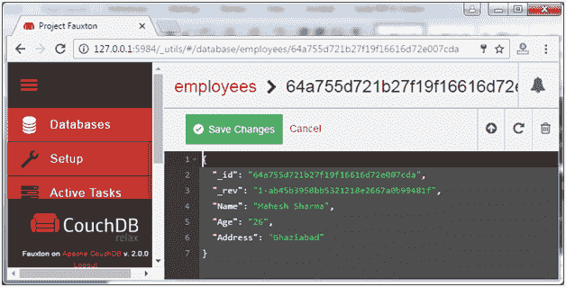
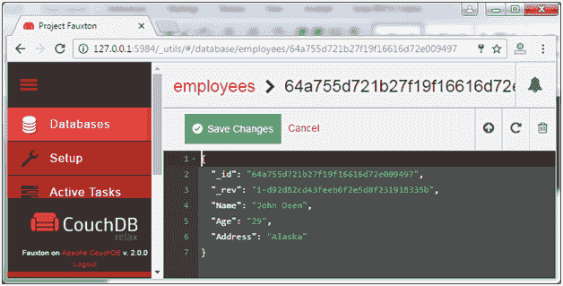
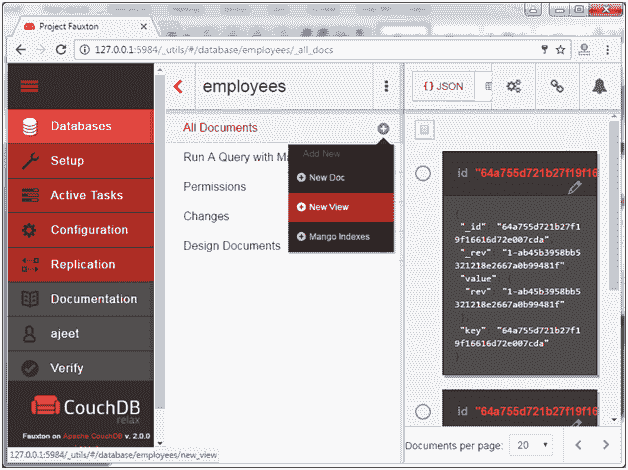
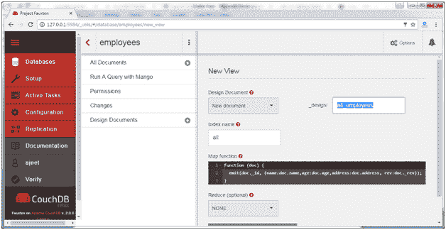
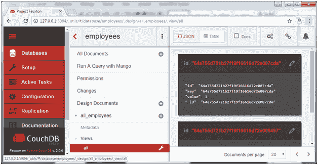
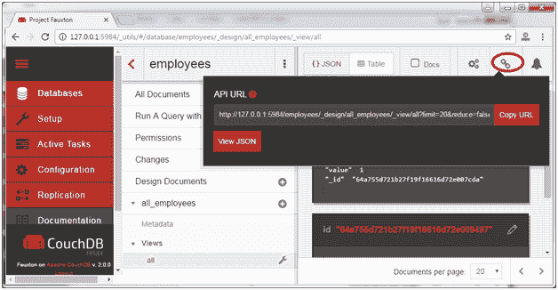
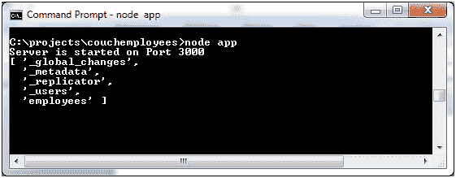
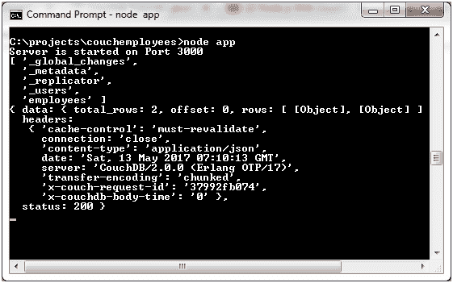
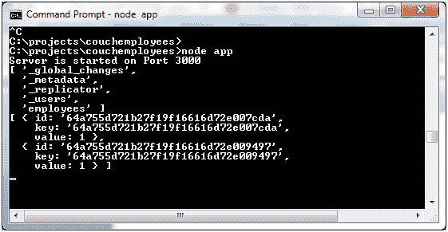

# CouchDB 创建视图

> 原文：<https://www.javatpoint.com/couchdb-create-view>

我们的“员工”数据库中有两名员工。


让我们假设员工 1 和员工 2:




现在，打开 Fauxton，转到所有文档，您会看到一个名为 New View 的块。



点击新视图并填写必填字段:



视图现在已创建。您可以按照以下命令验证它并获得查看结果:

**创建一个文件为“app.js”，代码如下:**

```js
const express = require('express');
const bodyParser = require('body-parser');
const path = require('path');
const NodeCouchdb = require('node-couchdb');
const app = express();
app.set('view engine', 'ejs');
app.set('views', path.join(__dirname, 'views'));
app.use (bodyParser.json());
app.use(bodyParser.urlencoded({extended: false}));
app.get('/', function(req,res){
 res.send('Working........');
});
app.listen(3000, function(){
 console.log('Server is started om Port 3000');
});

```

执行以下代码:

```js
node app  

```


打开本地浏览器:localhost:3000


* * *

## 列出数据库

```js
const express = require('express');
const bodyParser = require('body-parser');
const path = require('path');
const NodeCouchdb = require('node-couchdb');

const couch = NodeCouchdb({
auth:{
user: 'ajeet'
password: '12345'
}
});
couch.listDatabases().then(function(dbs){
console.log(dbs);
});

const app = express();
app.set('view engine', 'ejs');
app.set('views', path.join(__dirname, 'views'));
app.use (bodyParser.json());
app.use(bodyParser.urlencoded({extended: false}));
app.get('/', function(req,res){
 res.send('Working........');
});
app.listen(3000, function(){
 console.log('Server is started on Port 3000');
});

```


创建一个文件夹“视图”，然后在其中创建一个文件“index.ejs”，代码如下:

```js
Hello World!

```

现在在“app.js”文件中更改:

```js
res.render('index');

```


* * *

## 获取视图结果



单击全部，然后单击应用编程接口网址复制网址。



现在转到 app.js，用以下内容更改代码:

```js
const express = require('express');
const bodyParser = require('body-parser');
const path = require('path');
const NodeCouchdb = require('node-couchdb');

const couch = new NodeCouchdb({
auth:{
user:"ajeet",
password:"12345"
}
});

const dbName ='employees';
const viewUrl = '_design/all_employees/_view/all';

couch.listDatabases().then(function(dbs){
console.log(dbs);
});

const app = express();
app.set('view engine', 'ejs');
app.set('views', path.join(__dirname, 'views'));
app.use (bodyParser.json());
app.use(bodyParser.urlencoded({extended: false}));
app.get('/', function(req,res){
 couch.get(dbName, viewUrl).then(
function(data, headers, status){
console.log(data);
res.render('index',{
customer:data 
});
},
function(err){
res.send(err);
});
});

app.listen(3000, function(){
 console.log('Server is started on Port 3000');
});

```



**现在启动服务器，会看到如下结果:**



* * *

## 要查看文档详细信息

**编辑“app.js”，代码如下:**

```js
const express = require('express');
const bodyParser = require('body-parser');
const path = require('path');
const NodeCouchdb = require('node-couchdb');

const couch = new NodeCouchdb({
auth:{
user:"ajeet",
password:"12345"
}
});

const dbName ='employees';
const viewUrl = '_design/all_employees/_view/all';
couch.listDatabases().then(function(dbs){
console.log(dbs);
});

const app = express();
app.set('view engine', 'ejs');
app.set('views', path.join(__dirname, 'views'));
app.use (bodyParser.json());
app.use(bodyParser.urlencoded({extended: false}));
app.get('/', function(req,res){
 couch.get(dbName, viewUrl).then(
function(data, headers, status){
console.log(data.data.rows);
res.render('index',{
customer:data 
});
},
function(err){
res.send(err);
});
});
app.listen(3000, function(){
 console.log('Server is started on Port 3000');
});

```

输出:

