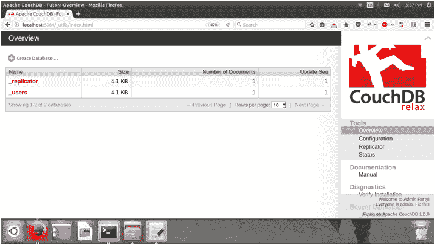
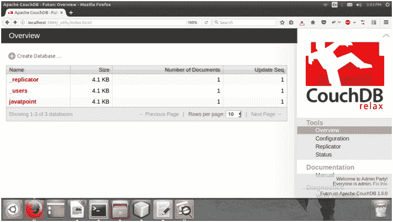
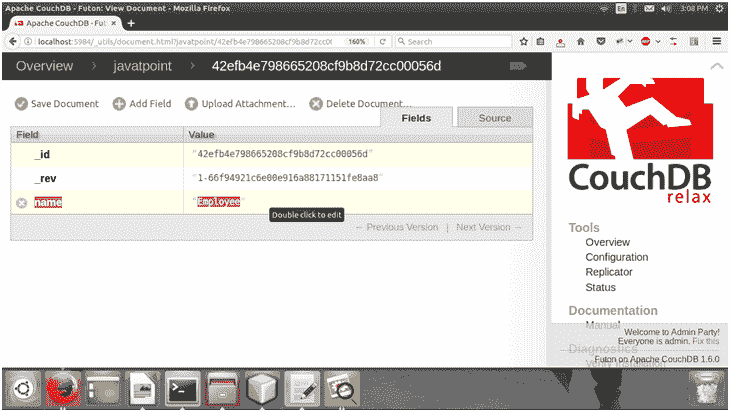

# Python 库连接

> 原文：<https://www.javatpoint.com/python-couchdb>

使用 Python 与 CouchDB 连接。我们必须安装以下软件包。

*   Python 解释器
*   CouchDB 数据库
*   python-couchdb 驱动程序

我们正在 Linux (Ubuntu 16.04)中执行这个例子。该示例包括以下步骤。

1)安装 python-couchdb 驱动程序

```
# pip install couchdb

```


2)启动蒙古数据库服务

```
# service couchdb start

```


3)创建一个 Python 脚本

```
# vi python-couch-connectivity.py

```


**//python-沙发-连接性. py**

```
import couchdb  # importing couchdb
# Connecting with couchdb Server 
couch = couchdb.Server()
# Creating Database
db = couch.create('javatpoint')
print("Database created");
# Creating document
doc = {'name':'Employee'}
db.save(doc) # Saving document
print("Document created")
# Fetching document from the database
print("Name is: "+doc['name'])

```

4)访问 CouchDB

按照这个网址**http://localhost:5984/_ utils**访问 localhost 上的数据库。



5)执行 Python 脚本

```
# python python-couch-connectivity.py

```


6)访问创建的数据库



看，储值。

