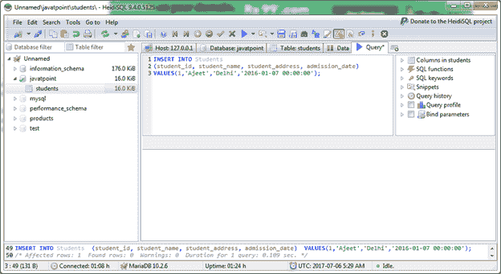
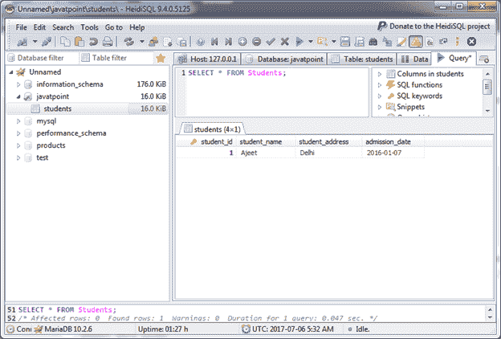
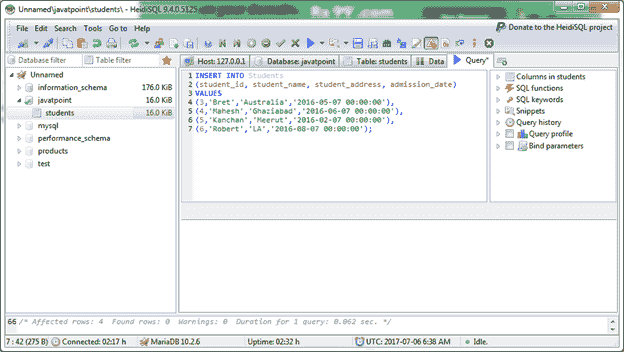
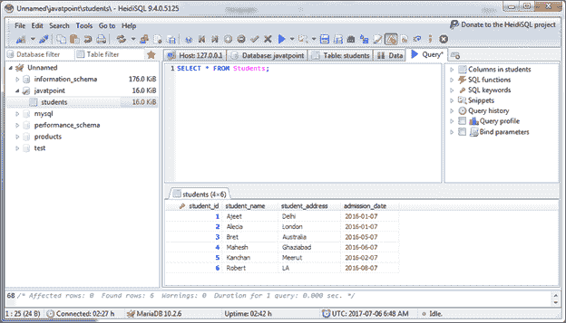

# 马里亚数据库插入数据

> 原文：<https://www.javatpoint.com/mariadb-insert>

在马里亚数据库中，INSERT INTO 语句用于在选定的表中插入数据。

**语法:**

```
INSERT INTO tablename (field,field2,...) VALUES (value, value2,...);

```

**或**

```
INSERT INTO table
(column1, column2, ... )
VALUES
(expression1, expression2, ... ),
(expression1, expression2, ... ),
...; 

```

**或**

您也可以在 WHERE 条件下使用它。

```
INSERT INTO table
(column1, column2, ... )
SELECT expression1, expression2, ...
FROM source_table
[WHERE conditions]; 

```

#### 注意:在马里亚数据库表中插入记录时，必须为每个非空列提供一个值。只有当列允许空值时，才能省略该列。

**示例:**

让我们在“学生”表中插入一些数据。

```
INSERT INTO Students
(student_id, student_name, student_address, admission_date)
VALUES(1,'Ajeet','Delhi','2016-01-07 00:00:00');

```



现在记录被插入到表中。您可以使用 SELECT 语句进行检查。

```
SELECT * FROM Students;

```

输出:



* * *

## 在表中插入多条记录

您也可以一次在 MariaDB 表中插入多个值。

**示例:**

```
INSERT INTO Students
(student_id, student_name, student_address, admission_date)
VALUES
(3,'Bret','Australia','2016-05-07 00:00:00'),
(4,'Mahesh','Ghaziabad','2016-06-07 00:00:00'),
(5,'Kanchan','Meerut','2016-02-07 00:00:00'),
(6,'Robert','LA','2016-08-07 00:00:00');

```



现在使用 SELECT 语句检查插入的记录。

```
SELECT * FROM Students; 

```

输出:

