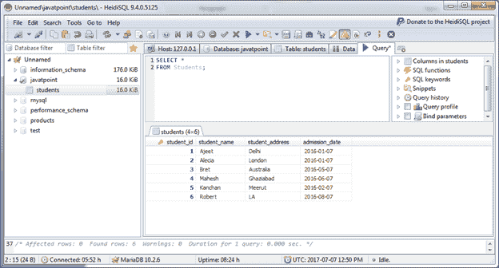
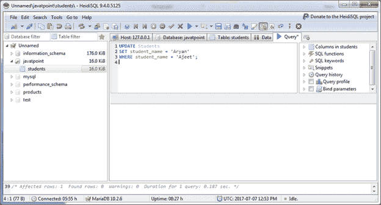
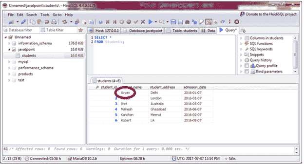
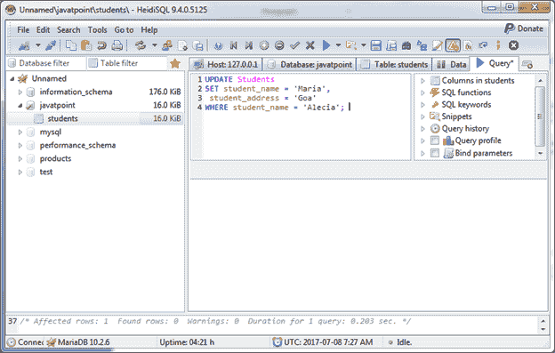
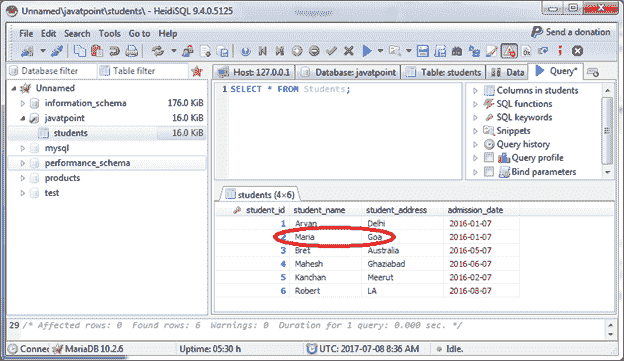

# MariaDB 更新数据

> 原文：<https://www.javatpoint.com/mariadb-update>

在 MariaDB 中，UPDATE 语句用于通过更改表中的值来修改现有字段。

**语法:**

```
UPDATE table_name SET field=new_value, field2=new_value2,...
[WHERE ...]

```

**或**

UPDATE 语句可以与 WHERE、ORDER BY 和 LIMIT 子句一起使用。

```
UPDATE table
SET column1 = expression1,
    column2 = expression2,
    ...
[WHERE conditions]
[ORDER BY expression [ ASC | DESC ]]
[LIMIT number_rows]; 

```

**示例:**

* * *

## 更新单个列

我们有一个“学生”表，包含以下数据:



让我们把学生名改为“雅利安”，其中“学生名”是“阿吉特”。

```
UPDATE Students
SET student_name = 'Aryan'
WHERE student_name = 'Ajeet'; 

```



查询成功执行。现在检查更新的数据:

输出:



**示例 2:**

* * *

## 更新多列

您也可以使用 MariaDB 数据库中的 UPDATE SATA entry 更新多个列。在下面的示例中，我们更新了“学生”表中的两列“学生名”和“学生地址”，其中“学生名”是“阿莱西亚”。

```
UPDATE Students
SET student_name = 'Maria',
 student_address = 'Goa'
WHERE student_name = 'Alecia'; 

```



列现在已更新。您可以使用 SELECT 语句检查和验证结果:

```
SELECT * FROM Students; 

```

输出:

