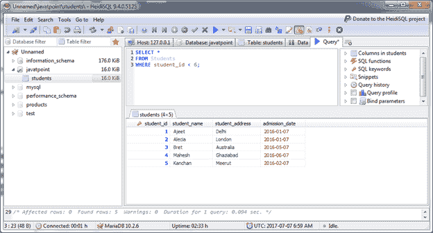
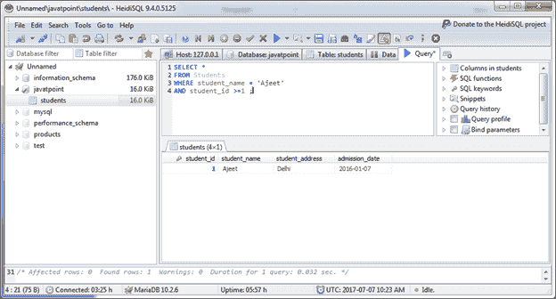
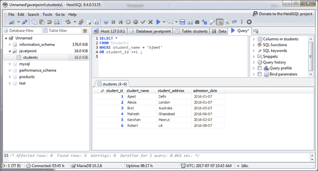
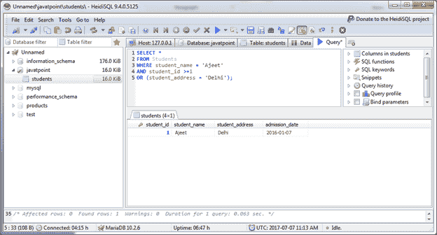

# 马里亚数据库 WHERE 子句

> 原文：<https://www.javatpoint.com/mariadb-where>

在马里亚数据库中，WHERE 子句与 SELECT、INSERT、UPDATE 和 DELETE 语句一起使用，以选择或更改我们要更改的特定位置。

它出现在语句中的表名之后。

**语法:**

```
[COMMAND] field,field2,... FROM table_name,table_name2,... WHERE [CONDITION] 

```

#### 注意:WHERE 子句是一个可选子句。它可以与 AND、OR、AND & OR、LIKE 运算符一起使用。

* * *

## 单条件 WHERE 子句

**示例:**

我们有一个“学生”表，有一些数据。让我们从 student_id 小于 6 的“Student”表中检索所有记录。

```
SELECT * 
FROM Students
WHERE student_id < 6; 

```

输出:



* * *

## 带与条件的 WHERE 子句

```
SELECT *
FROM Students
WHERE student_name = 'Ajeet'
AND student_id >=1 ; 

```

它将返回“学生”表中的所有列，其中“学生名称”是一个整数，“学生标识”大于或等于 1。

这两个条件都必须满足。

输出:



* * *

## 带或条件的 WHERE 子句

```
SELECT *
FROM Students
WHERE student_name = 'Ajeet'
OR student_id >=1 ; 

```

它将返回“学生”表中的所有列，其中“学生名称”是大于或等于 1 的整数或“学生标识”。

任何人的条件都必须满足。

输出:



* * *

## 带有 AND & OR 条件的 WHERE 子句

```
SELECT *
FROM Students
WHERE student_name = 'Ajeet' 
AND student_id >=1
OR (student_address = 'Delhi'); 

```

它将返回“学生”表中的所有列，其中“学生名称”是 Ajeet，“学生标识”大于或等于 1 或学生地址是德里。

输出:

