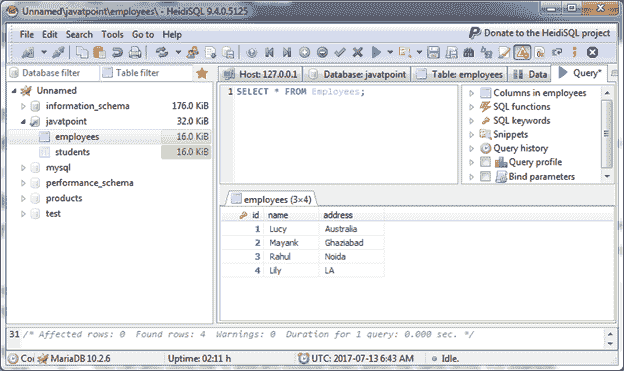
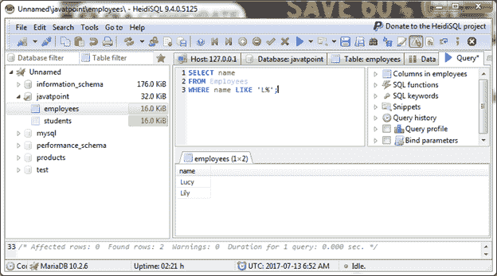
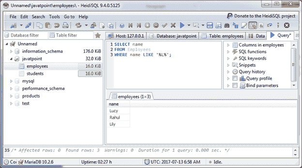
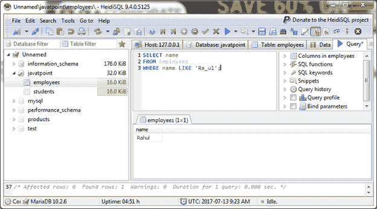
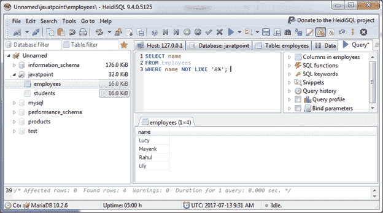

# MariaDB 布类似子句

> 原文：<https://www.javatpoint.com/mariadb-like>

在 MariaDB 中，当操作需要精确匹配时，LIKE 子句与 SELECT 语句一起使用来检索数据。它可以与 SELECT、INSERT、UPDATE 和 DELETE 语句一起使用。

它用于模式匹配并返回真或假。用于比较的模式接受以下通配符:

**“%”通配符:**它匹配字符数(0 或更多)。

**“_”通配符:**匹配单个字符。它匹配其集合中的字符。

**语法:**

```sql

SELECT field, field2,... FROM table_name, table_name2,...
WHERE field LIKE condition 

```

**示例:**

## 使用%通配符(百分号通配符)

我们有一个“员工”表，包含以下数据。



让我们使用带有 LIKE 条件的%通配符来查找所有以“L”开头的名称。

**示例 1:**

```sql

SELECT name
FROM Employees
WHERE name LIKE 'L%';

```

输出:



您也可以在同一个字符串中多次使用%通配符。

**示例 2:**

```sql

SELECT name
FROM Employees
WHERE name LIKE '%L%';

```

输出:



它将返回所有包含“L”的名称。

* * *

## 使用 _ 通配符(下划线通配符)

让我们在 LIKE 条件下使用 _ 通配符。下划线通配符只检查一个字符。让我们取一个类似“Ra_ul”的员工姓名。

```sql

SELECT name
FROM Employees
WHERE name LIKE 'Ra_ul'; 

```

输出:



* * *

## 带非运算符的 LIKE 子句

在 MariaDB 中，可以在 LIKE 子句中使用 NOT 运算符。让我们使用带非运算符的% wilcard。这里我们找出名字不以“A”开头的员工。

```sql

SELECT name
FROM Employees
WHERE name NOT LIKE 'A%'; 

```

输出:

