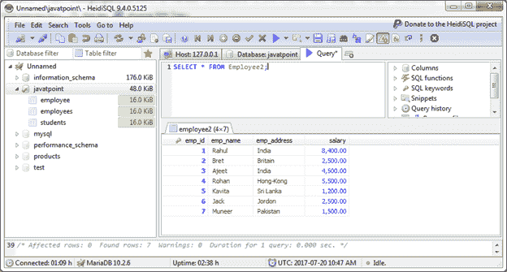
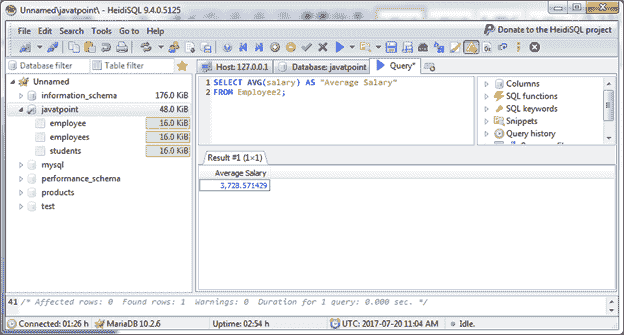
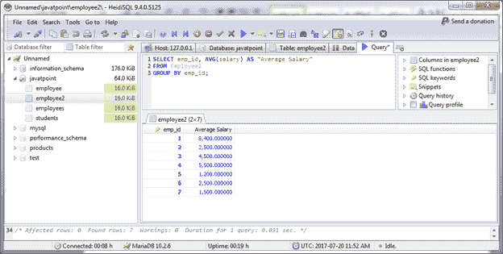

# MariaDB·AVG()函数

> 原文：<https://www.javatpoint.com/mariadb-avg-function>

MariaDB AVG()函数用于检索表达式的平均值。

**语法:**

```sql
SELECT AVG(aggregate_expression)
FROM tables
[WHERE conditions]; 

```

**或**

```sql
SELECT expression1, expression2, ... expression_n,
AVG(aggregate_expression)
FROM tables
[WHERE conditions]
GROUP BY expression1, expression2, ... expression_n; 

```

**示例:**

* * *

## 单表达式 AVG()函数

我们有一个名为“员工 2”的表格，包含以下数据:



让我们从表中检索员工的平均工资。

```sql
SELECT AVG(salary) AS "Average Salary"
FROM Employee2;

```

输出:



* * *

## 将 AVG()函数用于公式

你可以用 AVG()函数也用数学公式。例如，如果您想将员工的平均工资提高 50%，可以使用以下公式来估算成本:

```sql
SELECT AVG(salary * 1.5) AS "New Average"
FROM Employee2; 

```

输出:


它将增加 50%的工资。

* * *

## AVG()带订单子句的工资

```sql
SELECT emp_id, AVG(salary) AS "Average Salary"
FROM Employee2
GROUP BY emp_id; 

```

输出:

