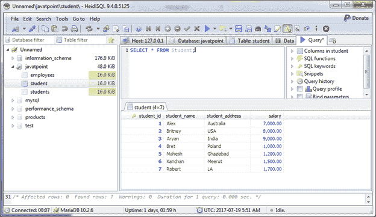
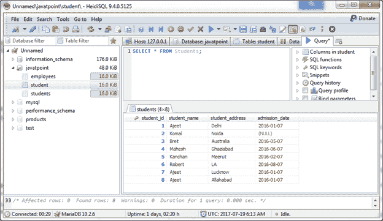

# 马里亚数据库联合运营商

> 原文：<https://www.javatpoint.com/mariadb-union-operator>

在 MariaDB 数据库中，UNION 运算符用于组合两个或多个 SELECT 语句的结果集。它删除各种 SELECT 语句之间的重复行。

**语法:**

```
SELECT expression1, expression2, ... expression_n
FROM tables
[WHERE conditions]
UNION [DISTINCT]
SELECT expression1, expression2, ... expression_n
FROM tables
[WHERE conditions];

```

#### 注意:UNION 运算符中的每个 SELECT 语句在具有相似数据类型的结果集中必须具有相同数量的字段。

* * *

## 使用联合运算符返回单个字段

让我们举一个 MariaDB UNION 运算符的例子，它从多个 SELECT 语句中返回一个字段。(两个表具有相同的公共字段)。

我们有两张桌子“学生”和“学生”。

**学生表:**



**学生表:**



```
SELECT student_name
FROM Student
UNION
SELECT student_name
FROM Students;

```

输出:


它显示了两个表中的 student_name，其中删除了重复的名称。

* * *

## 带有排序依据条款的联合运算符

使用带有 ORDER BY 子句的 UNION 运算符从两个表中检索多列。

```
SELECT student_id, student_name
FROM Students
WHERE student_name = 'Komal'
UNION
SELECT student_id, salary
FROM Student
WHERE student_id > 4
ORDER BY 1; 

```

输出:

