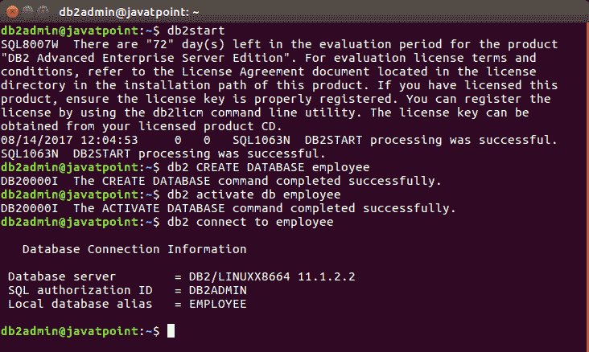
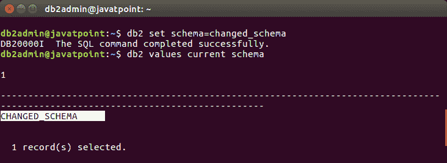

# DB2 架构

> 原文：<https://www.javatpoint.com/db2-schemas>

DB2 模式是数据库中逻辑分类的命名对象的集合。

在数据库中，不可能创建多个同名的数据库对象。为此，模式提供了一个组环境。

您可以在一个数据库中创建多个模式，也可以使用不同的模式组创建多个同名的数据库对象。

模式可以包含表、函数、索引、表空间、过程、触发器等。

例如，您为“员工”数据库创建了两个不同的名为“常规”和“兼职”的模式。

您还可以创建两个不同的同名“员工”表，其中一个表包含常规信息，另一个表包含员工的兼职信息。它实际上没有两个同名的表，尽管它们有两个不同的模式“常规”和“兼职”。

它方便用户在不面对任何问题的情况下同时使用两者。当对表的命名有约束时，此功能非常有用。

### 模式图像表示


### 获取当前活动的架构

**语法:**

```sql

db2 values current schema

```

我们有一个数据库“员工”:



让我们举一个例子来获取当前的数据库模式:

使用以下命令获取并更改您登录的当前模式:

```sql

db2 values current schema

```

**输出:**


### 将另一个模式设置为当前环境

**语法:**

```sql

db2 set schema  
```

**示例:**

让我们使用以下命令来更改模式:

```sql

db2 set schema=changed_schema

```

**输出:**


### 验证已更改的架构

您可以使用以下命令验证架构是否已成功更改:

```sql

db2 values current schema

```



### 创建新模式

**语法:**

```sql

db2 create schema authroization 
```

**示例:**

让我们用不同的授权用户 id 创建一个新的模式。创建由“sonoo”授权的“new_schema”模式

```sql

db2 create schema new_schema authorization sonoo

```

**输出:**


让我们用相同的名称创建两个不同的表，但是使用两个不同的模式。在这里，您使用两种不同的模式创建员工表，一种用于常规模式，另一种用于兼职模式。

**步骤 1:创建两个模式。**

**模式 1:** 【创建名为常规的模式】

**db2 创建模式常规授权 db2admin**

**模式 2:** 【创建名为兼职的模式】

**db2 创建模式兼职授权 db2admin**

现在您可以看到这两个命令都成功执行了。


现在为员工详细信息创建两个同名的表

**表 1:正式员工**

```sql

db2 create table Regular.employee(id number, name
varchar(20), job varchar(20), join_date date,
salary number);

```