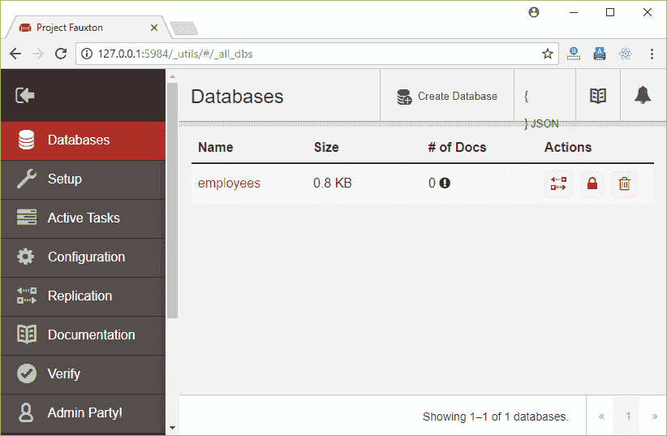
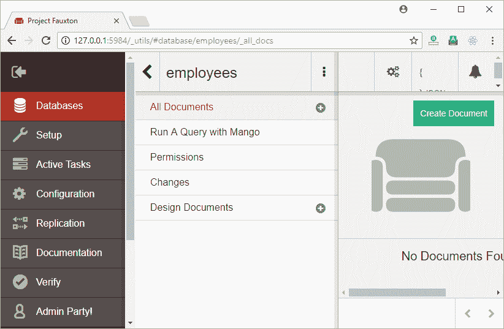
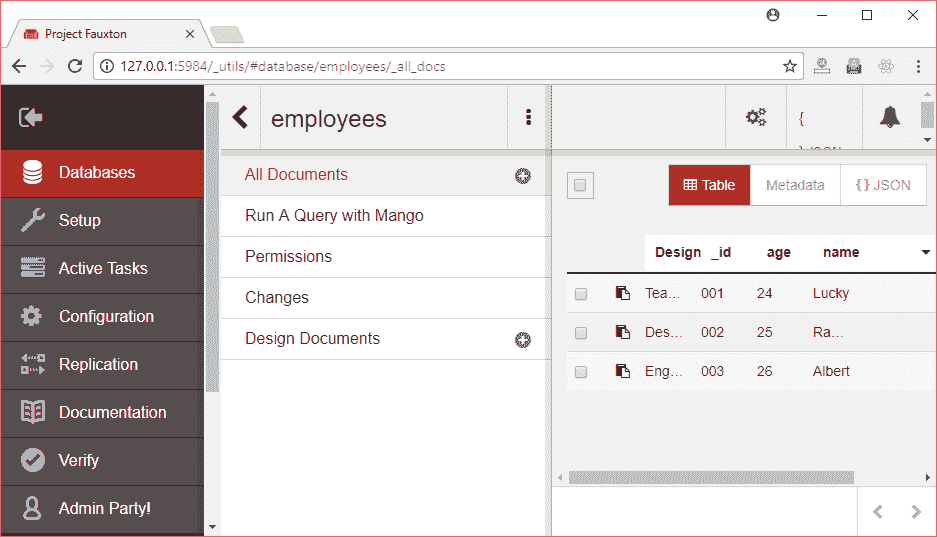

# 创建批处理

> 原文：<https://www.javatpoint.com/pouchdb-create-batch>

批处理是 PouchDB 中的一组文档。db.bulkDocs()方法用于创建文档或批处理的数组。创建文档时，如果您不提供 _id 值，那么 PouchDB 会代表您为所有批量文档生成唯一的 id。

您可以将想要在 PouchDB 中创建的所有文档存储在数组中，并将其作为参数传递给此方法。此方法还接受回调(可选)函数作为参数。

**语法:**

```js

db.bulkDocs(docs, [options], [callback]) 

```

* * *

## 创建批处理示例

让我们使用 db.bulkDocs()方法在 PouchDB 中创建多个文档。文档应该是 JSON 格式，一组由逗号(，)分隔的键值对，并包含在大括号({})中。

该批处理将在存储在 PouchDB 服务器上的名为“Second_Database”的数据库中创建。

```js

//Requiring the package
var PouchDB = require('PouchDB');
//Creating the database object
var db = new PouchDB('Second_Database');
//Preparing the documents array
doc1 = {_id: '001', name: 'Ajeet', age: 23, Designation: 'Programmer'}
doc2 = {_id: '002', name: 'Robert', age: 24, Designation: 'Teacher'}
doc3 = {_id: '003', name: 'Abdul', age: 25, Designation: 'Mechanic'}
docs = [doc1, doc2, doc3]
//Inserting Documents
db.bulkDocs(docs, function(err, response) {
   if (err) {
      return console.log(err);
   } else {
      console.log("Documents created Successfully");
   }
});

```

将上述代码保存在名为“PouchDB_Examples”的文件夹中名为“Create_Batch.js”的文件中。打开命令提示符，并使用节点执行 JavaScript 文件:

```js

node Create_Batch.js

```

输出:


* * *

## 在远程数据库中创建批处理

您可以在远程存储在 CouchDB 服务器上的数据库中创建一个批处理。为此，您必须传递要创建批处理的数据库的路径。

### 例子

我们在 CouchDB 服务器上有一个名为“雇员”的数据库。



“员工”数据库中没有文档。



让我们在“员工”数据库中创建一个批处理。

```js

//Requiring the package
var PouchDB = require('PouchDB');
//Creating the database object
var db = new PouchDB('http://localhost:5984/employees');
//Preparing the documents array
doc1 = {_id: '001', name: 'Lucky', age: 24, Designation: 'Teacher'}
doc2 = {_id: '002', name: 'Raman', age: 25, Designation: 'Designer'}
doc3 = {_id: '003', name: 'Albert', age: 26, Designation: 'Engineer'}
docs = [doc1, doc2, doc3]
//Inserting Documents
db.bulkDocs(docs, function(err, response) {
   if (err) {
      return console.log(err);
   } else {
      console.log("Documents (Batch) created Successfully");
   }
});

```

将上述代码保存在一个名为“PouchDB_Examples”的文件夹中，该文件名为“Create_Remote_Batch.js”。打开命令提示符，并使用节点执行 JavaScript 文件:

```js

node Create_Remote_Batch.js

```

输出:


* * *

## 确认

您可以在 CouchDB 服务器上看到创建的文档。

