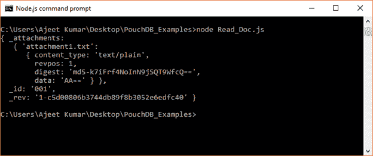
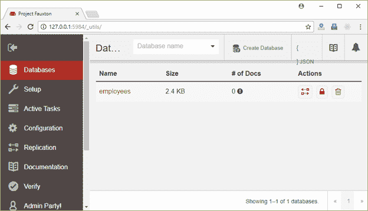
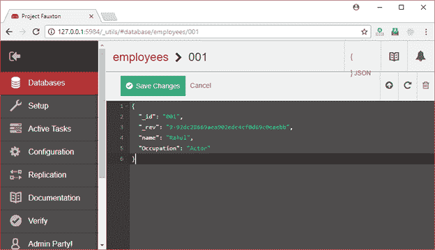
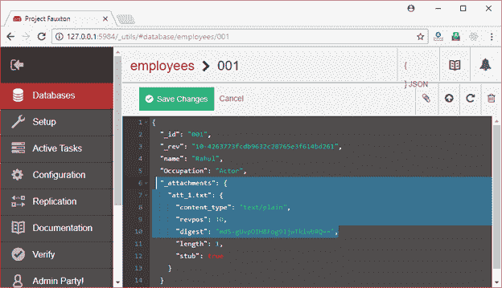

# 添加附件

> 原文：<https://www.javatpoint.com/pouchdb-add-attachment>

putAttachment()方法用于向 PouchDB 中的文档添加二进制对象。要使用此方法，您必须将文档 id、附件 id、MIME 类型与附件一起传递。这个方法也接受一个可选的回调函数。

**语法:**

```

db.putAttachment( doc_Id, attachment_Id, attachment, type, [callback] );

```

Blob 或 buffer 对象用于准备文档附件。使用浏览器时使用 Blob，使用 Node.js 时使用缓冲区

这里我们使用的是 Node.js 控制台，所以我们将使用缓冲对象。

* * *

## 添加附件示例

让我们举一个例子，在一个新创建的数据库“New_Database”中创建一个带有附件的文档。

```

//Requiring the package 
var PouchDB = require('PouchDB');
//Creating the database object 
var db = new PouchDB('New_Database');
//Preparing the attachment 
var my_attachment = new Buffer(['Hello JavaTpoint......'], {type:'text/plain'});
//Adding attachment to a document 
db.putAttachment('001', 'attachment1.txt', my_attachment, 'text/plain', function(err, res) { 
   if (err) { 
      return console.log(err); 
   } else { 
      console.log(res+"Attachment added successfully") 
   } 
});

```

将上述代码保存在名为“PouchDB_Examples”的文件夹中名为“Add_Attachment.js”的文件中。打开命令提示符，并使用节点执行 JavaScript 文件:

```

node Add_Attachment.js

```

输出:


上面的示例将创建一个空文档，向存储在 PouchDB 中的名为“New_Database”的数据库添加一个附件。

* * *

## 确认

使用以下代码验证是否添加了附件。

```

//Requiring the package 
var PouchDB = require('PouchDB');
//Creating the database object 
var db = new PouchDB('New_Database');
//Reading the Document 
db.get('001',{attachments: true}, function(err, doc) { 
   if (err) { 
      return console.log(err); 
   } else { 
      console.log(doc); 
   } 
});

```

将上述代码保存在名为“PouchDB_Examples”的文件夹中名为“Read_Doc.js”的文件中。打开命令提示符，并使用节点执行 JavaScript 文件:

```

node Read_Doc.js

```

输出:



* * *

## 向现有文档添加附件

我们在数据库中有一个名为“Last_Database”的文档，其 id 为“002”。您可以看到文档的价值:

```

{ name: 'Aryan',
  age: 21,
  designation: 'Teacher',
  _id: '002',
  _rev: '1-06272bacc14146d68d8ee0c36dfa0cb9' 
}

```


现在使用其 _rev 值向该文档添加附件。

**示例:**

```

//Requiring the package 
var PouchDB = require('PouchDB');
//Creating the database object 
var db = new PouchDB('Last_Database');
//Adding attachment to existing document 
var my_attachment = new Buffer (['Hello JavaTpoint....'], {type: 'text/plain'});

rev = '1-06272bacc14146d68d8ee0c36dfa0cb9'; 
db.putAttachment('002', 'attachment1.txt', rev, my_attachment, 'text/plain', function(err, res) { 
   if (err) { 
      return console.log(err); 
   } else { 
      console.log (res + "Attachment added successfully") 
   } 
});

```

将上述代码保存在一个名为“PouchDB_Examples”的文件夹中，该文件名为“Add_Attachment2.js”。打开命令提示符，并使用节点执行 JavaScript 文件:

```

node Add_Attachment2.js

```

输出:


* * *

## 确认

您可以使用 read 命令验证添加的附件:


```

{ name: 'Aryan',
  age: 21,
  designation: 'Teacher',
  _attachments:
   { 'attachment1.txt':
      { content_type: 'text/plain',
        revpos: 2,
        digest: 'md5-k7iFrf4NoInN9jSQT9WfcQ==',
        data: 'AA==' } },
  _id: '002',
  _rev: '2-388510d44393457cb06764dd89542ef3' }

```

* * *

## 向远程数据库添加附件

您也可以将附件添加到远程存储的服务器(CouchDB)。您只需将路径传递到 CouchDB 中的数据库，该数据库包含要添加附件的文档。

### 例子

我们在 CouchDB 服务器上存储了一个名为“雇员”的数据库。



数据库中有一个 id 为 001 的文档。



向存储在名为“employees”的数据库中的文档 001 添加附件，该数据库存储在 CouchDB 服务器中。

```

//Requiring the package
var PouchDB = require('PouchDB');

//Creating the database object
var db = new PouchDB('http://localhost:5984/employees');

//Adding attachment to existing document
var my_attachment = new Buffer (['Hello JavaTpoint...'], {type: 'text/plain'});

rev = '9-92dc28669aea902edc4cf0d69c0eaebb';
db.putAttachment('001', 'att_1.txt',rev, my_attachment, 'text/plain', function(err, res) {
   if (err) {
      return console.log(err);
   } else {
      console.log (res+ "Attachment added successfully")
   }
});

```

将上述代码保存在一个名为“PouchDB_Examples”的文件夹中，该文件名为“Add_Remote_Attachment.js”。打开命令提示符，并使用节点执行 JavaScript 文件:

```

node Add_Remote_Attachment.js

```

输出:


* * *

## 确认

转到 CouchDB 服务器，您可以看到附件已随文档一起添加。

