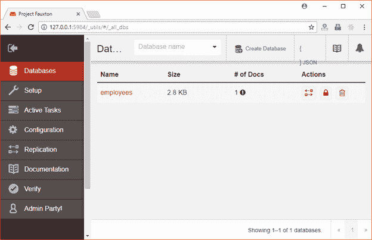
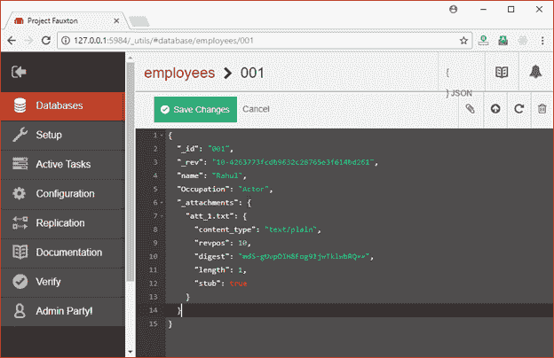

# 删除附件

> 原文：<https://www.javatpoint.com/pouchdb-delete-attachment>

removeAttachment()方法用于从 PouchDB 中删除附件。您必须通过此方法传递 document_id、attachment_id 和 _rev 值来删除 attachment met。这个方法也接受一个可选的回调函数。

**语法:**

```
db.removeAttachment ( doc_Id, attachment_Id, rev, [callback] );

```

* * *

## 删除附件示例

我们在 PouchDB 中有一份 id 为 002 的文档，其中包含一名员工的 id、姓名、年龄、职务和附件。

```
{ name: 'Aryan',
  age: 21,
  designation: 'Teacher',
  _attachments:
   { 'attachment1.txt':
      { content_type: 'text/plain',
        revpos: 2,
        digest: 'md5-k7iFrf4NoInN9jSQT9WfcQ==',
        data: 'AA==' } },
  _id: '002',
  _rev: '2-388510d44393457cb06764dd89542ef3' }

```


让我们使用 removeAttachment()方法删除附件。

```
//Requiring the package
var PouchDB = require('PouchDB');
//Creating the database object
var db = new PouchDB('Last_Database');
db.removeAttachment('002', 'attachment_1.txt', '2-388510d44393457cb06764dd89542ef3',
function(err, res) {
if (err) {
  return console.log(err);
} else {
  console.log(res+"Attachment Deleted successfully")
}
});

```

将上述代码保存在名为“PouchDB_Examples”的文件夹中名为“Delete_Attachment.js”的文件中。打开命令提示符，并使用节点执行 JavaScript 文件:

```
node Delete_Attachment.js

```

输出:


附件已成功删除。

* * *

## 确认

您可以使用 read 命令验证附件是否已从文档中删除。


* * *

## 从远程数据库中删除附件

您可以从远程存储的服务器(CouchDB)中删除附件。您只需将路径传递给包含附件的文档的库数据库。

### 例子

我们在 CouchDB 服务器上存储了一个名为“雇员”的数据库。



数据库“雇员”有一个 id 为“001”的文档。



让我们删除附件。

```
//Requiring the package 
var PouchDB = require('PouchDB');
//Creating the database object 
var db = new PouchDB('http://localhost:5984/employees');

db.removeAttachment('001', 'att_1.txt', '10-4263773fcdb9632c28765e3f614bd261', 
   function(err, res) { 
   if (err) { 
      return console.log(err); 
   } else { 
      console.log(res+"Attachment Deleted successfully") 
   } 
});

```

将上述代码保存在名为“PouchDB_Examples”的文件夹中的一个名为“Delete_Remote_Attachment.js”的文件中。打开命令提示符，并使用节点执行 JavaScript 文件:

```
node Delete_Remote_Attachment.js 

```

输出:


* * *

## 确认

现在你可以看到附件被删除了。