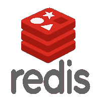
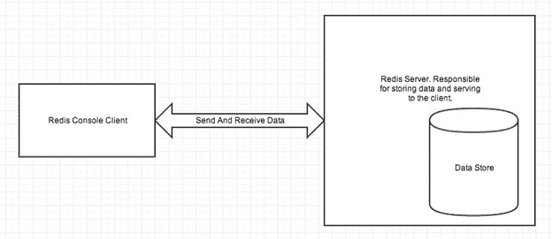
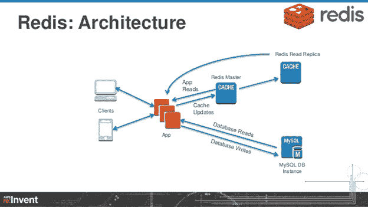

# 重复教学课程

> 哎哎哎:# t0]https://www . javatppoint . com/redis-tutorial

Redis 教程提供了 Redis 数据库的基本概念和高级概念。我们的 Redis 教程是为初学者和专业人士设计的。

Redis 是一个基于键值对概念的无 SQL 数据库。

我们的 redis 教程包括 redis 的所有主题，如什么是 redis，如何安装 Redis，Redis 命令，数据类型，键，列表，字符串，哈希，集合，排序集合，事务，脚本，连接，服务器，面试问题等。

## 什么是里兹

Redis 是一个遵循键值存储原则的 NoSQL 数据库。键值存储提供了在键中存储一些称为值的数据的能力。只有当您知道用于存储数据的确切密钥时，您才能在以后接收这些数据。

Redis 是一个灵活的、开源的(BSD 许可的)、内存中的数据结构存储，用作数据库、缓存和消息代理。Redis 是一个 NoSQL 数据库，因此它方便用户存储大量数据，而不受关系数据库的限制。

Redis 支持各种类型的数据结构，如字符串、散列、列表、集合、排序集合、位图、超日志和带有 radius 查询的地理空间索引。

* * *

## Redis 体系结构

Redis 架构中有两个主要过程:

*   客户端重定向
*   重定向服务器

这些客户端和服务器可以在同一台计算机上，也可以在两台不同的计算机上。

Redis 服务器用于在内存中存储数据。它控制所有类型的管理，并构成架构的主要部分。您可以在安装 Redis 应用程序时创建 Redis 客户端或 Redis 控制台客户端，也可以使用

## Redis 的功能

以下是 Redis 的主要功能列表:

**速度:** Redis 将整个数据集存储在主内存中，这就是它速度极快的原因。它每秒加载高达 110，000 个 SEt，在一个入门级 Linux 盒子中每秒可以检索 81，000 个 get。Redis 支持命令的流水线操作，并方便您在一个命令中使用多个值来加速与客户端库的通信。

**持久性:**虽然所有数据都保存在内存中，但更改会根据自上次保存以来经过的时间和/或更新次数，使用灵活的策略异步保存在磁盘上。Redis 支持只追加的文件持久模式。有关持久性的更多信息，请查看附录文件如何获取更多信息。

**数据结构:** Redis 支持各种类型的数据结构，如字符串、哈希、集合、列表、带范围查询的排序集合、位图、超日志和带 radius 查询的地理空间索引。

**原子操作:**在不同数据类型上工作的 Redis 操作是原子的，因此设置或增加一个键、在集合中添加和移除元素、增加一个计数器等都是安全的。

**支持的语言:** Redis 支持 ActionScript、C、C++、C#、Clojure、Common Lisp、D、Dart、Erlang、Go、Haskell、Haxe、Io、Java、JavaScript (Node.js)、Julia、Lua、Objective-C、Perl、PHP、Pure Data、Python、R、球拍、Ruby、Rust、Scala、Smalltalk、Tcl 等很多语言。

**主/从复制:** Redis 遵循非常简单快速的主/从复制。配置文件中只需要一行代码就可以设置好，一个 Slave 只需要 21 秒就可以完成亚马逊 EC2 实例上 10 MM 密钥集的初始同步。

**分片:** Redis 支持分片。像其他键值存储一样，将数据集分布在多个 Redis 实例中非常容易。

**可移植:** Redis 是用 ANSI C 写的，在 Linux、BSD、Mac OS X、Solaris 等大多数 POSIX 系统中都可以工作。据报道，如果用 Cygwin 编译，Redis 可以在 WIN32 下编译和工作，但是目前还没有官方对 Windows 的支持。

* * *

## 重定向索引

* * *

**重读教程**

*   [重读教程](redis-tutorial)
*   [背对 RDBMS](redis-vs-rdbms)
*   [Redis 对其他键值](redis-vs-other-key-value-stores)
*   [安装在窗户上](redis-installation)
*   [在 Ubuntu 上安装](redis-installation-on-ubuntu)
*   再配置
*   [重定向数据类型](redis-data-types)
*   [重新起草所有命令](redis-all-commands)

**再命令**

*   [再命令](redis-commands)
*   [重复密钥](redis-keys)
*   重编字符串
*   [重复申述](redis-hashes)
*   [重编清单](redis-lists)
*   再编集
*   [重复排序集](redis-sorted-sets)
*   再交易
*   [重复脚本](redis-scripting)
*   再连接
*   重定向服务器

**重复前进**

*   [Redis 备份&恢复](redis-backup-restore)
*   [重定向安全](redis-security)
*   [重新制定基准](redis-benchmarks)
*   重定向客户端连接
*   [重复管道铺设](redis-pipelining)
*   再分区

**重复差异**

*   背对背
*   [背对蒙戈布](redis-vs-mongodb)
*   背对弹性搜索
*   [直航对抗气溶胶](redis-vs-aerospike)

**面试问题**

*   重复面试问题

* * *

## 先决条件

在学习 Redis 之前，必须具备 SQL 的基础知识。

## 观众

我们的 Redis 教程旨在帮助初学者和专业人士。

## 问题

我们保证您在这个 Redis 教程中不会发现任何问题。但是如果有任何错误，请在联系表格中发布问题。