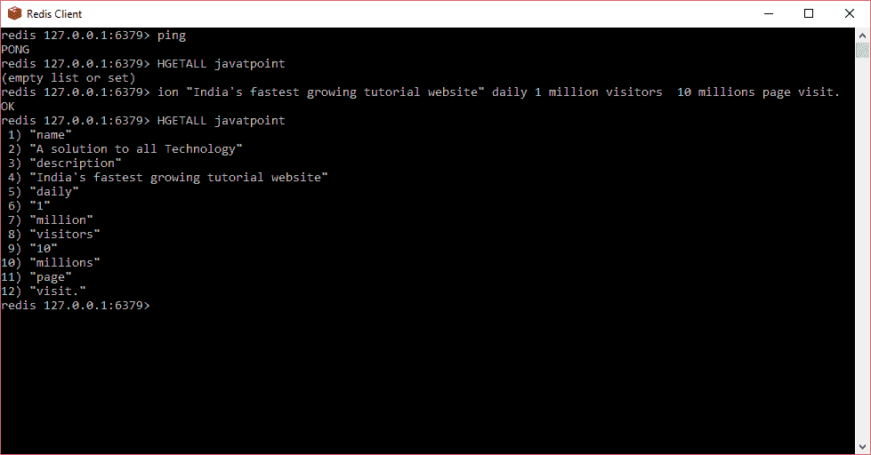

# 再说一遍

> 哎哎哎:# t0]https://www . javatppoint . com/redis-hashes

Redis Hashes 是表示对象的完美数据类型。它们用于在字符串字段和字符串值之间进行映射。在 Redis 中，每个哈希最多可以存储 40 多亿个字段值对。

### 例子

redis 127 . 0 . 0 . 1:6379 > HMSET javatpoint 名称“所有技术的解决方案”描述“印度增长最快的教程网站”每日 100 万访问者 1000 万页面访问量。

```

OK
redis 127.0.0.1:6379> HGETALL javatpoint
 1) "name"
 2) "A solution to all Technology"
 3) "description"
 4) "India's fastest growing tutorial website"
 5) "daily"
 6) "1"
 7) "million"
 8) "visitors"
 9) "10"
10) "millions"
11) "page"
12) "visit."
redis 127.0.0.1:6379>

```




在上面的例子中，“javatpoint”是 Redis hash，它包含详细信息(名称、描述、1、百万、10、远景、页面、访问)等。

* * *

## 重复散列命令

| 索引 | 命令 | 描述 |
| one | HDEL 键字段 2[字段 2] | 它用于删除一个或多个哈希字段。 |
| Two | HEXISTS 关键字段 | 它用于确定哈希字段是否存在。 |
| three | HGET 密钥场 | 它用于获取存储在指定键上的哈希字段的值。 |
| four | HGETALL 密钥 | 它用于获取存储在指定键的散列中的所有字段和值 |
| five | HINCRBY 关键字字段增量 | 它用于将散列字段的整数值增加给定的数字 |
| six | HINCRBYFLOAT 键字段增量 | 它用于将哈希字段的浮点值增加给定的数量 |
| seven | HKEYS 密钥 | 它用于获取散列中的所有字段 |
| eight | 选择关键点 | 它用于获取哈希中的字段数 |
| nine | HMGET 关键字字段 1[字段 2] | 它用于获取所有给定哈希字段的值 |
| Ten | HMSET 键字段 1 值 1[字段 2 值 2 ] | 它用于将多个哈希字段设置为多个值 |
| Eleven | HSET 关键字段值 | 它用于设置哈希字段的字符串值 |
| Twelve | HSETNX 关键字段值 | 仅当哈希字段不存在时，它才用于设置该字段的值 |
| Thirteen | HVALS 键 | 它用于获取散列中的所有值 |